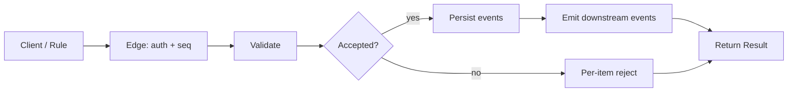

# Actions Framework

The shared shape of every **action** in the EMS: an authenticated, identified, sequence-stamped, batch-by-default operation that goes through [[arch-validator|validation]], persists as an [[arch-event-sourcing|event]], and emits a structured result. All concrete workflows compose actions; the framework is the underlying contract.

## Purpose

Stop reinventing the operation envelope. Every workflow's `route_orders`, `amend_orders`, `apply_markup`, `bind_rule`, etc. shares the same surrounding mechanics — auth, identity, seq, batch, validation, persistence, result. Capture them once.

## The canonical action shape

```
Action {
  op_name             string                      # e.g. "stage_orders"
  request_id          UUID                        # client idempotency key
  client_seq          uint64                      # session seq, see [[arch-sequence-recovery]]
  identity            Identity                    # see [[arch-firm-desk-user]]
  items               [Item]                      # batch by default per [[arch-api-first]]
  options             { partial_ok, dry_run, ... }
}

Result {
  request_id          UUID
  results             [ItemResult]                # 1:1 with request.items
  summary             { ok, rejected, deferred }
}

ItemResult {
  status              ACCEPTED | REJECTED | DEFERRED
  ref_id              EMS-side ID (e.g. order_id)
  error               { code, message, admin_hint } # see [[arch-validator]]
}
```

## The action pipeline



Every action goes through this pipeline. The pipeline is the framework; the action type determines:

- Which validator rules apply.
- Which events emit.
- Which downstream consumers care.

## Trigger / Entry Point

Any action call from any surface:

- API client.
- FIX bridge (translated to an action).
- Automation rule firing (action).
- Admin operation.

## Actors

- The caller (with identity).
- [[arch-validator]] — gates.
- [[arch-order-staged|order layer]] / other domain services — persist.
- [[arch-event-sourcing|log]] — records.

## Steps (uniform)

1. Authenticate at [[entry-point-bas|BAS]]; resolve identity.
2. Session seq check ([[arch-sequence-recovery]]).
3. Batch envelope received; iterate items.
4. Per-item validation (per [[arch-validator]] layered evaluation order).
5. Accepted items persisted (one event per accepted item).
6. Result returned with per-item status.

## Inputs

Per action type — see individual workflow notes.

## Outputs / Side Effects

- Per accepted item: one or more events.
- Per rejected item: a `ValidationRejected` event with the code.
- A `BatchOperationCompleted` envelope event for batch ops with N > 1.

## Why this matters for designers

When adding a new operation:

1. Don't reinvent the envelope — use the canonical shape.
2. Define your action's accepted item shape.
3. Add validator rules.
4. Define the events emitted.
5. Define the result envelope contents.

A new workflow that follows the framework gets auth, seq, audit, replay, and partial-success **for free**.

## Edge Cases & Nuances

- **Partial-success policy.** Default `partial_ok=true`. Operations explicitly atomic (e.g. some admin operations) set `partial_ok=false` and roll back on any failure.
- **Idempotency.** `request_id` replay returns the prior `Result` byte-identically — no double-apply.
- **Synchronous vs async.** Most actions are synchronous (result returned in the same response). Some (e.g. RFQ election with venue round-trip) are async — the response carries a `DEFERRED` status; the final result arrives as an event the caller subscribes to.
- **Cross-action ordering.** Actions within a session are seq-ordered. Across sessions, ordering is by event log `global_seq`.
- **Replay.** All actions replay deterministically through the same pipeline.

## Related

- [[arch-api-first]] · [[arch-sequence-recovery]] · [[arch-validator]] · [[arch-event-sourcing]] · [[arch-firm-desk-user]] · [[arch-fix-api-bridge]]
- [[entry-point-bas]] · [[order-manager]] · [[validation]] · [[permissioning-config]] · [[regulatory-base]]
