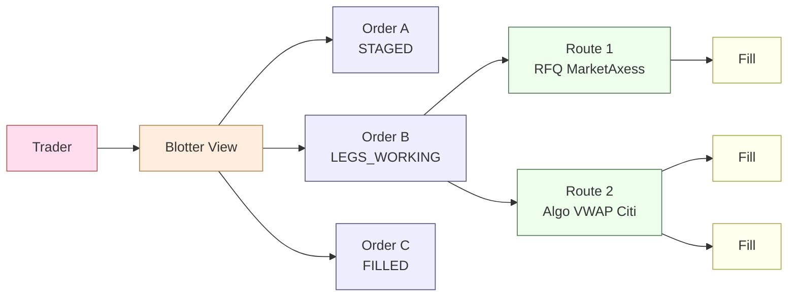
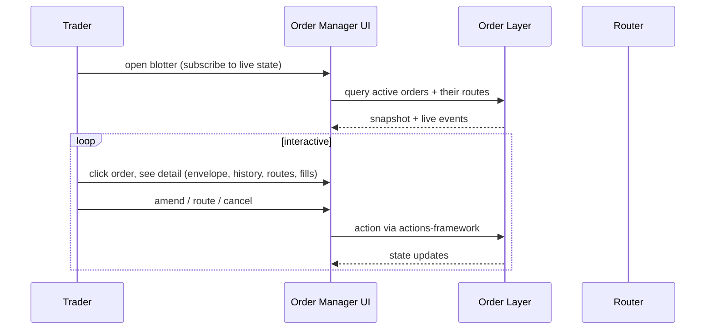

# Order Manager

The "Order Manager" is the user-facing umbrella over the EMS's two OMS layers — [[arch-order-staged|staged orders]] (layer 1) and [[arch-router-layer|routes]] (layer 2). This workflow note describes how a user (trader / sales / ops) interacts with both layers consistently.

## Purpose

Make the user's mental model match the architecture's: orders are containers of intent; routes are obligations to venues. The Order Manager UI / API surface presents both clearly.

## Trigger / Entry Point

- Trader opens the blotter view; sees all live orders + their routes + fills.
- API calls querying / acting on either layer.
- Automation rules acting on either layer.

## Actors

- Trader / sales / ops / automation.
- [[arch-order-staged|order layer]].
- [[arch-router-layer|router]].
- [[arch-quote-server]] — market context.

## What the Order Manager presents

The blotter is a **projection** of the [[arch-event-sourcing|event log]] — rebuildable from scratch, never the authoritative state.

## Steps (typical interactive session)

## Inputs

- Selector / filter for the blotter view (asset class, status, batch, group, owner).
- Per-action inputs per workflow.

## Outputs / Side Effects

Per action workflow.

## Blotter UX concerns

- **Two-row hierarchical view.** Orders as parent rows; routes as expandable children.
- **Live updates.** Every event tail-subscribed; UI updates in place.
- **Bulk select.** Multi-select drives [[bulk-order-update-route|bulk operations]].
- **Search / filter.** Selector shape (asset class, side, state, tag, batch, group) matches the API selector for bulk ops.
- **Audit drilldown.** Click an order → see the event history → click an event → see its `caused_by` chain.

## Edge Cases & Nuances

- **Blotter scale.** A desk may have thousands of live orders. The view streams updates per visible window; off-screen orders are tracked but not actively rendered.
- **Permission-scoped view.** Users see only orders within their permission scope (own + same-desk by default; cross-desk requires tag).
- **State staleness.** Blotter is event-sourced; rebuilding takes a couple of seconds at startup. Visual indicator while syncing.
- **Audit consistency.** The blotter shows the same state the audit log proves; any UI rendering bug is observable as divergence and tested.
- **Mobile / restricted UIs.** Reduced views are still backed by the same projection.

## Related

- [[arch-order-staged]] · [[arch-router-layer]] · [[arch-event-sourcing]] · [[arch-quote-server]] · [[arch-firm-desk-user]]
- [[actions-framework]] · [[entry-point-aaa]] · [[validation]] · [[permissioning-config]]
- [[bulk-order-update-route]] · [[amend-order]] · [[order-ownership]]
