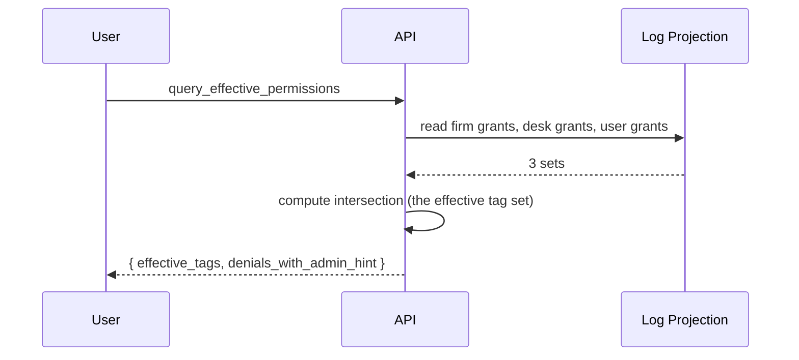

# Permissioning / Config (FXPV & PF)

The user-facing permissioning and configuration workflow covering FXPV (FX Pre-trade Validation) — the sales/trading permission and screen-config surface — and PF (Preferences) — the per-user setting surface. Both ride the same backbone: [[arch-firm-desk-user|firm/desk/user hierarchy]] + [[arch-tag-permissions|tag permissions]] + cascading settings.

## Purpose

Make permissions and settings concretely manageable: an admin or a user can see what they can / cannot do, request grants, change preferences, and inspect the effective merge of firm → desk → user values.

## Trigger / Entry Point

- Firm / desk admin opens the permissioning screen to grant tags.
- User opens their preferences screen to set defaults.
- A `query_effective_permissions(user_id)` API call.

## Actors

- Firm admin, desk admin, tag admin.
- End user (read-only on their own permissions; can modify own non-restricted preferences).
- [[arch-validator]] — uses the result of grants to gate operations.

## Steps (granting a tag)

```mermaid
sequenceDiagram
  participant FA as Firm Admin
  participant DA as Desk Admin
  participant TA as Tag Admin
  participant API as API
  participant L as Log

  FA->>API: grant_tag(firm_id, tag)
  API->>L: TagGranted{ scope=FIRM, tag, ... }
  DA->>API: grant_tag(desk_id, tag)
  API->>L: TagGranted{ scope=DESK, tag, ... }
  TA->>API: grant_tag(user_id, tag)
  API->>L: TagGranted{ scope=USER, tag, ... }
  Note over L: 3-layer AND-gate satisfied; user can now perform tag-gated ops
```

## Steps (querying effective permissions)



Critical UX detail: when a user sees a denial in this view, they get the exact admin hint — "you have the user grant; missing desk grant; talk to desk_admin = jdoe" — same as a runtime reject.

## Inputs

- For grants: `tag`, `scope` (FIRM | DESK | USER), `scope_ref`.
- For preferences: per-key value + (sometimes) scope (the field is firm-overridable or user-overridable per `Setting` definition).

## Outputs / Side Effects

- `TagGranted` / `TagRevoked` events.
- `PreferenceUpdated` events.
- Subsequent validator decisions reflect changes.

## Setting cascade (FXPF-style preferences)

```
resolved = user_value ?? desk_value ?? firm_value ?? default
```

Plus narrowing rules from [[arch-firm-desk-user]]:

- Caps (max-notional, max-tenor) **narrow downward**: desk cap cannot be widened by user.
- Defaults (TIF, account, broker) **resolve upward**: user value if set, else desk, else firm.

## Edge Cases & Nuances

- **Self-grant attempts.** Users cannot grant tags to themselves. Even tag-admin role for tag T cannot grant T to self for the same scope.
- **Revoking a permission with active rules / orders.** Revocation does not retroactively cancel orders; future actions requiring the tag fail. Active automation rules requiring the tag get suppressed at firing.
- **FXPV solicited screen.** A subset of the permissioning UI surfaced for sales-traders solicitating client trades — see [[two-step-approval]] FXPV section.
- **Effective-permission caching.** Caches keyed on (user_id, generation_id). Generation_id bumps on grant/revoke events.
- **Replay.** Permission decisions in replay use the historical event log; identical decisions reproduced.

## API mapping

```
operation: grant_tag
items: [{ tag, scope, scope_ref, effective_date?, expiry_date? }]

operation: revoke_tag
items: [{ tag, scope, scope_ref, reason }]

operation: query_effective_permissions
items: [{ user_id }]

operation: set_preference
items: [{ key, scope, scope_ref, value }]

operation: query_preferences
items: [{ scope?, scope_ref?, keys? }]
```

## Validator codes touched

`EMS-PRM-1001..1003` (3-layer denials), `EMS-PRM-2400` (self-grant attempt), `EMS-PRM-2401` (admin missing on grant).

## Permissions

- `#firm-admin`, `#desk-admin`, `#tag-admin` (3-layer hierarchy).
- `#preference-set-{key}` for restricted preferences (e.g. max-notional cannot be set by user).

## Related

- [[arch-firm-desk-user]] · [[arch-tag-permissions]] · [[arch-validator]] · [[arch-event-sourcing]]
- [[entry-point-bas]] · [[actions-framework]] · [[validation]]
- [[two-step-approval]] · [[trading-limits]] · [[counterparty-enablement]]
