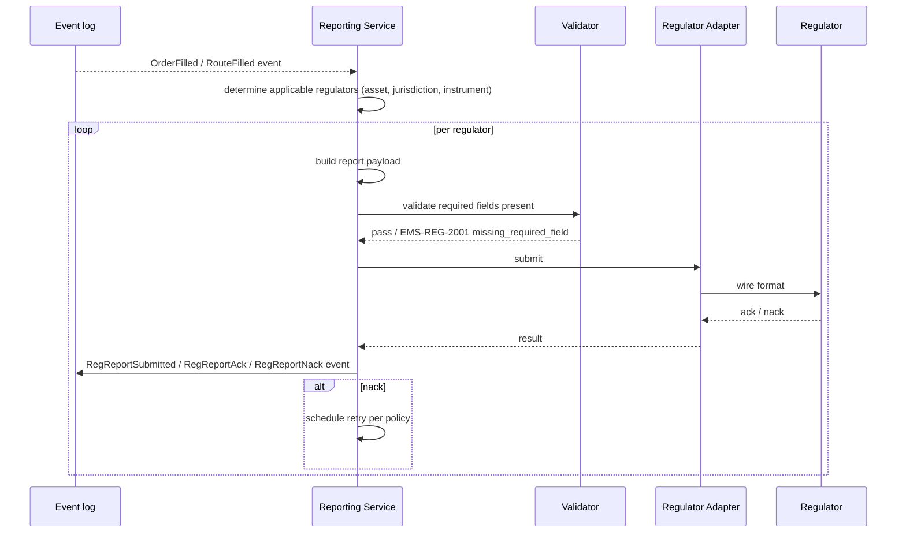

# Regulatory (Cross-Asset Base)

The cross-asset regulatory reporting workflow: per fill, derive the applicable regulator(s), build the required report, submit, track acknowledgement, handle retry / nack / manual triage. The bedrock under [[stp-summary]]'s regulatory column and the per-regulator notes under `40_regulatory/`.

## Purpose

Reporting is non-optional. Every fill, every amend, every cancel, can have a reporting obligation depending on asset class, jurisdiction, instrument, and execution venue. The base workflow makes the obligation determination deterministic and the submission auditable.

## Trigger / Entry Point

- Internal event: `OrderFilled`, `RouteFilled`, sometimes `OrderAmended` or `OrderCancelled`.
- Periodic reconciliation: regulator-specific position / exposure reports.

## Actors

- Regulatory reporting service.
- [[arch-validator]] — checks completeness of regulator-required fields.
- Outbound regulator adapter (per regulator: TRACE, MSRB, CFTC DTCC, etc.).
- Compliance ops (handles nacks / unmatched).

## Steps



## Determining applicable regulators

A small decision table keyed by `(asset_class, instrument, jurisdiction)`:

| Match | Regulator |
|---|---|
| US corp bond IG/HY, MBS | [[trace|TRACE]] |
| US muni | [[msrb-rtrs|MSRB]] |
| US gov bond | Fed |
| OTC IRS / CDS (US-nexus) | CFTC + DTCC SDR ([[cftc-sdr]]) |
| Whole loan (US bank) | FDIC / OCC ([[fdic-occ]]) |
| Equity (US) | FINRA ([[finra]]) |
| Cleared trades | FICC report ([[ficc-reporting]]) |
| SEF-executed | SEF reporting ([[sef-reporting]]) |

Multi-jurisdiction trades may report to multiple regulators independently.

## Inputs

- Event payload (the order / route / fill envelope).
- Per-firm regulatory configuration (LEI, registration status, jurisdiction).
- Instrument reference data ([[arch-symbology-figi]]).
- Counterparty enablement record ([[counterparty-enablement]]) for cpty LEI.

## Outputs / Side Effects

- Outbound regulator messages (per protocol — typically FIX or RegOpsAPI).
- `RegReportSubmitted`, `RegReportAck`, `RegReportNack`, `RegReportRetry`, `RegReportEscalated` events.
- Ops dashboard surfacing unmatched / nacked reports.

## Edge Cases & Nuances

- **Late counterparty info.** Required field missing at fill time; report queues with `RegReportDeferred` until info available.
- **Reporting deadlines.** Each regulator has timing rules (e.g. TRACE 15-minute window). Late submissions emit a `RegReportLate` event for ops attention.
- **Retry policy per regulator.** Configurable backoff; final failure → manual triage.
- **Cancel reporting.** Many regulators require cancel reports too; some cancels are "as if never traded" semantics. Per-regulator rules.
- **Amend reporting.** Some require a corrected report; others want a void + new.
- **Cross-jurisdiction conflicts.** A trade subject to two regulators with conflicting field semantics — reported independently per regulator, with translation tables.
- **Replay determinism.** Reports in replay mode are sandboxed (not sent); the event sequence reproduces the same would-be submissions.

## API mapping

Mostly event-driven; admin surfaces:

```
operation: resend_regulatory_report
items: [{ report_id, reason }]

operation: query_regulatory_status(filter)

operation: register_regulator_config
items: [{ regulator, firm_lei, jurisdiction, ... }]
```

## Validator codes touched

`EMS-REG-2001..2010` (missing fields per regulator), `EMS-REG-3001` (LEI not registered), `EMS-REG-9999` (regulator-unmapped reject from venue).

## Permissions

- `#regulatory-report-resend` for manual resends.
- `#regulator-config-admin` for `register_regulator_config`.

## Related

- [[arch-event-sourcing]] · [[arch-symbology-figi]] · [[arch-validator]] · [[arch-venue-connectivity]]
- [[stp-summary]] · [[counterparty-enablement]] · [[trading-limits]]
- `40_regulatory/` notes, including [[trace]], [[msrb-rtrs]], [[cftc-sdr]], [[finra]], [[ficc-reporting]], [[fed-reporting]], [[fdic-occ]], [[dtcc-sdr]], [[sef-reporting]]
