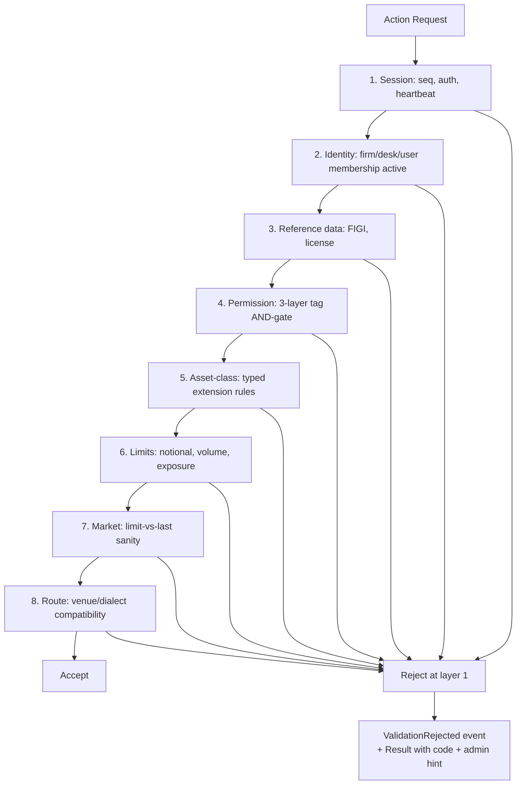

# Validation

The cross-asset validation workflow: every action runs through [[arch-validator|the validator]] in a fixed, layered order, producing either acceptance or a standardized reject with code + admin hint. This workflow note documents the operational view; [[arch-validator]] is the architectural reference.

## Purpose

Make validation predictable, debuggable, and reproducible. When a user gets a reject, they can:

- See the exact failing layer.
- See the exact code (e.g. `EMS-RTE-1003`) and its meaning.
- See the relevant admin to contact.
- Replay the same input in a sandbox and get the same reject.

## Trigger / Entry Point

Every action — `stage_orders`, `amend_orders`, `route_orders`, `bind_rule`, `subscribe`, `add_note`, `enable_counterparty`, etc.

## Actors

- Calling user / rule.
- Validator service.
- Subscribers to `ValidationRejected` events (compliance dashboards, ops queues).

## Layered evaluation



The order is fixed. A reject reports the **first failing layer**; layers below are not evaluated.

## Reject code namespace

| Prefix | Category | Examples |
|---|---|---|
| `EMS-SES-` | Session | `EMS-SES-1001` invalid credentials |
| `EMS-REF-` | Reference data | `EMS-REF-2001` unknown FIGI |
| `EMS-PRM-` | Permission | `EMS-PRM-1001..1003` 3-layer denials |
| `EMS-ORD-` | Order envelope | `EMS-ORD-1014` missing limit |
| `EMS-RTE-` | Route | `EMS-RTE-1003` capability unsupported |
| `EMS-AUT-` | Automation | `EMS-AUT-2001` action not permitted |
| `EMS-LIM-` | Limits | `EMS-LIM-1003` notional cap |

Full code list lives in the validator service and surfaces via [[arch-jmx-introspection|introspection]].

## Steps (a single validation pass)

1. Action arrives.
2. Validator enumerates applicable layers per action type.
3. Each layer evaluated in fixed order.
4. First failure → reject with code + admin hint.
5. All pass → action proceeds; `ValidationPassed` event for audit.

## Inputs

- The action request (full envelope).
- Reference data, permission registry, limit state, market state — all read from projections.

## Outputs / Side Effects

- `ValidationPassed` or `ValidationRejected` events.
- Aggregated `RejectCount{code}` metrics ([[arch-jmx-introspection]]) for ops dashboards.

## Edge Cases & Nuances

- **Validator changes.** New rules ship as version bumps; replay pins to a rule-set version. Test: `golden replay` confirms identical decisions.
- **Performance.** Hot path; budget < 100 µs per validation including ref-data lookups. Caches with explicit invalidation on event types.
- **Validator outage.** Conservative default = reject all actions with `EMS-SES-9999 validator_unavailable`. Better to halt new orders than let unvalidated traffic through.
- **Test coverage.** Every code has at least one golden test (input → expected reject envelope).
- **Per-firm rule overlays.** Some firms add custom layers; these slot into the standard order but cannot reorder it.

## API mapping

The validator is invoked internally by every action. Direct API surface:

```
operation: explain_rejection
items: [{ request_id, item_index }]
returns: { code, layer, rule, admin_hint, references_in_code: ["EMS-PRM-1001", ...] }
```

`explain_rejection` provides a deeper diagnostic; users typically see the brief reject in the original Result.

## Permissions

- The validator is a system service; no end-user-facing permissions.
- `#validator-rule-author` to publish new rule versions (admin only).

## Related

- [[arch-validator]] · [[arch-event-sourcing]] · [[arch-jmx-introspection]] · [[arch-time-replay-server]]
- [[entry-point-bas]] · [[actions-framework]] · [[order-manager]] · [[permissioning-config]] · [[regulatory-base]]
- [[trading-limits]] · [[counterparty-enablement]]
