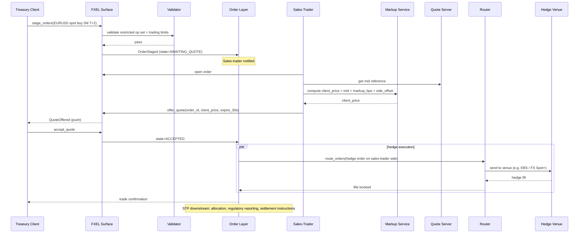

# Corp Treasury — Basic Workflow

The end-to-end happy-path of a corporate-treasury FX trade: from order entry through quote, accept, hedge, and confirmation. Other corp-treasury notes ([[fxel]], [[markup]], [[staging-on-behalf]], [[trading-limits]]) cover specific aspects of this flow.

## Purpose

Give a single end-to-end reference so subsequent specialised notes can refer "see step 5 of [[basic-workflow]]" rather than re-explaining the surrounding context.

## Actors

- Corporate treasury client.
- Sales-trader at the dealer.
- [[arch-order-staged|order layer]].
- [[arch-router-layer|router]] for the hedge side.
- [[arch-validator]] throughout.
- [[arch-quote-server]] for price reference.

## End-to-end sequence

## Steps (numbered)

1. **Treasury stages** a simple FX order via FXEL ([[fxel]]).
2. **Validator** checks the restricted op set ([[staging-restrictions]]), the trading limits ([[trading-limits]]), and the per-asset-class permissions.
3. **Order persists** as `AWAITING_QUOTE`.
4. **Sales-trader** opens the order, pulls market reference from [[arch-quote-server]], applies markup ([[markup]]).
5. **Quote offered** to treasury with an expiry window.
6. **Treasury accepts** (or rejects) within the window.
7. **On accept**, the order state transitions to `ACCEPTED`. The sales-trader's side fires a hedge order routed normally — typically to an FX CLOB or RFQ venue.
8. **Hedge fills** flow back, updating the order's `cum_qty` / `avg_px`. Difference between client_price and hedge cost is the dealer's mark-to-market PnL on the trade.
9. **Confirmation** sent to treasury; downstream STP ([[stp-summary]]) handles allocation ([[allocation-prime-broker]]), regulatory reporting, settlement instructions.

## Inputs

- Treasury: simple FX order envelope.
- Sales-trader: markup parameters (from desk policy + permitted band).
- Firm: trading limits, restricted-op tags, hedge-venue enablement.

## Outputs / Side Effects

- Per [[fxel]] event list.
- Hedge route lifecycle events ([[arch-router-layer]]).
- Confirmation outbound.
- Regulatory reporting per asset class / jurisdiction.

## Edge Cases & Nuances

- **Quote expires unaccepted.** Order remains in `AWAITING_QUOTE`. Sales-trader can re-price.
- **Sales-trader unavailable.** Order queues. Some firms auto-route to other sales-traders after a timeout.
- **Treasury cancels mid-quote.** `CancelDuringQuote` event; sales-trader notified.
- **Hedge fails / slips.** The trade is still on between sales-trader's firm and treasury at the accepted price; the dealer absorbs the slippage. PnL impact recorded in dealer's books.
- **Cross-jurisdiction.** Some treasury clients are subject to different reporting / documentation regimes; the order's regulatory metadata captures.

## API mapping

Same as [[fxel]] — no new operations.

## Validator codes touched

Aggregate of [[fxel]], [[staging-restrictions]], [[trading-limits]], [[markup]].

## Permissions

Per actor: `#corp-treasury-client`, `#fxel-sales-trader`, `#markup-author`, hedge-venue `#cpty-*`.

## Related

- [[fxel]] · [[markup]] · [[staging-restrictions]] · [[staging-on-behalf]] · [[trading-limits]]
- [[arch-order-staged]] · [[arch-router-layer]] · [[arch-quote-server]] · [[arch-validator]]
- [[stp-summary]] · [[tsox-aim-to-fxem]] · [[allocation-prime-broker]]
