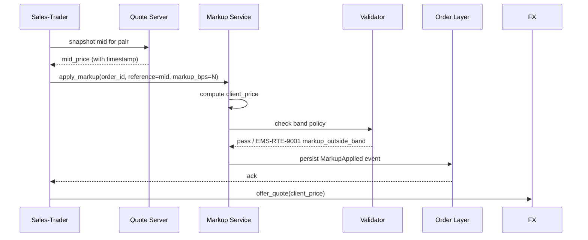

# Markup

Sales-traders offering quotes to corporate-treasury clients apply a **markup** — the difference between the dealer's hedge / internal price and the client-facing price. The EMS captures markups as **structured, validated, audited** transactions, not free-form price overrides.

## Purpose

Make markup a first-class object: bounded by regulatory and firm-policy bands, traceable per trade, and auditable for compliance (Dodd-Frank, MiFID II markup disclosure rules).

## Trigger / Entry Point

- Sales-trader prices a treasury order on the FXEL surface ([[fxel]]).
- Markup service computes `client_price = reference + markup_amount` for a side-aware offset.
- Automation may apply a default markup per client tier.

## Actors

- Sales-trader (markup author).
- Markup service (computation + validation).
- [[arch-validator]] — band enforcement.
- [[arch-event-sourcing|log]] — `MarkupApplied` event for audit.

## Markup envelope

```
MarkupRecord {
  markup_id              UUID
  order_id               UUID
  reference_kind         MID | BID | OFFER | LAST | FIRM_INTERNAL
  reference_price        decimal
  reference_source       quote_topic / order_book / firm_pricing_engine
  markup_value           { kind: BPS | TICKS | ABSOLUTE, amount: decimal }
  client_price           decimal                   # reference + side-aware markup
  side                   BUY | SELL                # treasury's side
  applied_by             Identity
  applied_at             timestamp
  band_policy_ref        BandPolicyRef             # the policy in effect at apply time
}
```

## Steps



## Band policy

A band defines the permitted markup range per:

- Client tier (Tier 1 / 2 / 3 — institutional vs. small-corp).
- Asset class (FX spot / forward / NDF).
- Currency pair (majors typically have tighter bands).
- Notional bucket (smaller trades may carry higher %).
- Region / regulator.

```
BandPolicy {
  policy_id, version,
  rules: [
    { asset_class, pair?, client_tier, notional_bucket?, min_bps, max_bps }
  ],
  effective_date, expiry_date?
}
```

The validator looks up the policy at `applied_at` and rejects if outside.

## Edge Cases & Nuances

- **Outside band.** `EMS-RTE-9001 markup_outside_band` with admin hint to firm pricing admin.
- **Stale reference.** If `mid_price` timestamp older than threshold, the validator may require sales-trader to refresh or accept a wider band.
- **Band policy change mid-life.** A markup applied yesterday under old policy is grandfathered (validated at apply time, not at later inspection time). The applied policy version is recorded on the markup record.
- **Sales-trader markdown.** Sometimes markups are negative (a discount). Bands allow this only with explicit `#markup-allow-negative`.
- **Mid-order re-markup.** Sales-trader can replace the markup before the quote is accepted. The previous markup is preserved in audit.
- **Disclosure rules.** Some regimes (e.g. Dodd-Frank) require disclosing markup to the client. The disclosure text and treasury-side acknowledgement are recorded as a side-event on the order.
- **Multi-leg.** For an FX swap, markup may apply per leg or to the package; per-leg is more common for clarity.

## API mapping

```
operation: apply_markup
items: [{
  order_id,
  reference: { kind, source },
  markup: { kind: BPS | TICKS | ABSOLUTE, amount },
  disclosure?: { text, acknowledged_by? }
}]

operation: list_markups(filter)            # audit / TCA

operation: register_band_policy            # admin
items: [{ policy_id, rules, effective_date }]
```

## Validator codes touched

`EMS-RTE-9001` (markup outside band), `EMS-RTE-9002` (stale reference), `EMS-PRM-1901` (`#markup-author` missing), `EMS-PRM-1902` (negative markup not allowed), `EMS-ORD-2503` (cannot re-markup after quote accepted).

## Permissions

- `#markup-author` (3-layer per [[arch-tag-permissions]]).
- `#markup-allow-negative` for discounts.
- `#markup-band-admin` for managing band policies.

## Related

- [[fxel]] · [[basic-workflow]] · [[staging-restrictions]] · [[trading-limits]]
- [[arch-validator]] · [[arch-quote-server]] · [[arch-event-sourcing]] · [[arch-tag-permissions]]
