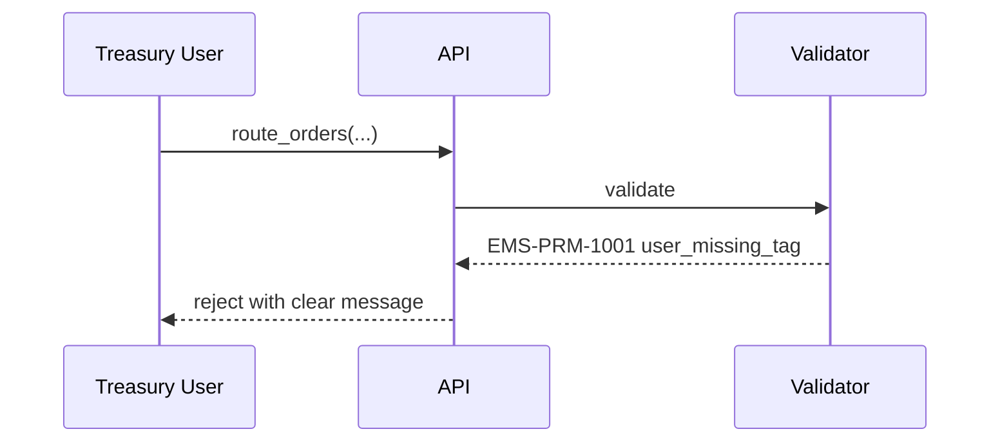

# Staging Restrictions (Corporate Treasury)

Corporate-treasury staging operates under a **restricted operation surface** versus a regular trading desk. This note enumerates the restrictions and how they are enforced.

## Purpose

Treasury users should not be able to do anything that's not part of "request a quote, accept or reject". The full trader toolset is intentionally hidden: no routing, no automation rule binding, no bulk ops, no aggressive route modes. Enforced declaratively at the validator with the `#corp-treasury-restricted` tag set.

## Trigger / Entry Point

- Treasury user staged via FXEL or equivalent ([[fxel]]).
- The user's identity carries `#corp-treasury-restricted`.

## Actors

- Treasury user.
- [[arch-validator]] — every operation gated by the restricted tag.

## What's restricted

```mermaid
flowchart LR
  CT[Treasury User]:::user
  CT --> A{[[arch-validator]]<br/>checks tag}:::v
  A -->|stage one order| OK1[Allowed]:::ok
  A -->|accept/reject quote| OK2[Allowed]:::ok
  A -->|amend notes / value_date| OK3[Allowed]:::ok
  A -->|cancel own order| OK4[Allowed]:::ok
  A -->|bulk operations| D1[Denied]:::den
  A -->|route_orders| D2[Denied]:::den
  A -->|bind automation rule| D3[Denied]:::den
  A -->|amend qty/side| D4[Denied]:::den
  A -->|set allocation template| D5[Denied — sales-trader uses internal default]:::den

  classDef user fill:#fde,stroke:#a55
  classDef v fill:#fed,stroke:#a85
  classDef ok fill:#efe,stroke:#575
  classDef den fill:#fee,stroke:#a55
```

## Specific restrictions

| Restriction | Enforcement |
|---|---|
| **One order at a time** | Batch size capped to 1 in `stage_orders` for treasury identity. |
| **Asset class limited to FX (often spot/forward only)** | Validator's asset-class permission tags. |
| **No outright derivative orders** | `#trade-rates-credit-deriv` not granted to treasury. |
| **No routing operations** | `#route` tag not granted; even attempting `route_orders` returns `EMS-PRM-1001`. |
| **No automation binding** | `#auto-route-binder` not granted. |
| **No amend of qty/side/instrument** | Per-field amend tag `#amend-material-treasury` not granted; `EMS-ORD-2501 cannot_amend_after_quote`. |
| **No bulk** | `#bulk-*` not granted. |
| **Trading-hour gate (optional)** | Some firms gate by time-of-day — see [[trading-limits]]. |

## Steps (typical user attempt → reject)



Every restricted-op denial includes the admin hint per [[arch-validator]] / [[arch-tag-permissions]] so the user knows who to contact (always firm/desk admin — they can't lift it).

## Edge Cases & Nuances

- **Treasury user with a tag they shouldn't have.** Permission tags are 3-layer AND-gated. A treasury user accidentally granted `#route` user-level still fails because firm-level `#route` is not granted to the treasury firm.
- **Sales-trader on behalf.** Sales-trader uses their full identity for routing the hedge; restrictions don't apply to them. See [[staging-on-behalf]] for the on-behalf semantics.
- **Restricted ops visible in UI.** The FXEL UI hides ops the user cannot perform, derived from the user's effective tag set. This is UX, not security.
- **Audit of denied ops.** All denials are logged as `PermissionDenied` events; firm compliance can review.

## API mapping

No new operations; the restrictions are declarative in the [[arch-validator|validator rules]] keyed off `#corp-treasury-restricted`.

## Validator codes touched

`EMS-PRM-1001..1003` (3-layer denials), `EMS-ORD-2501` (cannot amend after quote), most `EMS-RTE-*` codes when restricted users attempt routing.

## Permissions

- `#corp-treasury-restricted` (3-layer, grants the deny-by-default profile).

## Related

- [[fxel]] · [[arch-validator]] · [[arch-tag-permissions]] · [[arch-firm-desk-user]]
- [[basic-workflow]] · [[markup]] · [[staging-on-behalf]] · [[trading-limits]]
- [[two-step-approval]]
