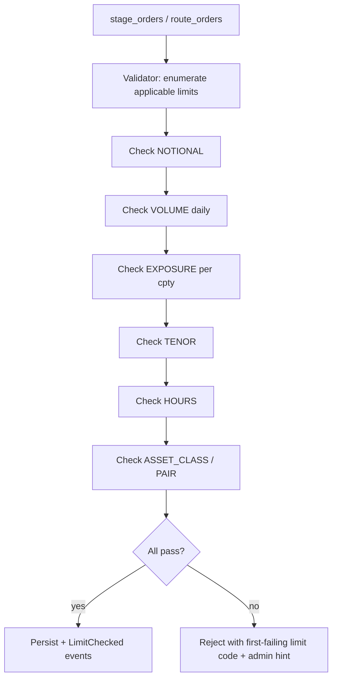

# Trading Limits

Per-client, per-desk, and per-firm caps on what can be traded — by notional, by tenor, by counterparty exposure, by daily volume, by time of day. Enforced at the [[arch-validator|validator]] on every staging and routing operation.

## Purpose

Make limit enforcement mechanical and auditable: never rely on convention or human policing. Every limit failure is a clear, code-mapped reject explaining which limit and at which scope.

## Trigger / Entry Point

- Any `stage_orders` or `route_orders` call triggers per-call limit evaluation.
- Periodic limit usage projection (intraday) computed for risk reporting.
- Admin operations: register, amend, retire limits.

## Actors

- Firm risk / treasury admin — sets limits.
- [[arch-validator]] — enforces per call.
- [[arch-event-sourcing|log]] — `LimitChecked`, `LimitBreached` events.

## Limit taxonomy

| Limit kind | Scope | Examples |
|---|---|---|
| Notional per single order | client / desk / firm | "no single order > 50M USD" |
| Daily volume | client / desk / firm | "client X cannot trade > 200M USD per day" |
| Outstanding exposure (per cpty) | firm | "exposure to counterparty Y not to exceed 100M" |
| Tenor cap | client / firm | "no forwards > 1y" |
| Trading hours window | client / desk | "treasury can only trade 09:00–17:00 NY" |
| Asset-class restriction | client | "no commodity for treasury" |
| Currency pair restriction | client | "treasury allowed major pairs only" |
| Per-instrument cap | firm | "max position in single bond CUSIP" |

## Limit storage shape

```
Limit {
  limit_id          UUID
  kind              one_of(NOTIONAL | VOLUME | EXPOSURE | TENOR | HOURS | ASSET_CLASS | PAIR | INSTRUMENT)
  scope             FIRM | DESK | CLIENT | USER
  scope_ref         id
  value             decimal | enum | TimeWindow
  per_period?       DAY | WEEK | MONTH      # for VOLUME-style
  warn_at?          decimal                 # soft-warn threshold (e.g. 80% of value)
  effective_date, expiry_date?
}
```

## Steps



All limit checks are deterministic; the order of evaluation is fixed so reject messages are stable.

## Inputs

- The operation being validated (with its full envelope).
- Current state of usage counters (read from projections of [[arch-event-sourcing|the event log]]).

## Outputs / Side Effects

- `LimitChecked { limit_id, used, headroom }` per limit (for risk dashboard).
- `LimitBreached { limit_id, attempted_value, current_used }` on reject.
- Possible automation rule firing on `LimitWarning` when soft-warn threshold crossed.

## Edge Cases & Nuances

- **Concurrent staging racing the same limit.** Optimistic check then atomic commit at the validator's commit phase; second writer may see `EMS-LIM-2001 limit_breached_in_concurrent_window` and retry.
- **Replay determinism.** Limit usage is a function of the event log. Replay reproduces limit-check outcomes identically.
- **Soft-warn vs hard-reject.** `warn_at` triggers an automation event but does not block; only the hard limit blocks. UI surfaces the warning visually.
- **Cross-currency limits.** Notional limits in USD may apply to non-USD orders; conversion done at the time of check using the firm's reference FX (from [[arch-quote-server]] or a published reference). Stale reference → `EMS-LIM-3001 ref_fx_stale`.
- **Tenor cap and rolls.** A forward whose tenor is below the cap today may exceed it after the [[tradedate-roll|trade-date roll]] — handled by the rolling re-evaluation.
- **Per-client window.** Trading-hours window can be timezone-specific per client.
- **Limit retirement.** Setting `enabled=false` on a limit stops new checks but does not retroactively unfreeze breached orders.

## API mapping

```
operation: register_limit
items: [{ limit }]

operation: amend_limit
items: [{ limit_id, fields }]

operation: retire_limit
items: [{ limit_id }]

operation: list_limits(filter)
operation: query_limit_usage(scope, scope_ref)   # for dashboards
```

## Validator codes touched

`EMS-LIM-1001..1010` (one per limit kind), `EMS-LIM-2001` (concurrent breach), `EMS-LIM-3001` (reference rate stale).

## Permissions

- `#limit-admin` (3-layer) for register / amend / retire.

## Related

- [[arch-validator]] · [[arch-event-sourcing]] · [[arch-quote-server]] · [[arch-time-replay-server]] · [[arch-tag-permissions]]
- [[fxel]] · [[basic-workflow]] · [[markup]] · [[staging-on-behalf]] · [[staging-restrictions]]
- [[netting-auto-via-excel]] · [[counterparty-enablement]]
