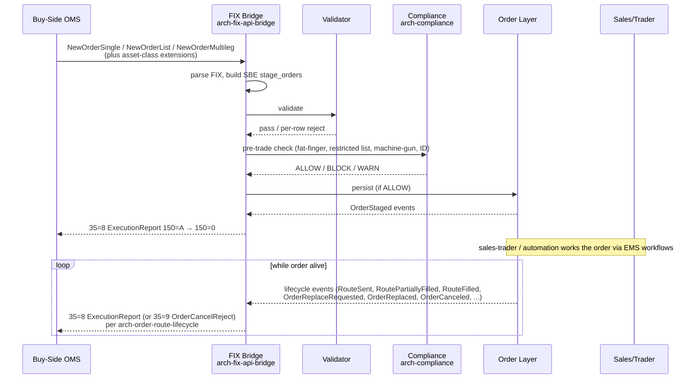

# Buy-Side OMS Integration

The inbound flow from a **buy-side Order Management System** (OMS) — whether a vendor product, a buy-side proprietary OMS, an asset-manager / hedge-fund / corporate-treasury front-office, or any FIX-capable upstream — into this EMS. Covers the protocol handshake, the data mapping into our canonical envelope, and the lifecycle echo back so the buy-side system tracks order state in real time without drift.

## Purpose

Make the EMS a clean, predictable destination for any upstream FIX-capable OMS. The upstream gets an order in our system, we work it through routing / SOR / venues, and every state change is echoed back as a FIX `ExecutionReport` so their blotter stays in sync.

## Trigger / Entry Point

- Upstream OMS opens a FIX session (or uses the EMS API).
- The session's `SenderCompID` (FIX) or API identity maps to a registered `(firm, desk)` per [[arch-firm-desk-user]].
- Per the [[arch-fix-api-bridge|mixed-client rule]], the upstream picks a primary surface: FIX-only, API-only, or FIX-stage + API-manage.

## Actors

- Upstream buy-side OMS (any FIX-capable OMS — institutional, corp-treasury, hedge-fund prop OMS, sell-side desk OMS).
- [[arch-fix-api-bridge]] at our EMS.
- [[arch-order-staged|order layer]].
- Sales-trader / trader at the receiving firm.

## Steps

1. Upstream sends `D` / `E` / `AB` / `G` / `F` per its order intent.
2. FIX bridge decodes per asset-class extension rules (FX value_date, FI CUSIP+settle_date, equity DMA flags, options strike+expiry, etc.).
3. Standard validation + compliance + persistence.
4. **Echoes back as `ExecutionReport`** for every state change — critical for upstream blotter sync.

## Inputs — common upstream extension fields

Beyond standard FIX tags (see [[staging-via-fix]]), buy-side OMSs typically carry:

- **Fixing-order extensions**: `is_fixing`, `benchmark` (WMR_4PM / ECB_115 / BFIX / iNAV / etc.), `fix_time`, `pre_fix_minutes`, `post_fix_minutes`. Often in custom tags or structured XML in tag 213.
- **Batch / program kind**: `REBALANCE`, `BENCHMARK_REBALANCE`, `CASH_FLOW`, `OPTIONS_DELTA_HEDGE`, `MERGER_ARB`, `PAIRS`. Drives downstream automation rule selection.
- **Source trader / decision-maker identity**: per [[arch-jurisdictional-compliance|RTS 22]] requirements.
- **Strategy hint**: upstream may suggest an algo / routing strategy; the receiving firm's policy decides whether to follow (per [[arch-best-execution|best-ex policy]]).
- **Client-directed-instruction flag**: distinguishes client-directed venue choices from discretionary routing.
- **Allocation template ID**: where allocation is pre-determined upstream.
- **Cross-system order reference**: upstream's internal ID, preserved on the EMS envelope for audit cross-lookups.

The bridge supports **per-counterparty extension dialects** — different upstream OMS vendors / generations encode these fields differently; the catalog handles the variation.

## Outputs / Side Effects

- All standard order events on the [[arch-event-sourcing|event log]].
- Outbound `35=8` ExecutionReport, `35=9` OrderCancelReject, `35=j` BusinessMessageReject per [[arch-fix-api-bridge]].
- Possible [[arch-automation-layer|automation rule]] firings keyed on extension fields (e.g. [[auto-route-fixing-orders|fixing-order auto-route]], [[fx-automation-rbld|FX rebalance automation]]).

## Edge Cases & Nuances

- **Batch upload pacing.** Some upstream batches arrive over seconds-to-minutes. Firm policy decides batch close on quiet-window timeout vs. explicit close marker.
- **Mixed FIX + manual edit (the classic integration gotcha).** Upstream expects to drive the order; if a receiving-firm trader manually amends in the EMS, upstream sees the update as the standard cancel/replace lifecycle echoes — `35=8 ExecType=E Pending Replace` then `35=8 ExecType=5 Replaced` — per [[arch-order-route-lifecycle]]. Some upstream systems handle this gracefully, others get out of sync — a perennial integration issue. The EMS surface is deterministic; behaviour on the upstream side is per-system.
- **Order matching key.** Upstream's `ClOrdID` is unique per its session per day. EMS-internal `order_id` is the canonical id; both preserved on the order envelope.
- **Cancel race.** Upstream cancel arrives while EMS already routed. Cancel propagates to venue; late venue fill becomes anomaly per [[arch-fix-appendix-d|Appendix D D4/D5]].
- **Extension dialect heterogeneity.** Different upstream products and even different versions of the same product encode metadata differently. The bridge supports a per-counterparty extension dialect catalog, versioned in [[arch-reference-data-service]].
- **Pure FIX vs API mixed.** Upstream is normally pure FIX. If the buy-side firm also has an API session for the same `SenderCompID`, the [[arch-fix-api-bridge|mixed-client rule]] applies — FIX-only staging, API for everything else, FIX echoes outbound.
- **"Open trade" semantics.** Some upstreams consider a partially-filled-but-still-working order as "open" for cancel purposes; this EMS treats them identically — cancel from upstream cancels the residual route.
- **Pre-trade compliance for delegated decisions.** When upstream sends a client-directed routing instruction, our [[arch-compliance|compliance]] still applies — a client cannot bypass restricted-list or sanctions checks via routing instruction.

## API mapping

No new operations; this is purely a FIX inbound integration that maps to existing `stage_orders` / `amend_orders` / `cancel_orders` per [[arch-fix-api-bridge]].

## Validator codes touched

All standard codes; common upstream-integration surface: `EMS-REF-1001` (license denied for identifier from upstream), `EMS-ORD-1015` (GTC age cap), `EMS-RTE-1013` (TIF unsupported), `EMS-PRM-2110` (LEI required for jurisdiction).

## Permissions

- Upstream's `SenderCompID` mapped to a registered `(firm, desk)` identity with the appropriate `#trade-*` tags.
- Mapping is reference data in [[arch-reference-data-service]] with sign-off; spurious or duplicate `SenderCompID` claims are detected at logon.

## Related

- [[arch-fix-api-bridge]] · [[arch-order-staged]] · [[arch-validator]] · [[arch-compliance]] · [[arch-firm-desk-user]]
- [[staging-via-fix]] · [[auto-route-fixing-orders]] · [[fx-automation-rbld]]
- [[fxel]] · [[stp-summary]] · [[counterparty-enablement]]
