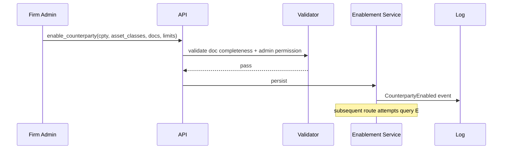

# Counterparty Enablement

Counterparties (dealers, venues, brokers, prime brokers, custodians) are not implicitly tradable — they must be **explicitly enabled** at the firm + desk + (often) user level. This workflow covers the enablement registry, the per-asset-class enablement, and the linkage to [[arch-tag-permissions|3-layer tag permissions]].

## Purpose

Make counterparty access a controlled vocabulary: a single source of truth listing who can trade with whom, for what, with which documentation in place, and at which limits.

## Trigger / Entry Point

- Firm admin onboards a new counterparty: `enable_counterparty([{cpty_id, asset_classes, documentation, limits}])`.
- A trader attempts to route to / quote from a counterparty; validator checks enablement.
- Periodic review: enablement records carry expiry / review-due dates.

## Actors

- Firm admin.
- Compliance.
- [[arch-validator]] — checks on every route / RFQ.
- [[arch-event-sourcing|log]] — enablement events stream.

## Enablement envelope

```
CounterpartyEnablement {
  cpty_id           CounterpartyRef
  firm_id           FirmRef
  asset_classes     set<AssetClass>
  venues            set<VenueRef>            # which venues this cpty is reachable on
  documentation_refs map<doc_kind, doc_ref>  # ISDA, CSA, GMRA, etc. — see 60_documentation/
  limits            [LimitRef]               # references into [[trading-limits]]
  enabled           bool
  pre_authorized    bool                     # see [[pre-authorized-cptys]]
  effective_date, expiry_date?, review_due?
  notes
}
```

## Steps



## Per-asset-class documentation requirements

| Asset class | Required documents |
|---|---|
| OTC IRS / CDS | [[isda]] + [[csa]] + asset-specific annex (e.g. [[cds-annex]]) |
| Repo | [[gmra]] |
| Cash equity / corp bond | [[dvp]] settlement instructions |
| TBA / MBS | [[sifma-tba-guidelines]] |
| Whole loan | [[loan-agreement]] |
| Convertibles | [[convertible-indenture]] (per instrument) |
| FX (deliverable) | usually master agreement at firm level |

Missing required doc → `EMS-PRM-2100 documentation_missing` with the specific doc kind named.

## Edge Cases & Nuances

- **Counterparty retirement.** Setting `enabled=false` stops new routes but does not affect in-flight orders. Existing routes complete; new ones rejected.
- **Document expiry.** ISDAs and CSAs are amended periodically. Past-expiry doc → block until renewed.
- **Per-desk enablement.** Firm-level enablement is necessary but not sufficient; each desk must also be enabled. See [[arch-tag-permissions|3-layer]] rule.
- **Per-user enablement (optional).** Some firms add an additional user-level enablement gate for specific cpty (typically for new traders).
- **Enablement audit.** Every change recorded; compliance reviews at periodic intervals.
- **Sanction screening.** Enablement integrates with sanctions screening; a sanctioned cpty is hard-blocked even if enablement record is `enabled=true`.
- **Linked allocations.** Enablement affects allocation-template account-pickable lists; revoking a PB also revokes templates referencing that PB.

## API mapping

```
operation: enable_counterparty
items: [{ cpty_id, asset_classes, venues, documentation_refs, limits, effective_date, expiry_date? }]

operation: amend_counterparty
items: [{ cpty_id, fields }]

operation: retire_counterparty
items: [{ cpty_id }]

operation: list_counterparties(filter)

operation: query_enablement(cpty_id, asset_class) returns enablement_record
```

## Validator codes touched

`EMS-PRM-2100` (documentation missing), `EMS-PRM-2101` (counterparty not enabled for asset class), `EMS-PRM-2102` (counterparty retired), `EMS-PRM-2103` (documentation expired), `EMS-PRM-2104` (sanctioned).

## Permissions

- `#counterparty-admin` (3-layer) for enable / amend / retire.
- `#sanctions-screen-override` (rarely granted, fully audited).

## Related

- [[arch-validator]] · [[arch-event-sourcing]] · [[arch-tag-permissions]] · [[arch-firm-desk-user]]
- [[trading-limits]] · [[pre-authorized-cptys]] · [[broker-codes]] · [[allocation-prime-broker]]
- `60_documentation/` notes
