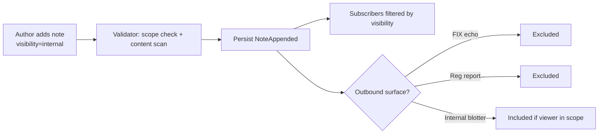

# Internal Notes

Notes scoped to **internal-only** visibility — invisible to clients, FIX-paired counterparts, and outbound regulatory reports. Used for trader rationale, compliance hand-offs, and operational context that should never leave the firm.

## Purpose

Distinguish operational/compliance commentary from client-facing notes (see [[notes-and-custom-notes]] for the general note workflow). An internal note is the right place for "client X is shaky on this trade idea, do not push", "compliance signed off but watch for adverse selection", or "broker Y's connectivity flaky today".

## Trigger / Entry Point

- Trader / sales / compliance adds an internal note via UI ("Internal" toggle on note ticket).
- API `add_note([{order_id, text, kind, visibility: "self_only" | "desk_internal" | "firm_internal"}])`.
- Automation may append diagnostic notes on certain rule firings.

## Actors

- Trader / sales / compliance.
- [[arch-validator]] — enforces visibility scopes.
- Outbound services (FIX echo, reg reporting) — read the visibility and filter.

## Visibility scopes

| Scope | Who sees |
|---|---|
| `self_only` | The author only. Audit retains; supervisors with `#supervisor-read-all` can read. |
| `desk_internal` | Author's desk colleagues. Default for trader internal notes. |
| `firm_internal` | Firm-wide. Default for compliance-tagged internal notes. |

**External surfaces always exclude internal notes**: FIX `8` ExecutionReport doesn't echo, reg reporting omits, client-facing UI views omit.

## Steps



## Inputs

- `text` or `custom_notes` key/value (see [[notes-and-custom-notes]]).
- `visibility: self_only | desk_internal | firm_internal`.
- `kind` — typically `compliance`, `risk`, `ops_diagnostic`.

## Outputs / Side Effects

- `NoteAppended { visibility: internal-* }` event.
- Audit retains across all visibility scopes; redaction is purely an outbound concern.

## Edge Cases & Nuances

- **Accidental disclosure risk.** Outbound surfaces must explicitly filter. Defense: visibility is encoded on the note, every outbound serializer reads it. Test: every outbound surface has a "no internal note leaks" property test on every release.
- **Supervisor access.** Supervisors can read all visibility scopes within their desk / firm. This requires `#supervisor-read-all`.
- **Internal notes survive ownership transfer.** New owner inherits visibility scope; notes don't disappear.
- **Regulatory subpoena.** Internal notes are subpoena-able; the visibility scope is a usability feature, not a legal privilege.
- **MNPI marking.** Internal notes containing material non-public information should be tagged `kind=mnpi`; auto-flagged by content scanner; access further restricted to need-to-know users.
- **Editing.** Append-only like all notes; corrections are new notes that supersede.

## API mapping

Same as [[notes-and-custom-notes]] with explicit visibility:

```
operation: add_note
items: [{
  order_id,
  text,
  kind:        "compliance" | "risk" | "ops_diagnostic" | "mnpi" | "general",
  visibility:  "self_only" | "desk_internal" | "firm_internal"
}]
```

## Validator codes touched

`EMS-ORD-1019` (length cap), `EMS-PRM-1101` (kind requires tag), `EMS-PRM-2200` (visibility scope upgrade requires tag).

## Permissions

- `#internal-note-author` (3-layer).
- `#supervisor-read-all` for cross-scope visibility.
- `#mnpi-note-author` for `kind=mnpi`.

## Related

- [[arch-validator]] · [[arch-event-sourcing]] · [[arch-tag-permissions]] · [[arch-fix-api-bridge]]
- [[notes-and-custom-notes]] · [[order-ownership]] · [[two-step-approval]]
- [[stp-summary]] · [[staging-on-behalf]]
