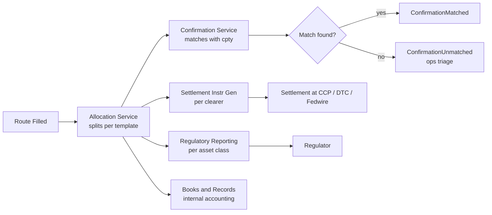

# STP Summary

Straight-Through Processing (STP) is the post-execution pipeline: allocation, confirmation, settlement instruction generation, regulatory reporting, books-and-records booking, with **no manual touch points** in the happy path. This note summarizes how the EMS interfaces with STP and what flows back as `Anomaly` events.

## Purpose

Provide a single map of the post-trade hand-offs so workflows can reference "see STP step 3" rather than re-describing the pipeline. Also catalogues the STP-related event taxonomy.

## Trigger / Entry Point

- Order reaches a fillable state (`RouteFilled` / `OrderFilled` events).
- Each fill emits one or more STP-bound events.

## Actors

- [[arch-router-layer]] — emits `RouteFilled`.
- [[arch-order-staged|order layer]] — emits `OrderFilled` (with allocation).
- Allocation service.
- Confirmation service (matches to dealer's affirmation — see [[route-to-cnf]]).
- Settlement instruction generator (per asset class / clearer).
- Regulatory reporting service.
- Books-and-records integration.

## STP pipeline



### Specific reporting paths

| Asset class | Reporting | Where (see notes) |
|---|---|---|
| Corp bond IG/HY, MBS | TRACE | [[trace]] |
| Muni | MSRB RTRS | [[msrb-rtrs]] |
| IRS, CDS | CFTC + DTCC SDR | [[cftc-sdr]] |
| US gov bond | Fed | [[fed-reporting]] |
| Equity | FINRA | [[finra]] |
| Repo | Fed, OFR | [[fed-reporting]] |
| Whole loan | FDIC / OCC | [[fdic-occ]] |

### Specific clearing/settlement paths

| Asset class | Clearer |
|---|---|
| Equity | [[dtc]] (T+1) |
| US Treasury | [[fedwire]], [[ficc-clearing]] |
| Corp / Muni | [[dtc]] |
| OTC IRS | [[lch]] / [[cme-clear]] |
| OTC CDS | [[ice-clear]] |
| TBA / MBS | [[ficc-clearing]] |
| FX | bilateral / [[triparty-clearing|triparty]] for repo collateral |
| Eurobonds | [[euroclear]] / [[clearstream]] |

## Events

```
TradeBooked             { order_id, fills_summary, allocations }
AllocationApplied       { account, qty, price, settlement_target }
ConfirmationSubmitted   { cpty, confirmation_ref }
ConfirmationMatched     { ... }
ConfirmationUnmatched   { reason, ops_queue }
SettlementInstructed    { clearer, instruction_ref }
RegReportSubmitted      { regulator, report_ref }
RegReportAck            { ... }
RegReportNack           { error_code, retry_window }
StpAnomaly              { stage, details, ops_queue }
```

All flow into [[arch-event-sourcing|the log]] and have stable, code-mapped error semantics.

## Edge Cases & Nuances

- **Confirmation mismatch.** Dealer's confirmation differs from the EMS's view. `ConfirmationUnmatched` events queue to ops. Resolution: amend on one side, re-confirm.
- **Reg report fail.** Regulator nack'd. Retry per the regulator's retry policy. After threshold attempts → `StpAnomaly` for manual intervention.
- **Allocation late-arriving.** A "block now, allocate later" workflow leaves `AllocationDeferred` events; the allocation arrives, completes the pipeline.
- **Cross-jurisdictional reporting.** Some trades fall under multiple regulators (e.g. dual-listed); each report is independent.
- **Replay determinism.** STP outbound calls in replay mode are sandboxed; the event log reproduces the same submissions deterministically.
- **Books-and-records integration.** Often a near-real-time push or end-of-day batch into a separate ledger system. Both supported; the integration shape is an outbound adapter analogous to [[arch-venue-connectivity]].

## API mapping

STP is mostly event-driven internally, not exposed as a foreground API. Subscriptions:

```
operation: subscribe
items: [{ topic: "stp.*", filter: { asset_class? } }]

operation: list_stp_anomalies(filter)
```

## Permissions

- `#stp-ops` (3-layer) for ops users.
- `#regulatory-report-resend` for forced retries.

## Related

- [[arch-event-sourcing]] · [[arch-venue-connectivity]] · [[arch-router-layer]] · [[arch-validator]]
- [[allocation-prime-broker]] · [[route-to-cnf]] · [[counterparty-enablement]]
- `40_regulatory/`, `50_clearing_settlement/`, `60_documentation/`
