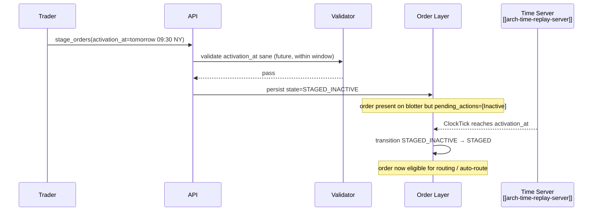

# Temporal

"Temporal" in the EMS workflow vocabulary refers to **time-bound order semantics** that don't fit neatly into [[expiry-type|TIF]] or [[effective-date|effective date]]: activation windows, scheduled releases, conditional time gates, and similar. This note documents what falls under "temporal" and how each maps to the time / replay infrastructure.

> Some firms originally introduced this term as a catch-all; treat this note as the canonical decomposition.

## Purpose

Avoid a vague "temporal" bucket that drifts. Pin each time-bound semantic to either:

- A standard envelope field ([[expiry-type|tif]], [[effective-date|effective_date]], `activation_at`, `expire_at`), or
- A [[arch-automation-layer|rule]] driving the time-bound behavior (auto-route at start of window, auto-cancel on timer, etc.).

## Concepts under "temporal"

| Concept | Modeled as |
|---|---|
| Activation time (stage now, become routable later) | Order field `activation_at: timestamp` |
| Expiry time (in addition to TIF) | Order fields `expire_at`, plus TIF semantics (see [[expiry-type]]) |
| Fixing window | Rule-driven (see [[auto-route-fixing-aim]]) |
| Trading-hours gate | Per-client/desk limit (see [[trading-limits]]) |
| Roll behaviour | [[tradedate-roll]] |
| Scheduled batch close | Batch policy (see [[batch-creation]]) |
| Time-of-day-aware automation | Rule with `active_window` (see [[arch-automation-layer]]) |
| Bench-fixing observation | Rule that listens for the fix publication event |

## Steps (illustrative — activation_at semantics)



## Implementation principles

- **No wall-clock reads in business logic.** Everything time-related goes through [[arch-time-replay-server|the clock interface]] for determinism.
- **Events for transitions.** Every time-driven state change emits an event (`OrderActivated`, `OrderExpired`, `WindowOpened`, `WindowClosed`).
- **Replayable.** [[arch-time-replay-server|Simulated clock]] reproduces transitions exactly in replay.

## Inputs

Per concept — see the relevant linked workflow.

## Outputs / Side Effects

Per concept.

## Edge Cases & Nuances

- **`activation_at` in the past at staging.** Reject `EMS-ORD-1052 effective_date_in_the_past` (covers the activation case too).
- **Activation across [[tradedate-roll|trade-date roll]].** An order activating in tomorrow's trade date doesn't auto-expire at today's roll; it activates fresh tomorrow.
- **Cross-region time references.** Activation specified in client timezone; converted to UTC for the clock subscription.
- **Bursty activation.** Many orders activating at the same instant; the time-server tick fan-out handles N-thousand activations in one tick. Bottlenecks fall on validator throughput, not on time tracking.
- **DST transitions.** Activations specified by wall time + zone must respect DST; spring-forward gaps and fall-back overlaps logged for ops review.

## API mapping

No "temporal" operation per se; the relevant fields and rules are on the order envelope and automation layer:

```
order.activation_at?:  timestamp
order.expire_at?:       timestamp     # in addition to TIF
order.window?:          { start: timestamp, end: timestamp }    # rare; usually rule-driven
```

## Validator codes touched

`EMS-ORD-1052` (past), `EMS-ORD-1054` (activation after expiry), `EMS-ORD-1055` (window invalid), `EMS-ORD-1056` (activation_at across roll requires explicit flag).

## Permissions

- `#schedule-future-activation` for `activation_at`.

## Related

- [[arch-time-replay-server]] · [[arch-event-sourcing]] · [[arch-order-staged]] · [[arch-automation-layer]]
- [[expiry-type]] · [[effective-date]] · [[tradedate-roll]] · [[auto-route-fixing-aim]] · [[batch-creation]]
