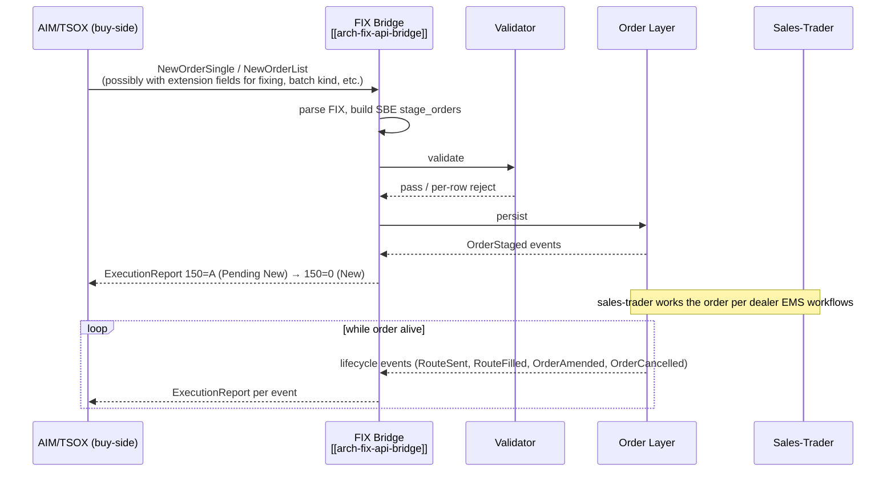

# TSOX (AIM) → FXEM Workflow

The flow from a buy-side OMS — Bloomberg AIM/TSOX — into the dealer EMS (FXEM equivalent for FX, EMSX for equity, equivalent for FI). This note describes the integration boundary and what the EMS expects on receipt.

## Purpose

Capture the protocol-level handshake, the data mapping from buy-side-OMS schema into the EMS canonical envelope, and the lifecycle echo back to the buy-side OMS so it tracks order state in real time.

## Trigger / Entry Point

- Buy-side OMS sends a FIX (or proprietary) message representing a new order, amend, or cancel.
- The receiving EMS instance has the buy-side OMS configured as a FIX counterparty (`SenderCompID` mapped to a known firm+desk identity).

## Actors

- Buy-side OMS (AIM, TSOX, others).
- [[arch-fix-api-bridge]] at the dealer EMS.
- [[arch-order-staged|order layer]].
- Sales-trader / trader at the dealer firm.

## Steps

1. AIM sends `D` / `E` / `AB` / `G` / `F` per its order intent.
2. FIX bridge decodes per asset-class extension rules (FX value_date, FI CUSIP+settle_date, equity DMA flags).
3. Standard validation + persistence.
4. **Echoes back as `ExecutionReport`** for every state change — this is critical: AIM's blotter cannot diverge from the EMS's view.

## Inputs (key FIX tags from AIM)

Beyond standard tags (see [[staging-via-fix]]), AIM-specific:

- Fixing-order extension: `is_fixing`, `benchmark`, `fix_time` (often custom tags in the 9300+ range or a structured XML in `213`).
- Batch kind: `RBLD`, `BENCHMARK_REBALANCE`, `CASH_FLOW`, `OPTIONS_DELTA_HEDGE`.
- Source trader identity: AIM trader ID for audit.
- Strategy hint: AIM may suggest an algo / routing strategy.

## Outputs / Side Effects

- All standard order events.
- Outbound `ExecutionReport` (`8`), `OrderCancelReject` (`9`), `BusinessMessageReject` (`j`) per [[arch-fix-api-bridge]].
- Possible automation rule firings keyed on AIM-specific extension fields (e.g. [[auto-route-fixing-aim]], [[fx-automation-rbld]]).

## Edge Cases & Nuances

- **AIM batch upload pacing.** Some AIM batches arrive over seconds-to-minutes; firm policy decides batch close on quiet-window timeout.
- **Mixed FIX + manual edit.** AIM expects to drive the order; if a dealer trader manually amends in the EMS, AIM sees the update as `ExecutionReport 150=5` (Replaced). Some AIM versions handle this gracefully, others get out of sync — common integration gotcha.
- **Order matching key.** AIM's `ClOrdID` is unique per AIM session per day. EMS-internal `order_id` is the canonical id; both are preserved on the order envelope for cross-system lookups.
- **Cancel race.** AIM cancel arrives while EMS already routed. The cancel propagates to venue; late venue fill is logged as anomaly.
- **Extension flexibility.** Different AIM versions encode fixing/batch metadata differently. The bridge supports a per-counterparty extension dialect catalog.
- **Pure FIX vs API mixed.** AIM is normally pure FIX. If the buy-side firm also has an API session, the [[arch-fix-api-bridge|mixed-client rule]] applies — but rare in this integration.
- **AIM's "open trade" semantics.** AIM may consider a partially-filled-but-still-working order as "open"; the dealer EMS treats it identically. Cancel from AIM cancels the residual route.

## API mapping

No new operations; this is purely a FIX inbound integration that maps to existing `stage_orders` / `amend_orders` / `cancel_orders` per [[arch-fix-api-bridge]].

## Validator codes touched

All standard codes; common AIM-specific surface: `EMS-REF-1001` (license denied for CUSIP from AIM), `EMS-ORD-1015` (GTC age cap), `EMS-RTE-1013` (TIF unsupported).

## Permissions

- AIM's `SenderCompID` mapped to a registered (firm, desk) identity with the appropriate `#trade-*` tags.

## Related

- [[arch-fix-api-bridge]] · [[arch-order-staged]] · [[arch-validator]] · [[arch-firm-desk-user]]
- [[staging-via-fix]] · [[auto-route-fixing-aim]] · [[fx-automation-rbld]]
- [[fxel]] · [[stp-summary]] · [[counterparty-enablement]]
