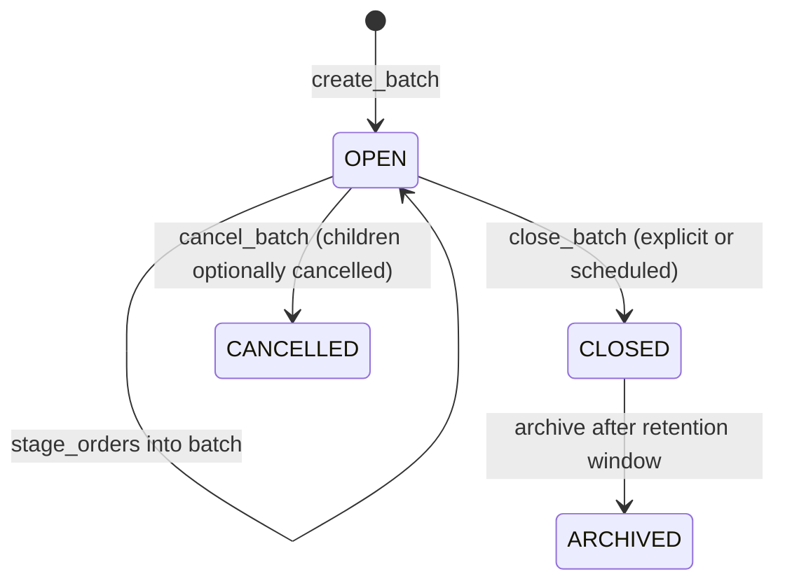
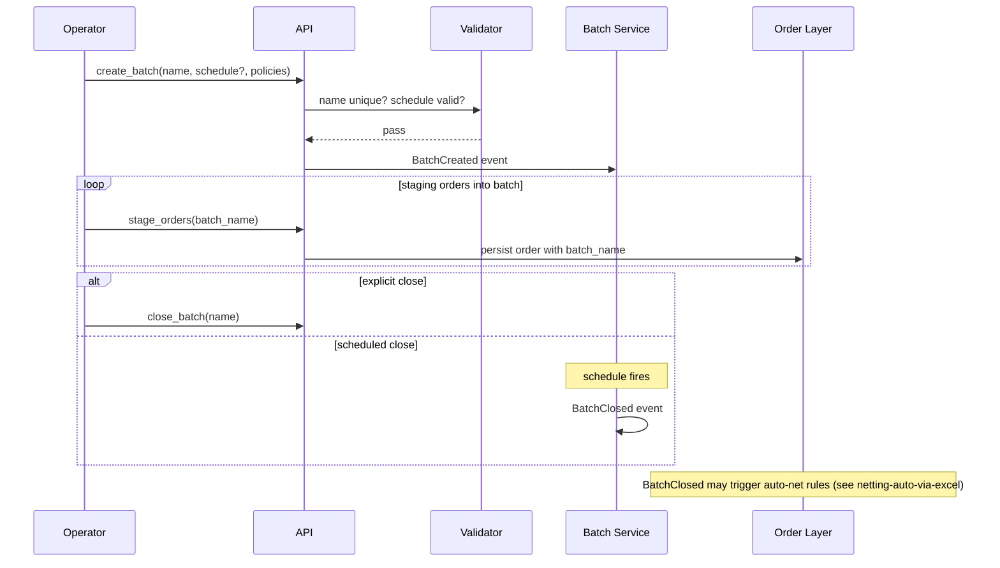

# Batch Creation

Explicit creation and lifecycle management of **batches** — named collections of orders for grouped operations. Distinct from the implicit batch identity that comes from a single [[staging-via-excel|Excel upload]]; batches can be created, extended, closed, and have their own metadata, schedule, and permissions.

## Purpose

For workflows that don't fit "one Excel upload = one batch" — e.g. a multi-leg-rebalance assembled over several hours from multiple sources, a "trade idea" batch accumulating from research, a treasury netting cycle that runs at fixed times.

## Trigger / Entry Point

- Trader / operator calls `create_batch(name, schedule?, policies?)`.
- Bulk staging API: `stage_orders(options:{batch_name: X, create_if_missing: true})`.
- Schedule-driven: a desk's daily auto-batch at 09:30 NY for treasury operations.

## Actors

- Operator / trader.
- [[arch-validator]] — name uniqueness, schedule sanity.
- [[arch-event-sourcing|event log]] — batch lifecycle as a stream.
- [[arch-automation-layer]] — schedule-driven creation.

## Batch lifecycle





1. Create with name + optional schedule + policies (`auto_net_on_close`, `auto_route_on_close`).
2. Orders staged with this `batch_name` join.
3. Close explicitly or on schedule.
4. Close triggers downstream automation if policies bound.

## Inputs

- `name`: unique within firm (sometimes scoped per desk).
- `schedule?`: cron-like expression for time-driven close.
- `policies`: `auto_net_on_close`, `auto_route_on_close`, `default_allocation_template`, `default_tags`.

## Outputs / Side Effects

- `BatchCreated`, `BatchClosed`, `BatchCancelled` events.
- Each `stage_orders` into the batch persists with `batch_name` on the envelope.
- On close: dependent rules fire ([[netting-auto-via-excel]], [[bulk-order-update-route]]).

## Edge Cases & Nuances

- **Name collision.** Same `name` already open → `EMS-ORD-1082 batch_name_collision`. Forces unique names within open set.
- **Late entry to closed batch.** Closed batch rejects new orders with that name; new orders revert to "no batch" or join a sibling open batch per policy.
- **Cancel batch with active routes.** Cancelling the batch does not auto-cancel routed children — those have their own lifecycles. Some firms add explicit "cancel batch including routed" with `#cancel-routed-bulk` tag.
- **Schedule + manual close race.** Both fire; first wins. Second logs `BatchAlreadyClosed`.
- **Default policies inherited by orders.** A child order without an explicit allocation template uses the batch's default; same for `tags`.

## API mapping

```
operation: create_batch
items: [{ name, schedule?, policies, owner }]

operation: close_batch
items: [{ name }]

operation: cancel_batch
items: [{ name, cancel_children?: bool }]

operation: list_batches(filter)
```

## Validator codes touched

`EMS-ORD-1082` (name collision), `EMS-ORD-1083` (cannot reopen closed batch), `EMS-ORD-1084` (schedule expression invalid), `EMS-PRM-1701` (batch operator tag missing).

## Permissions

- `#batch-create` (3-layer).
- `#cancel-routed-bulk` for cancel-batch with active children.

## Related

- [[arch-order-staged]] · [[arch-automation-layer]] · [[arch-event-sourcing]] · [[arch-validator]]
- [[batchname-column]] · [[group-id]] · [[bulk-order-update-route]] · [[netting-auto-via-excel]] · [[staging-via-excel]]
- [[order-ownership]]
