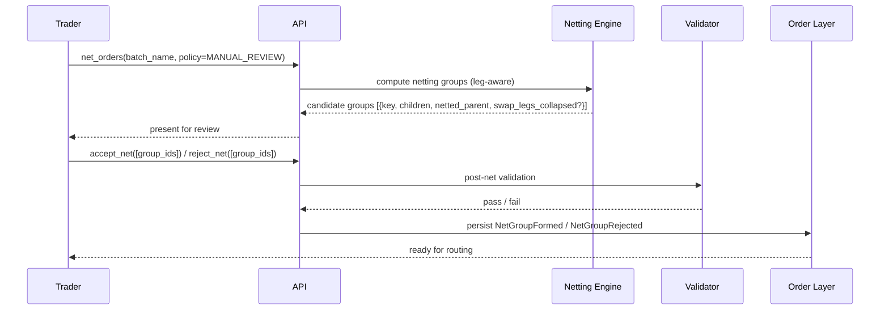

# Netting & Swap Net

The user-facing pre-trade workflow for netting orders — including the **leg-aware "swap net"** case where FX swaps can collapse against other swaps or against outright orders. Backed by [[arch-fx-netting]] semantics; the basic Excel-driven path is in [[netting-auto-via-excel]].

## Purpose

Provide a deliberate netting step in the trader's pre-trade workflow: review eligible groups, accept / reject specific collapses, handle swap-leg netting properly, and verify post-net limits before routing.

## Trigger / Entry Point

- Trader explicitly initiates `net_orders(batch_name)` from the blotter.
- Automation rule runs net evaluation on a timer or on `BatchClosed`.
- Swap-aware net option is enabled via `#leg-aware-netting` permission.

## Actors

- Trader / sales-trader.
- [[arch-validator]] — pre- and post-netting limit checks.
- Netting engine (per [[arch-fx-netting]]).
- [[arch-order-staged|order layer]] — parent/child relationship.

## Steps (manual review variant)



1. Engine computes netting keys per [[arch-fx-netting]]; leg-aware if enabled.
2. Candidate groups surfaced for review.
3. Trader accepts or rejects each candidate.
4. Accepted groups go through post-net validation; failures roll children back to `STAGED`.

## Inputs

- `batch_name` or `selector` (see [[bulk-order-update-route]] for selector shapes).
- `policy`: `AUTO` (commits all) or `MANUAL_REVIEW` (trader-gated).
- `leg_aware`: bool — enables swap-leg netting.

## Outputs / Side Effects

- `NetCandidateGenerated` events per candidate.
- `NetGroupFormed` / `NetGroupRejected` per decision.
- Standard child / parent state transitions.

## Swap-net (leg-aware) detail

Two FX swaps can collapse if their legs match:

```
Swap A: Spot(Buy 10M EURUSD T+2) + Fwd(Sell 10M EURUSD T+30)
Swap B: Spot(Sell 10M EURUSD T+2) + Fwd(Buy 10M EURUSD T+30)
→ Both swaps fully cancel.
```

A swap and an outright can partially collapse:

```
Swap A: Spot(Buy 10M EURUSD T+2) + Fwd(Sell 10M EURUSD T+30)
Outright C: Sell 6M EURUSD T+2
→ Spot leg of A nets 6M with C; residual: 4M spot Buy + 10M forward Sell (a smaller swap).
```

The leg-aware algorithm walks leg structures rather than just envelopes. See [[arch-fx-netting]] for the full algorithm.

## Edge Cases & Nuances

- **Partial swap collapse.** Residuals may form a new (smaller) swap envelope or revert to outrights. Per firm policy.
- **Cross-PB swap legs.** A swap's spot leg goes to GS and forward to JPM (rare but possible). Swap netting must respect PB isolation per leg — see [[arch-fx-netting]] PB rules.
- **Sales-trader confirmation.** Manual review may require sales sign-off if the customer originally requested a specific structure.
- **Audit trail.** Each candidate's accept/reject is an event, so post-trade analytics can study why netting was forgone.
- **Re-net on amend.** If a child order is amended after net candidates were generated, the candidates are invalidated; engine re-runs.

## API mapping

```
operation: net_orders
items: [{ batch_name | selector, policy: AUTO | MANUAL_REVIEW, leg_aware: bool }]

operation: accept_net
items: [{ group_id }]

operation: reject_net
items: [{ group_id, reason }]

operation: un_net_group
items: [{ netted_parent_id }]
```

## Validator codes touched

`EMS-ORD-2201..2210` (full net code range from [[netting-auto-via-excel]]), `EMS-PRM-1502` (cross-batch / leg-aware tag required).

## Permissions

- `#fx-trade` (3-layer).
- `#net-manual-review` for manual policy.
- `#leg-aware-netting` for swap-net.

## Related

- [[arch-fx-netting]] · [[arch-multileg]] · [[arch-order-staged]] · [[arch-validator]]
- [[netting-auto-via-excel]] · [[what-are-swaps]] · [[spot-first]] · [[allocation-prime-broker]]
- [[batch-creation]] · [[bulk-order-update-route]]
