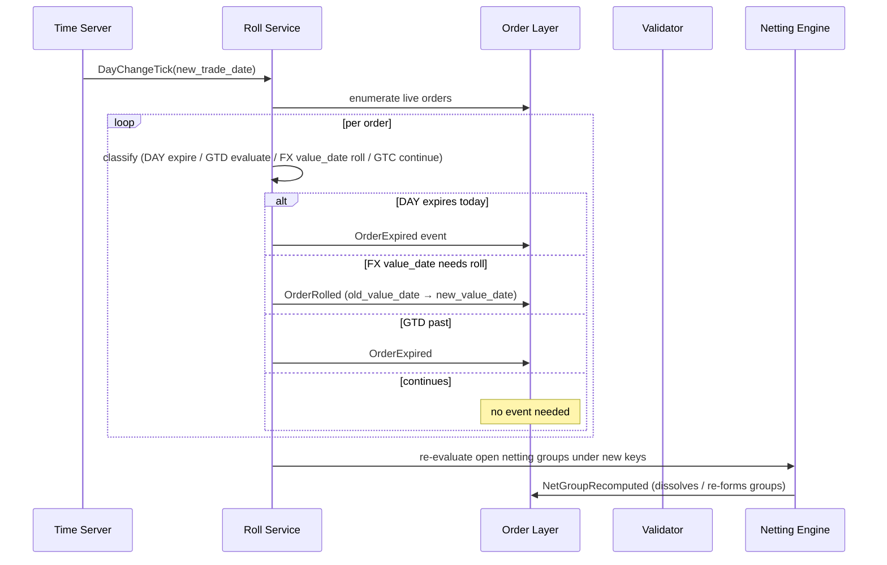

# TradeDate Roll

The **trade-date roll** is the daily transition that re-evaluates all live orders against the new trade date. It expires `DAY`-TIF orders, rolls FX value dates forward, transitions ownership (in some firms), and re-evaluates netting groups under new keys.

## Purpose

Maintain consistency of date-sensitive orders across the boundary between business days. Without an explicit roll, `DAY` orders linger ambiguously, FX value dates drift silently, and netting groups dissolve in inconsistent ways.

## Trigger / Entry Point

- Time-driven by [[arch-time-replay-server|clock]] at the firm's configured roll time (often per region: NY 5pm, LDN 5pm, TYO 5pm).
- Manual `force_roll(reason)` by an admin for testing or recovery.

## Actors

- Roll service (subscribes to the time server's day-change tick).
- [[arch-validator]] — re-evaluates orders.
- [[arch-order-staged|order layer]] — emits `OrderExpired`, `OrderRolled`, `OrderOwnershipTransferred` events.
- [[arch-event-sourcing|log]].

## Steps



1. Time server fires `DayChangeTick`.
2. Roll service enumerates live orders.
3. Per-order classification:
   - **DAY**: expire (with venue-side cancel for any working routes).
   - **GTD with date today**: expire end-of-day per regional close.
   - **GTC**: continue, but evaluate against max-age cap.
   - **FX with `value_date` that was T+0 yesterday and is now T-1**: roll forward per pair's spot-days convention.
4. Netting groups dissolve / re-form under new keys.
5. (Optional) Cross-region ownership handoff if firm policy enabled.

## Inputs

- `DayChangeTick` from [[arch-time-replay-server]].
- Order envelope state.
- Firm's roll policy (per region).

## Outputs / Side Effects

- `OrderExpired` per expired order.
- `OrderRolled` per rolled FX order.
- `NetGroupRecomputed` events.
- Outbound venue cancels for `DAY` orders' working routes.
- `RollCompleted` envelope event with summary counts.

## Edge Cases & Nuances

- **Cross-region complexity.** A 24-hour firm has multiple rolls per global day (NY, LDN, TYO). Each region's `DAY` orders expire at its own close; FX value dates use a single global convention pair-by-pair.
- **Holiday boundaries.** Roll into a holiday: orders may expire or sit pending until next business day depending on policy.
- **Venue cancel race.** EOD venue cancel races with a late venue fill. Reconciliation per [[arch-venue-connectivity]] anomaly rules.
- **Forced roll for testing.** A QA / staging environment can force-roll mid-day; production is strictly time-server-driven.
- **Replay determinism.** Roll events are time-driven; in [[arch-time-replay-server|replay]] the simulated clock fires identical `DayChangeTick`s, reproducing the roll deterministically.
- **Netting group implications.** A swap whose forward leg's value_date was T+30 yesterday is now T+29; netting bucket changes. Group dissolves and may re-form with different members.
- **GTC max-age check.** A `GTC` order beyond the firm's cap (e.g. 90 days) expires at roll with `EMS-ORD-1015 gtc_exceeds_max_age`.
- **Audit reports.** Roll generates a summary digest emailed/posted to ops; counts of expired, rolled, errored.

## API mapping

```
operation: force_roll
items: [{ reason, region?, dry_run?: bool }]

# Subscriber:
operation: list_rolled_today(filter)
```

The day-change tick itself is a system event, not an API operation.

## Validator codes touched

`EMS-ORD-1015` (GTC exceeds max age), `EMS-ORD-1050..1053` (effective-date re-validation), `EMS-RTE-3002` (venue cancel for rolled DAY).

## Permissions

- `#force-roll-admin` for `force_roll` (rare; high-impact).
- Standard order permissions are not consulted during roll — it's a system-actor operation.

## Related

- [[arch-time-replay-server]] · [[arch-event-sourcing]] · [[arch-order-staged]] · [[arch-fx-netting]]
- [[expiry-type]] · [[effective-date]] · [[netting-auto-via-excel]] · [[order-ownership]]
- [[stp-summary]]
