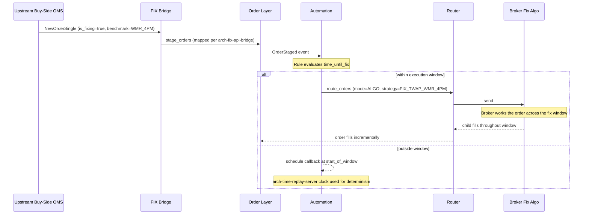

# Auto-Route — Fixing Orders

**Fixing orders** are FX orders that price against a published benchmark fix (e.g. WMR/Refinitiv 4pm London, ECB 1:15pm CET, BFIX, iNAV for ETFs). They commonly arrive from buy-side OMSs (institutional asset managers, corporate treasurers, hedge funds) where the client wants to track a published benchmark. This workflow auto-routes them at the correct moment under the correct execution policy.

## Purpose

Handle fixing orders' two atypical requirements:

1. **Time-bound execution** — the order must price at the fix, not before.
2. **Benchmark-tracking strategy** — execution must minimise tracking error vs the published fix (often a TWAP around the fix window).

Manual handling at scale is impractical; this workflow uses a bound [[arch-automation-layer|automation rule]] keyed on the fix's published schedule.

## Trigger / Entry Point

- An order arrives via [[arch-fix-api-bridge|FIX]] (or API) from an upstream buy-side system with an extension tag indicating `is_fixing = true` and `benchmark = WMR_4PM | ECB_115 | BFIX | iNAV | ...`. See [[buy-side-oms-integration]] for the integration boundary.
- A bound auto-route rule with trigger pattern matching `OrderStaged where extension.is_fixing = true` and condition `time_until_fix(extension.benchmark) <= execution_window`.
- The rule's action template selects the strategy and venue: typically `route_to_algo` with a fixing-TWAP strategy or `route_to_rfq` for a fix-locked dealer offer.

## Actors

- Upstream buy-side OMS — order source.
- [[arch-automation-layer]] — the bound rule.
- [[arch-router-layer]] — executes the rule's action.
- Fix-aware venue / algo — usually a broker offering a fixing benchmark strategy.

## Steps



1. Upstream OMS stages the order; the fixing extension fields decode into the staged order's `extension` block.
2. Automation rule matches; condition checks `time_until_fix`.
3. If outside the execution window, rule schedules a re-evaluation at the window start via the [[arch-time-replay-server|clock interface]] (not wall-clock directly — deterministic).
4. At window start, rule fires `route_orders` with the appropriate strategy.
5. Broker algo executes around the fix; fills stream back.
6. After fix publication, the order's effective fill price may be adjusted to the published benchmark (depending on broker contract).

## Inputs

- Order extension: `is_fixing`, `benchmark`, `fix_time`, `pre_fix_minutes`, `post_fix_minutes`.
- Rule template: strategy, venue, execution-window definition.

## Outputs / Side Effects

- `RuleFired` event with the resulting `route_orders` request.
- Standard route lifecycle.
- Possible `BenchmarkAdjustment` event when the broker confirms the final fixed price.

## Edge Cases & Nuances

- **Fix not published.** Rare but possible (exchange holiday, system failure). The order has no executable price reference; firm policy: cancel and notify trader, or roll to next fix.
- **Late order arrival.** Order arrives after the execution window has started; rule fires with the residual window only. Tracking error grows; flagged in audit.
- **Multiple fixings same day.** Some orders specify "fill at any of WMR 10am or 4pm"; rule has multiple triggers, fires on the first viable fix.
- **Cancel during window.** Cancellation accepted but late fills from the broker algo may still arrive — reconciled per [[arch-venue-connectivity|adapter anomaly rules]].
- **Multiple currency pairs from one upstream batch.** A single upstream upload can carry orders across many pairs; each rule fires independently. Aggregation rules (firm-policy) may consolidate same-pair orders before routing.
- **Replay.** The clock-bound condition is the trickiest determinism case; [[arch-time-replay-server|simulated clock]] in replay must reproduce window-start firings exactly. No wall-clock reads anywhere in the rule.
- **Cross-time-zone fixes.** WMR 4pm is London; ECB 1:15pm is CET. Mixed-fix portfolios from a single upstream upload schedule at different absolute times.

## API mapping

```yaml
operation: bind_rule
items: [{
  rule_id,
  scope: DESK,
  trigger: { event: "OrderStaged", filter: { extension.is_fixing: true } },
  condition: "time_until_fix(extension.benchmark) <= window_minutes",
  action: {
    op: "route_orders",
    template: {
      mode: "ALGO",
      strategy: "{broker}_FIX_TWAP_{benchmark}",
      algo_params: {
        start: "{fix_time} - pre_fix_minutes",
        end:   "{fix_time} + post_fix_minutes"
      }
    }
  }
}]
```

## Validator codes touched

`EMS-AUT-2001` (rule actor lacks fixing tag), `EMS-AUT-3002` (benchmark unknown), `EMS-RTE-1004` (broker fix strategy not supported), `EMS-ORD-3010` (fix window already closed).

## Permissions

- `#fx-fixing` (3-layer per [[arch-tag-permissions]]).
- `#cpty-{broker}` for the fix-capable broker.
- `#auto-route-binder` for the rule-binder.

## Related

- [[arch-automation-layer]] · [[arch-time-replay-server]] · [[arch-fix-api-bridge]] · [[arch-router-layer]]
- [[route-to-algo]] · [[auto-route]] · [[multi-route-rfq]]
- [[buy-side-oms-integration]] · [[fx-automation-tradebest]] · [[fx-automation-rbld]]
