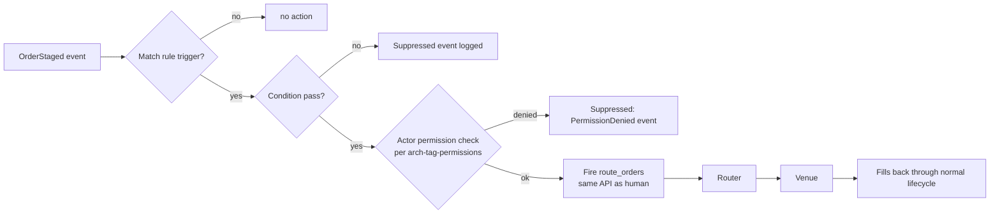

# Auto-Route to RFQ / FXOM / CNF

Rule-driven automatic routing: when a [[arch-order-staged|staged order]] matches a configured trigger and policy, the EMS calls `route_orders` **without human action**. Concrete forms include auto-route-to-RFQ (most common), auto-route-to-FXOM (FX Order Manager), and auto-route-to-CNF (auto-confirmation against a pre-agreed dealer).

## Purpose

Eliminate keystroke latency for routine routing decisions, free traders to focus on harder calls, and enforce consistent firm policy mechanically. All auto-routes flow through the same [[arch-automation-layer]] and use the same `route_orders` API; automation is just a peer caller.

## Trigger / Entry Point

A bound rule (see [[arch-automation-layer]]) with:

- **Trigger:** `OrderStaged` event matching an event-pattern filter (asset class, size, tags, batch).
- **Condition:** boolean predicate (e.g. `notional <= threshold AND tif = DAY`).
- **Action:** `route_orders(...)` with the strategy declared in the rule.

Rule scope is `FIRM | DESK | USER | TAG` and is evaluated through the [[arch-firm-desk-user|hierarchy]] / [[arch-tag-permissions|3-layer AND-gate]].

## Actors

- Rule binder (the user who installed the rule; carries permission context).
- [[arch-automation-layer]] — evaluates and fires.
- [[arch-router-layer]] — receives the fired call indistinguishably from a human call.
- [[arch-validator]] — runs the same checks regardless of origin.

## Steps



1. Order stages → `OrderStaged` event into the [[arch-event-sourcing|event log]].
2. Automation evaluates bound rules in priority order. Suppressions are recorded.
3. Matching rule's action template materializes a `route_orders` request with `source=AUTOMATION` and `actor` set to the rule binder.
4. Validator runs every standard check, including [[arch-tag-permissions|tag permissions]] against the rule binder's identity.
5. On accept, the route flows downstream identically to a human-initiated route.

## Inputs

- A bound `Rule` with trigger / condition / action.
- The triggering event (`OrderAccepted` / `OrderStaged` typically; can be `OrderReplaced`, `QuoteIncrement`, `OrderPartiallyFilled`, etc. — see [[arch-order-route-lifecycle]] for the full event taxonomy).

## Outputs / Side Effects

- `RuleFired` event with the resulting `request_id`.
- `RouteSent` event (and the rest of the normal route lifecycle).
- On suppression: `RuleSuppressed` event with reason.

## Three concrete auto-route shapes

| Shape | Target | Typical condition |
|---|---|---|
| **Auto-route to RFQ** | One or more RFQ venues with default dealer panel. | Asset class + size + desk setting `auto_rfq_on_stage=true`. See [[route-to-rfq]] / [[multi-route-rfq]]. |
| **Auto-route to FXOM** | FX Order Manager screen for trader review-then-route. | FX flows where firm policy requires human eyes despite automation. The "route" target is actually a queue — see related workflow. |
| **Auto-route to CNF** | Pre-agreed counterparty confirmation. | Standing voice agreement with one dealer (rare; usually small repeating trades). See [[route-to-cnf]]. |

## Edge Cases & Nuances

- **Multiple rules match.** Priority order resolves; suppressed rules log `RuleSuppressed { suppressed_by: rule_X }`. Equal priority → first-bound wins, second is logged as ambiguous for ops to deconflict.
- **Rule binder loses tag.** A rule bound by a user who later loses `#auto-route-binder` is **suppressed at firing time**, with the validator's clear denial — see [[arch-tag-permissions]] for the wording.
- **Trigger storm.** A burst of orders triggers many firings. The automation layer enforces per-rule rate limits; over-limit firings deferred to a queue with `RuleDeferred` events.
- **Stale rule definition.** A rule referencing a venue or strategy that was retired returns `EMS-AUT-3001 rule_references_unknown_target`; suppressed with admin hint.
- **Re-firing on amend.** If an order is amended after auto-route fired, the original route remains; firm policy decides whether the amend triggers a new firing (rare) or modifies the existing route via `replace_routes`.
- **Replay determinism.** Auto-route decisions must be deterministic given the same input + rule version. Non-deterministic conditions (clock, market state) go through the [[arch-time-replay-server|clock interface]] and [[arch-quote-server]] to allow replay.

## API mapping

The auto-route doesn't introduce new API operations; it composes existing ones:

```
operation: bind_rule
items: [{
  rule_id,
  scope:         FIRM | DESK | USER | TAG,
  scope_ref,
  trigger:       EventPattern,
  condition:     Expression,
  action: {
    op:          "route_orders",
    template: { venue, mode, dealers?, expire_in?, ... }
  },
  priority:      int,
  enabled:       bool
}]

operation: unbind_rule
items: [{ rule_id }]
```

## Validator codes touched

`EMS-AUT-1001` (rule scope mismatch), `EMS-AUT-2001` (action not permitted for actor), `EMS-AUT-3001` (rule references unknown target), all `EMS-RTE-*` codes that the downstream route hits.

## Permissions

- `#auto-route-binder` (3-layer per [[arch-tag-permissions]]) to bind a rule.
- The rule binder must also hold every permission the action would require (transitively).
- For tag-scoped rules, only orders carrying the matching tag and whose owner is also authorized for the tag fire.

## Related

- [[arch-automation-layer]] · [[arch-router-layer]] · [[arch-validator]] · [[arch-tag-permissions]]
- [[route-to-rfq]] · [[multi-route-rfq]] · [[route-to-cnf]] · [[route-to-algo]]
- [[auto-route-fixing-aim]] · [[fx-automation-tradebest]] · [[fx-automation-rbld]]
