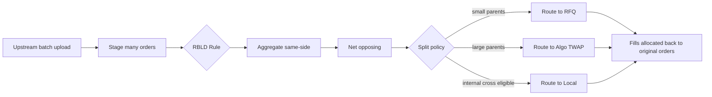

# FX Automation — RBLD

RBLD ("Rebalance / Block-Distribute") is an FX automation pattern for **portfolio-rebalance flows**: many small orders generated by a portfolio rebalance (often arriving from a buy-side OMS) get auto-aggregated, netted, and distributed across venues by rule rather than by hand.

## Purpose

A portfolio rebalance can generate hundreds of FX orders in minutes. Manual handling defeats both timeliness and consistency. RBLD chains [[arch-aggregation]] → [[arch-fx-netting]] → distributed routing so the operator only watches; the rule executes.

## Trigger / Entry Point

- A batch of FX orders staged from the upstream buy-side OMS with `extension.batch_kind = RBLD` (or equivalent firm convention).
- The desk's RBLD rule is bound and `enabled`.

## Actors

- Upstream buy-side OMS — source.
- [[arch-automation-layer]] — RBLD rule.
- [[arch-order-staged|order layer]] — aggregation & netting state.
- [[arch-router-layer]] — distributed routing of netted parents.

## Steps



1. Upstream batch arrives; orders enter [[arch-order-staged|staged state]] tagged with the RBLD batch ID.
2. Rule fires on `BatchClosed { kind: RBLD }`:
   - Aggregate same-side same-pair orders ([[arch-aggregation]]) into per-pair sums.
   - Net opposing sums per pair / value date ([[arch-fx-netting]]).
   - Apply distribution policy to resulting parents.
3. Distribution policy:
   - Parents < notional threshold → [[route-to-rfq]] with default dealer panel.
   - Parents ≥ threshold → [[route-to-algo]] with TWAP across a configured window.
   - Parents matching local-cross eligibility → [[route-to-local]] first, fallback external.
4. Fills allocate back to the original child orders via the aggregation rule.

## Inputs

- Upstream batch with `RBLD` marker.
- Bound RBLD rule with:
  - Aggregation policy.
  - Netting policy.
  - Distribution thresholds.
  - Allocation rule (typically `PRO_RATA`).
  - Per-pair venue preferences.

## Outputs / Side Effects

- `RuleFired` events for each step (aggregate / net / route).
- `AggregatedParentCreated`, `NetGroupFormed`, `RouteSent` events.
- Per-child fill allocations.
- Trader dashboard shows the rebalance progressing without intervention.

## Edge Cases & Nuances

- **Partial batch upload (timing).** If the upstream OMS uploads in waves over several minutes, the rule needs a `batch_close` signal (explicit) or a quiet-window timeout. Mis-close → an order misses the netting bucket, executes alone.
- **Cross-pair correlations.** A USD-funded EUR-buy and JPY-buy don't net but share funding leg considerations. RBLD typically handles per-pair independently; cross-pair optimization is out of scope (left to a separate balance optimization workflow).
- **PB / counterparty isolation.** Multiple PBs in the batch isolate netting buckets ([[arch-fx-netting]] PB rules).
- **Tracking error.** Distributing across venues introduces variance vs a single hypothetical block; the firm's TCA layer measures and feeds back via rule tuning.
- **Mid-rebalance market move.** A sudden move during execution: the rule does not re-aggregate mid-flight. Half-done routes complete on their original strategies; trader can intervene manually if escalated.
- **Replay.** Same determinism rules as other automation; the batch's [[arch-event-sourcing|event sequence]] reproduces the same aggregation/netting/distribution outcome.

## Distribution policy DSL (illustrative)

```
distribute(parent):
  if parent.notional < threshold_small:
    return route_to_rfq(venues=desk.default_rfq_venues, dealers="default", expire_in=60s)
  elif parent.notional < threshold_block:
    return route_to_algo(venue=preferred_algo_broker, strategy=TWAP, start=now, end=now+15m)
  else:
    return [
      route_to_local(qty=parent.qty * local_share, fallback=RE_ROUTE_EXTERNAL),
      route_to_algo(qty=parent.qty * (1-local_share), strategy=TWAP, ...)
    ]
```

## API mapping

```
operation: bind_rule
items: [{
  rule_id: "rbld-fx",
  scope: DESK,
  trigger: { event: "BatchClosed", filter: "batch.extension.kind == 'RBLD'" },
  action_pipeline: [
    { op: "aggregate_orders", policy: { eligibility: "same_pair_same_side_same_date", allocation_rule: PRO_RATA } },
    { op: "net_orders",       policy: { auto_net: true } },
    { op: "route_orders",     template: "distribute(parent)" }
  ]
}]
```

The action pipeline composition is a multi-step automation; each step's output feeds the next.

## Validator codes touched

`EMS-AUT-3003` (action pipeline step unknown), all `EMS-ORD-*` codes from aggregation / netting, all `EMS-RTE-*` codes from routing.

## Permissions

- `#rbld` (3-layer per [[arch-tag-permissions]]).
- `#auto-route-binder` + `#aggregator` + `#fx-trade` transitively required (rule binder must hold all).

## Related

- [[arch-automation-layer]] · [[arch-aggregation]] · [[arch-fx-netting]] · [[arch-router-layer]]
- [[route-to-rfq]] · [[route-to-algo]] · [[route-to-local]] · [[multi-route-rfq]]
- [[auto-route]] · [[fx-automation-tradebest]] · [[buy-side-oms-integration]] · [[auto-route-fixing-aim]]
