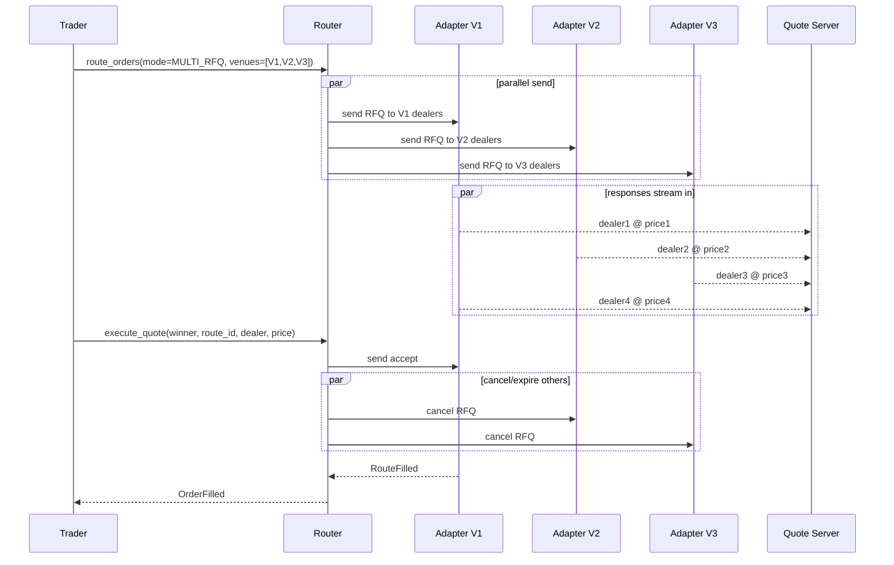

# Multi-Route to RFQ

Send parallel [[route-to-rfq|RFQs]] across multiple venues simultaneously and elect a winner from the **union** of responses. Common in FX (e.g. BBG ALLQ + FXConnect simultaneously) and corp bonds (BBG ALLQ + MarketAxess + Tradeweb).

## Purpose

Maximize price discovery in one go: the trader (or automation) sees competitive quotes from every enabled venue's dealer set in parallel, then elects the single best response. The FXPF (FX Preferences) setting `multi_route_rfq_enabled` gates this for the desk.

## Trigger / Entry Point

- Trader clicks "Multi-RFQ" or calls API directly: `route_orders([{order_id, venues: [V1, V2, ...], mode: MULTI_RFQ, dealers_per_venue, expire_in}])`.
- An [[arch-automation-layer|automation rule]] for orders above a notional threshold to ensure broad price discovery.
- FXPF (FX Preferences) policy at the desk level that defaults route requests to multi-RFQ.

## Actors

- Trader / sales-trader.
- Multiple RFQ venue adapters (parallel).
- Dealers across multiple venues (some may overlap — same dealer reachable on multiple venues).
- [[arch-router-layer]] — manages **one logical route family** with multiple sibling routes.
- [[arch-quote-server]] — fans out responses on a per-route-family topic.

## Steps



1. Validator gates: each venue must be enabled for the instrument, the user must hold every relevant `#cpty-{venue}` (3-layer), `multi_route_rfq` desk setting must be enabled.
2. Router creates a **route family** with parent_route_id and one child sibling-route per venue.
3. Adapters dispatch in parallel.
4. Responses tagged with `(parent_route_id, child_route_id, dealer, venue)`; all surface on a single topic `quote.{figi}.multi_rfq.{parent_route_id}`.
5. Trader / automation elects from the union. Election binds to a specific child-route + dealer.
6. Winner: `execute_quote` on winning child. Losers: `cancel_routes` issued for sibling children.
7. Confirmation streams back; parent `OrderFilled`.

## Inputs

- `order_id` (`READY`).
- `venues: [VenueRef]` — at least 2.
- `dealers_per_venue: map<VenueRef, [DealerRef]>` — explicit, or `"default"` to use each venue's default dealer list.
- `expire_in` — shared across venues; some venues use it as a server-side timer, others as a client-side hint.
- `min_responding_total` — gate before allowing election (across the union).

## Outputs / Side Effects

- `MultiRouteFamilyCreated`, per-child `RouteSent`, `QuoteResponseReceived` (tagged with venue+dealer), `RouteFilled` (winner) / `RouteCanceled` (losers) / `RouteExpired`.
- Single parent `OrderFilled` event referencing the winning child.
- Quote-server topic: one per family.

## Edge Cases & Nuances

- **Dealer overlap.** Same dealer appears on multiple venues (e.g. Citi on both Tradeweb and MarketAxess). Election should not double-count; the validator surfaces the overlap with `EMS-RTE-1015 dealer_overlap_across_venues` as a warning (configurable to error per firm policy).
- **Venue-specific timeouts.** Different venues honor `expire_in` differently. The router enforces a unified deadline locally and cancels any still-open siblings at that deadline.
- **Race on election.** Trader elects from V1 just as V2 returns a better quote. By policy, the elected child wins; the late V2 quote is logged but not actionable post-election. Audit captures the race.
- **Asset-class semantics:**
  - **FX**: value date must match across all responses; mixed value dates → invalidate that subset.
  - **Corp bonds**: TRACE post-trade reporting flows from the winning venue only.
  - **Muni BWICs**: not typical for multi-RFQ since BWICs are venue-specific list events.
- **Cancel-on-elect failure.** If the cancel to a sibling venue fails (e.g. adapter disconnect), the sibling may still print → results in a `RouteAnomaly` event for ops. Triple-tracked: family event, child event, anomaly event.
- **Throttling.** Many venues impose RFQ throttles; multi-route bursts hit them quickly. The router enforces a global rate limit per (user, venue) and queues if necessary, surfacing `EMS-RTE-3010 multi_rfq_throttled`.

## API mapping

```
operation: route_orders
items: [{
  order_id,
  mode:              MULTI_RFQ,
  venues:            [VenueRef],
  dealers_per_venue: map<VenueRef, [DealerRef] | "default">,
  qty:               decimal,
  expire_in:         duration,
  min_responding_total?: int
}]

operation: execute_quote
items: [{ parent_route_id, child_route_id, dealer, accepted_price, accepted_qty }]
```

## Validator codes touched

`EMS-RTE-1001` (venue not enabled), `EMS-RTE-1015` (dealer overlap warn/err), `EMS-RTE-3010` (throttled), `EMS-PRM-1001..1003` (per-venue cpty tags), `EMS-RTE-3003` (stale quote at execute).

## Permissions

- `#multi-route-rfq` (3-layer per [[arch-tag-permissions]]).
- `#cpty-{venue}` for every venue in the request.

## Related

- [[arch-router-layer]] · [[arch-quote-server]] · [[arch-venue-connectivity]] · [[arch-validator]]
- [[route-to-rfq]] · [[auto-route]] · [[fx-automation-tradebest]]
- [[marketaxess]] · [[tradeweb]] · [[bloomberg-bridge]] · [[trumid]] · [[neptune]] (pre-trade axes/IOIs only)
- [[bloomberg-allq]] (price-discovery screen — observed, not routed to)
