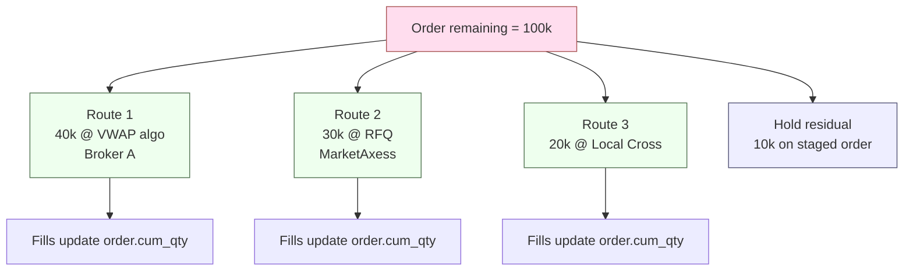

# Partial Routes (Single & Netted Orders)

Send only a **fraction** of an order's quantity to a venue, optionally splitting the rest across other venues, other times, or other strategies. Applies to single orders and to netted-parent orders ([[netting-auto-via-excel]] / [[arch-fx-netting]]).

## Purpose

Match execution shape to liquidity: pre-trade analytics suggest 30% of the size should go to dark, 50% to a VWAP algo, 20% kept on the desk for opportunistic crossing. Each piece is an independent route under one logical order.

## Trigger / Entry Point

- Trader explicitly issues multiple `route_orders` calls against the same `order_id` with `qty` summing to less than `order.remaining`.
- A bound automation rule that always splits orders above a notional threshold by a configured weighting.
- A netting parent that policies-out as multiple smaller routes for market impact.

## Actors

- Trader / sales / automation.
- [[arch-router-layer]] — central accounting of `qty + sum(active_routes) <= order.remaining`.
- Multiple [[arch-venue-connectivity|venue adapters]] (potentially).
- [[arch-validator]] — re-evaluates limits per route.

## Steps



1. Each `route_orders` call carries its own `qty`. The router checks `qty + sum(other_active_route_qty) <= order.remaining`.
2. Order's `remaining` is **only decremented on fill**, not on route creation — the `available_to_route` is `remaining - sum(active_route_qty)`.
3. Each route has its own lifecycle, independently terminal.
4. Cancelled / unfilled portions return to `available_to_route` immediately.
5. Order terminal: `FILLED` when `cum_qty = total_qty`; otherwise stays open until cancelled or expired.

## Inputs

- `order_id`.
- Per-route: `venue`, `mode`, `qty`, mode-specific parameters.
- Optional sequencing hints — see [[spot-first]] for one common case.

## Outputs / Side Effects

- One `RouteSent` per route.
- Per-route fills flow back; parent order increments cumulatively.
- `OrderFilled` (the parent) fires multiple times — once per fill from any child route.

## Edge Cases & Nuances

- **Sum exceeds remaining.** `EMS-RTE-2001 overcommitted` on the later call. The earlier route is unaffected.
- **One route fills fast, the residual.** Now you have `available_to_route = order.remaining - sum(active)`; new routes can claim it. No special handling needed.
- **Two routes for the same instrument cross internally.** Self-cross risk. If both routes are at the same venue, the venue may have native self-trade prevention; if at different venues, the firm's [[route-to-local|local crossing]] policy may auto-detect and cross internally instead. Firm policy controls.
- **Netted parent split.** A netted parent ([[arch-fx-netting]]) typically goes out as a single route to minimize footprint, but firms may split for risk reasons. The router treats this identically to splitting any other order — the children of the netted parent are untouched; only the parent's external execution is split.
- **Cross-venue partial cancel.** Cancelling route 1 of 3 does not affect routes 2/3. Each is independently `cancel_routes([route_id])`-addressable.
- **Asset-class semantics:**
  - **FX**: splitting across venues may produce slightly different value dates if execution times straddle a cut-off; rare but worth audit.
  - **FI / illiquid HY**: splitting too small can fail venue min-block-size requirements (`EMS-RTE-1014 below_venue_min_block`).
  - **Equity**: typical; the original use case.

## API mapping

No new operations — `route_orders` is batch by default, so partial routes are just multiple items in one call or multiple calls.

```
operation: route_orders
items: [
  { order_id, venue: V1, mode: ALGO, strategy: VWAP, qty: 40000 },
  { order_id, venue: V2, mode: RFQ, dealers: [...], qty: 30000 },
  { order_id, venue: V3, mode: LOCAL, qty: 20000 }
]
```

The router validates each independently and that their sum doesn't overcommit the order.

## Validator codes touched

`EMS-RTE-2001` (overcommitted), `EMS-RTE-1014` (below venue min block size), `EMS-RTE-3007` (fragment too small for strategy effectiveness — warning), `EMS-RTE-1001` / `1003` per route.

## Permissions

- `#trade-{asset_class}` (3-layer per [[arch-tag-permissions]]).
- Per-venue `#cpty-{venue}` tags.
- `#multi-venue-split` if firm requires explicit permission for splitting.

## Related

- [[arch-router-layer]] · [[arch-order-staged]] · [[arch-validator]]
- [[route-single]] · [[route-to-rfq]] · [[route-to-algo]] · [[route-to-local]]
- [[spot-first]] · [[netting-auto-via-excel]] · [[arch-fx-netting]]
