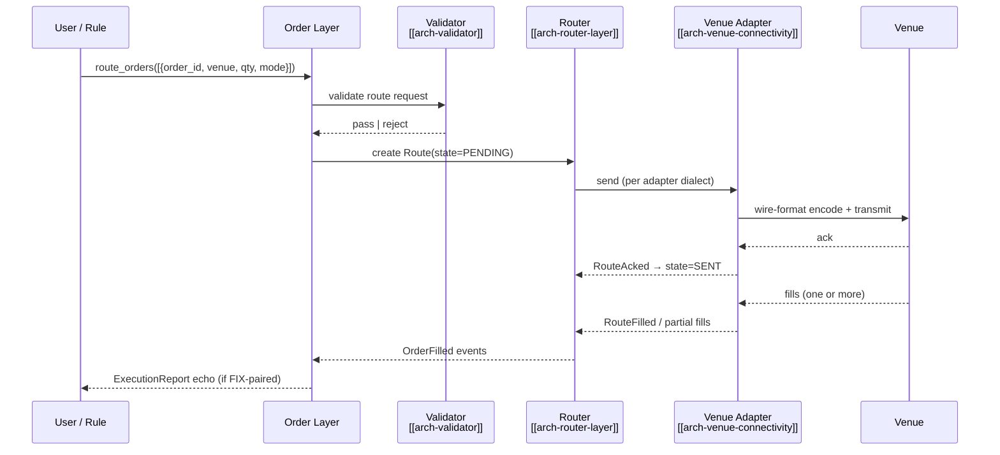

# Route Single (All Venues)

The baseline routing operation: take one [[arch-order-staged|staged order]] in `READY` state and send a single route to a single venue. Every other routing workflow is a specialization or composition of this.

## Purpose

Send one route to one venue. This is the simplest invocation of [[arch-router-layer]] and the lowest-overhead path from `READY` order to working liquidity.

## Trigger / Entry Point

- Trader clicks "Route" on a staged order in the UI → API call `route_orders([{order_id, venue, qty, ...}])`.
- A [[arch-fix-api-bridge|FIX-paired]] flow with `auto_route_on_stage` enabled at the desk level.
- A [[arch-automation-layer|rule firing]] that uses the same `route_orders` API.

## Actors

- Trader / DMA user / automation actor.
- [[arch-router-layer]] — creates and tracks the route.
- [[arch-venue-connectivity|venue adapter]] for the target venue.
- [[arch-validator]] — pre-route gating.

## Steps



1. Pre-route validation: venue support for the FIGI, venue capability vs requested instruction, [[arch-tag-permissions|3-layer permission]] check (`#cpty-{venue}`).
2. Router materializes `Route { state=PENDING }`, deducts `qty` from order's available remaining.
3. Adapter encodes per dialect (FIX `D` for FIX venues, binary frame for binary venues, REST POST for REST venues).
4. Venue ack → `state=SENT`, then `state=WORKING` on first market-side confirmation (working, not just received).
5. Fills stream in; route advances `cum_qty` / `last_qty` / `avg_px`.
6. Terminal: `FILLED` on full execution, `CANCELLED` on user/venue cancel, `REJECTED` on venue reject.

## Inputs

- `order_id` (must be in `READY` — see [[arch-order-staged]]).
- `venue` — VenueRef enumerated in the firm's enabled-venue list.
- `qty` — defaults to order.remaining; can be less (then this becomes a [[partial-routes|partial route]]).
- `mode` — `DIRECT` for CLOB-style, other modes covered by [[route-to-rfq]] / [[route-to-algo]] / [[route-to-resting]].
- `limit_price` (from order or override at routing time).
- `tif`, `exec_inst` (per venue capability).

## Outputs / Side Effects

- `RouteSent`, `RouteAcked`, `RouteFilled`/`RouteCancelled`/`RouteRejected` events into [[arch-event-sourcing]].
- Parent `OrderFilled` increments.
- FIX `ExecutionReport` mirror for paired FIX clients.

## Edge Cases & Nuances

- **Venue not enabled for instrument.** Validator returns `EMS-RTE-1001 venue_not_enabled_for_instrument`. Firm admin can extend enablement.
- **Capability mismatch.** Requested limit price for a market-only venue → `EMS-RTE-1003 capability_unsupported`.
- **Order already routing.** `qty + sum(active_routes) > order.qty` → `EMS-RTE-2001 overcommitted`. The order's remaining is the source of truth.
- **In-flight cancel race.** Cancel issued while venue ack is in-flight → adapter reconciles on receipt, may produce a `RouteAnomaly` event for ops triage.
- **Adapter disconnect mid-route.** Route enters `UNCERTAIN`; not auto-cancelled. Reconnect reconciles per [[arch-venue-connectivity]] failure-mode rules.
- **Tick rounding.** Adapter clamps prices to venue tick; persisted route reflects the clamped value with the original as metadata for audit.

## API mapping

```
operation: route_orders
items: [{
  order_id,
  venue:        VenueRef,
  mode:         DIRECT,
  qty:          decimal,        // defaults to order.remaining
  limit_price?: decimal,
  tif?:         TIF,
  exec_inst?:   set<ExecInst>
}]
```

## Validator codes touched

`EMS-RTE-1001` (venue not enabled for instrument), `EMS-RTE-1002` (qty exceeds venue max), `EMS-RTE-1003` (capability unsupported), `EMS-RTE-2001` (overcommitted), `EMS-PRM-1001..1003` (cpty tag 3-layer).

## Permissions

- `#trade-{asset_class}` (3-layer per [[arch-tag-permissions]]).
- `#cpty-{venue}` per venue.

## Related

- [[arch-router-layer]] · [[arch-venue-connectivity]] · [[arch-validator]] · [[arch-order-staged]]
- [[route-to-rfq]] · [[route-to-algo]] · [[route-to-cnf]] · [[route-to-local]] · [[route-to-resting]]
- [[partial-routes]] · [[auto-route]]
