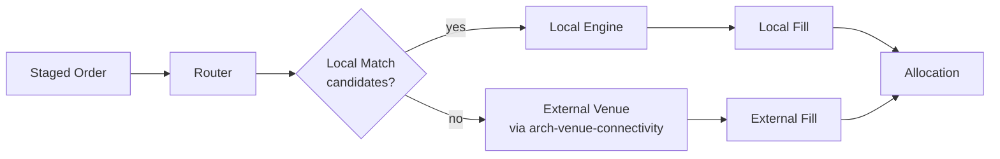

# Route to Local

Route a [[arch-order-staged|staged order]] to a **local execution surface** — an internal matching engine, an in-firm crossing network, or a captive liquidity pool — before (or instead of) going to an external venue.

## Purpose

Capture executable liquidity that already exists inside the firm: agency-cross opportunities between two of the firm's clients, principal market-making against firm inventory, or a desk's internal crossing book. Saves explicit external fees and reduces market impact.

## Trigger / Entry Point

- Trader manually selects "Route to Local" on a staged order.
- [[auto-route]] rule prefers Local before external when both have eligible liquidity.
- A scheduled local-match pass (cron) for batched orders.
- Spot-first style sequencing where the FX spot hedge is filled internally before the forward goes external — see [[spot-first]].

## Actors

- Trader / sales / automation actor.
- **Local matching engine** — runs as a venue adapter target, but the adapter is in-process (or in-firm) and not over the public network.
- Compliance — local crossing is regulated (e.g. agency cross requires consent both sides in some regimes).
- [[arch-router-layer]] — manages route lifecycle identically to external venues.

## Steps



1. Pre-route validation includes a `local_eligibility` check (instrument enabled for internal crossing, compliance regime allows, counterparties consent).
2. Router creates a route with `venue=LOCAL`. Adapter calls the in-process matching engine.
3. Engine looks for crossing candidates by instrument, side, qty constraints. On match: both legs settle simultaneously, often at midpoint or NBBO-pegged.
4. Partial match: matched portion fills; unmatched residual either rests at the local engine or is automatically re-routed externally per the order's routing policy.
5. Unmatched: route closes as `LOCAL_NO_MATCH` and the residual reverts to the [[arch-order-staged|order layer]] for re-decisioning.

## Inputs

- `order_id` (`READY`).
- `venue: LOCAL` plus an optional sub-pool reference (e.g. firm has multiple internal pools).
- `match_policy`: `MIDPOINT`, `NBBO_PEG`, `EXPLICIT_PRICE`.
- `fallback`: `REST_LOCAL`, `RE_ROUTE_EXTERNAL`, `RETURN_TO_ORDER`.

## Outputs / Side Effects

- `RouteSent`, `RouteFilled` (full or partial), `RouteLocalNoMatch` events.
- On match: two paired `OrderFilled` events (one for each side of the cross), with the local-match metadata so STP and reporting can correctly identify the cross.
- Internal allocation events when the cross involves multiple client accounts.

## Edge Cases & Nuances

- **Regulatory crossing constraints.** US agency cross rules require written consent / disclosure; EU MiFID II SI (Systematic Internaliser) rules apply when the firm acts as principal. The validator must verify the firm's classification per instrument matches the local-cross mode.
- **Price reference staleness.** Midpoint pricing needs a fresh [[arch-quote-server]] reference. If quote is stale → `EMS-RTE-3005 stale_local_reference`.
- **Both-sides consent (cross).** The matched contra-side must also be consenting to the cross. If only one side opted in → `EMS-RTE-3006 contra_not_eligible_for_cross`.
- **Adverse selection.** Firm policy may suppress local matches when one side is materially better informed (e.g. PM with research model crosses with treasury). Modelled as an [[arch-automation-layer|automation rule]] that suppresses the local route at the validator boundary.
- **Local fill timing vs external.** If local engine is slower than the external venue would have been, a downstream rule may set `local_timeout_ms`; on expiry the local match attempt is abandoned and the route flows external.
- **Replay determinism.** Local matches are derivable from the event log; in [[arch-time-replay-server|replay mode]] the local engine consumes the recorded sequence.

## API mapping

```
operation: route_orders
items: [{
  order_id,
  venue:           LOCAL,
  sub_pool?:       PoolRef,
  match_policy:    MIDPOINT | NBBO_PEG | EXPLICIT_PRICE,
  explicit_price?: decimal,
  fallback:        REST_LOCAL | RE_ROUTE_EXTERNAL | RETURN_TO_ORDER,
  local_timeout_ms?: int
}]
```

## Validator codes touched

`EMS-RTE-1011` (local crossing not enabled for instrument), `EMS-RTE-3005` (stale local reference), `EMS-RTE-3006` (contra not eligible for cross), `EMS-PRM-1001..1003` (`#local-cross` tag 3-layer).

## Permissions

- `#local-cross` (3-layer per [[arch-tag-permissions]]).
- `#agency-cross` for the agency-cross regime.
- `#si-principal` if the firm is acting as SI principal.

## Related

- [[arch-router-layer]] · [[arch-venue-connectivity]] · [[arch-quote-server]] · [[arch-validator]]
- [[route-single]] · [[route-to-resting]] · [[spot-first]] · [[auto-route]]
- [[stp-summary]] · [[allocation-prime-broker]]
