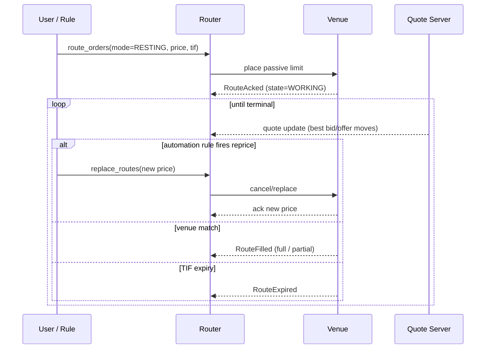

# Route to Resting

Place a passive limit order at a venue and **let it rest** in the order book until filled, cancelled, or expired. Contrasts with aggressive marketable routing ([[route-single]]) and with quote-discovery flows ([[route-to-rfq]]).

## Purpose

Earn the spread (or improve average price) by adding liquidity rather than taking it. The route sits at the venue's CLOB; the EMS holds an obligation to track its lifecycle and manage replaces / cancels.

## Trigger / Entry Point

- Trader sends a passive limit explicitly via API `route_orders([{order_id, venue, mode: RESTING, limit_price, tif}])`.
- [[auto-route]] rule that prefers passive when the order has a non-aggressive limit price (e.g. inside-bid for a buy order is aggressive; below-bid is passive).
- An [[arch-automation-layer|automation rule]] like [[fx-automation-tradebest|TradeBest]] reposting at chasing prices.

## Actors

- Trader / DMA user / automation actor.
- Venue's order book.
- [[arch-router-layer]] — tracks the resting route's lifecycle including replaces.
- [[arch-quote-server]] — used by automation to decide when to reprice.

## Steps



1. Validation: passive eligibility (some venues restrict who can rest), tick alignment, lot size, tif compatibility.
2. Router creates `Route { mode=RESTING, state=PENDING }`; adapter places the limit.
3. Venue ack → `state=WORKING`. The order sits in the book.
4. Lifecycle:
   - **Filled** by an aggressive contra → `RouteFilled` (full or partial).
   - **Replaced** by trader / rule — adapter issues cancel-replace; new `cl_ord_id` per FIX convention.
   - **Cancelled** explicitly.
   - **Expired** on TIF — `DAY` at close, `GTD` at the supplied date, `IOC`/`FOK` rejected as resting requests.

## Inputs

- `order_id` (`READY`).
- `venue` — a CLOB-capable venue.
- `limit_price` (required; resting without a limit is undefined).
- `tif` — `DAY`, `GTC`, `GTD`, `GTX` (good-till-extended).
- `display_qty` / `min_qty` — for iceberg orders where supported.
- `peg_offset` — for pegged-to-bid/offer orders where supported.

## Outputs / Side Effects

- `RouteSent`, `RouteAcked`, repeated `RouteReplaced` on each replace, `RouteFilled` / `RouteCancelled` / `RouteExpired` terminal.
- For partial fills: `RoutePartialFill` events; route remains `WORKING` until terminal.
- FIX `ExecutionReport` mirrored to paired FIX clients.

## Edge Cases & Nuances

- **Reprice cadence.** Aggressive reprice loops (replace every quote tick) can violate venue throttles. The [[arch-automation-layer|automation layer]] rules implementing TradeBest-style logic must respect rate limits or get `EMS-RTE-3008 venue_replace_throttled`.
- **In-flight replace race.** Replace issued while a fill is in-flight; venue may fill the old price. Reconciliation per [[arch-venue-connectivity]] failure-mode rules.
- **Late cancel after fill.** Cancel sent after venue has already filled → adapter receives both ack messages; `RouteAnomaly` event for ops triage; book state unaffected.
- **Iceberg/hidden quantity.** Venue may report only the `display_qty` portion as visible; fills can exceed `display_qty` per refresh cycle. Adapter aggregates fills correctly against the parent route.
- **GTC across trade dates.** A `GTC` resting order traverses the [[tradedate-roll|trade-date roll]]; the route's logical identity persists but venue may require a fresh ID per session.
- **Asset-class semantics:**
  - **FX**: most FX RFQ venues are not CLOBs; resting applies to FX CLOB venues (e.g. EBS, FX Spot+).
  - **FI**: resting on bond CLOBs is rare; mostly used on listed UST futures via the futures adapter.
  - **Equity**: standard. Display quantity, MPID handling, ELP / iceberg.

## API mapping

```
operation: route_orders
items: [{
  order_id,
  venue:         VenueRef,
  mode:          RESTING,
  limit_price:   decimal,
  qty:           decimal,
  tif:           DAY | GTC | GTD | GTX,
  display_qty?:  decimal,
  min_qty?:      decimal,
  peg?:          { kind: BID | OFFER | MID, offset: decimal }
}]

operation: replace_routes
items: [{ route_id, fields: { limit_price? | qty? | display_qty? } }]

operation: cancel_routes
items: [{ route_id }]
```

## Validator codes touched

`EMS-RTE-1012` (resting not supported at venue), `EMS-RTE-3008` (replace throttled), `EMS-RTE-3009` (peg parameters out of range), `EMS-RTE-1013` (TIF not supported), `EMS-PRM-1001..1003` (cpty tag 3-layer).

## Permissions

- `#trade-{asset_class}` (3-layer).
- `#cpty-{venue}`.
- `#iceberg` / `#peg` where the firm restricts those order types.

## Related

- [[arch-router-layer]] · [[arch-venue-connectivity]] · [[arch-quote-server]] · [[arch-automation-layer]]
- [[route-single]] · [[route-to-rfq]] · [[auto-route]] · [[fx-automation-tradebest]]
- [[tradedate-roll]] · [[partial-routes]]
