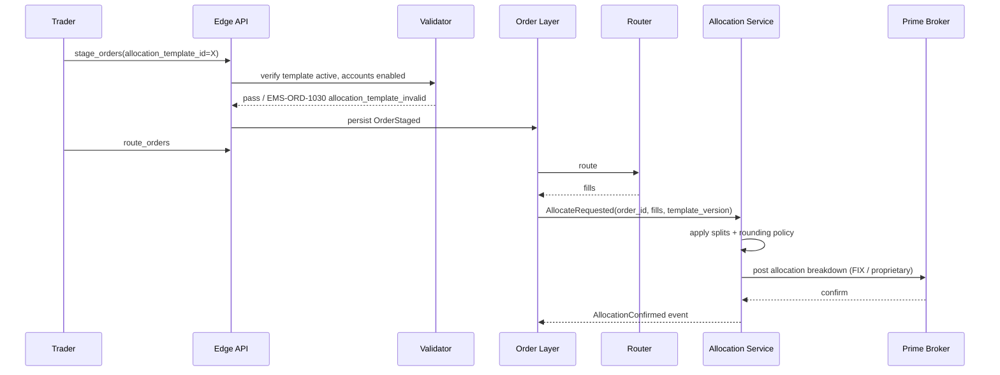

# Allocation → Prime Broker, Templates, Internal Accounts

Orders carry an **allocation template** that describes how fills will distribute across one or more accounts (often via a prime broker) once execution completes. Templates are reusable, named, and versioned; orders reference them by ID rather than copying the allocation in.

## Purpose

Decouple execution from allocation: the order is sized and routed as a single block, but post-fill the block is split across N internal accounts / sub-accounts / fund slots according to the template. This is universal in buy-side flows and corporate-treasury workflows.

## Trigger / Entry Point

- Staging a new order: `allocation_template_id` set on the envelope.
- [[amend-order|Amending]] an existing order to add/change the template.
- Automation: a rule attaches a default template by tag or batch.

## Actors

- Sales / portfolio assistant — owns the template registry.
- Trader — sets template on order.
- Prime broker — receives the allocation breakdown post-execution.
- [[arch-validator]] — verifies template currency, account membership, and template publication state.

## Allocation template shape

```
AllocationTemplate {
  template_id              UUID
  name                     string
  version                  int               # bump on edit; orders reference a specific version
  owner                    Identity
  scope                    FIRM | DESK | USER
  prime_broker             PrimeBrokerRef?
  splits: [
    { account: AccountRef, share: decimal | absolute_qty, sub_account_hint? }
  ]
  total_share              decimal           # must sum to 1.0 if proportional
  rounding_policy          ROUND_HALF_UP | ROUND_DOWN | DISTRIBUTE_RESIDUAL
  effective_date?          date
  expiry_date?             date
}
```

## Steps



1. Staging: template referenced by ID + version.
2. Validator checks: template exists, not expired, scope-appropriate for user, all listed accounts are enabled for the firm/desk.
3. Routing proceeds normally — template doesn't affect routing.
4. On fills, [[arch-event-sourcing|`AllocationRequested`]] event triggers the allocation service.
5. Service computes the per-account split per the template's policy.
6. Output: per-account fill records sent to the PB or booked internally.

## Inputs

- `allocation_template_id` (or `allocation_inline` for one-off — discouraged at scale).
- `allocation_template_version`: pinned at stage time; subsequent template edits don't affect this order.

## Outputs / Side Effects

- `AllocationRequested` per fill.
- `AllocationApplied` per account.
- `AllocationConfirmed` when PB acknowledges (where applicable).
- Outbound FIX `J` AllocationInstruction to the prime broker, or proprietary API.

## Edge Cases & Nuances

- **Partial fills.** Template applied per fill, not per order. Each fill produces per-account fractions; rounding policy distributes residual.
- **Rounding residual.** With 5 accounts at 20% each and a fill of 17 lots, 3 lots split cleanly; 2 lots are residual. `DISTRIBUTE_RESIDUAL` assigns to the largest-share accounts first; `ROUND_HALF_UP` may produce slightly unequal allocations.
- **Mid-life template change.** Editing a referenced template version: the order keeps its pinned version. To switch, amend the order's `allocation_template_id` (gated as a material amend — may reset [[two-step-approval]]).
- **Account permission scope.** All accounts in the template must be enabled for the trader's user/desk under [[arch-tag-permissions]]. If one account loses enablement post-stage, the next allocation attempt fails with `EMS-ORD-1031 allocation_account_no_longer_enabled`.
- **PB mismatch.** Order's `broker` field and template's `prime_broker` must be consistent (or template's PB is null and order's broker drives). Mismatch → `EMS-ORD-1032 pb_template_mismatch`.
- **Multi-PB templates.** Some templates split across multiple PBs (e.g. half to GS, half to JPM). Then each PB receives its share separately; reconciliation tracks both.
- **Late-arriving instructions.** Some buy-side flows finalize allocations only after execution (block trade, allocate later). Order has `allocation_template_id=DEFERRED`; on execution, a manual `set_allocation_template` op binds the template before the PB call.
- **Audit.** Every allocation step is an event; auditors can reconstruct any moment.
- **Cross-asset.** FX has different per-leg allocation semantics (spot + forward of an FX swap may go to the same template, but PB constraints differ). FI typically allocates by account share to a settle date. Equity is the simplest case.

## API mapping

```
operation: stage_orders
items: [{ ..., allocation_template_id, allocation_template_version }]

operation: set_allocation_template
items: [{ order_id, allocation_template_id, allocation_template_version }]

operation: register_allocation_template
items: [{ name, prime_broker, splits, rounding_policy, ... }]

operation: list_allocation_templates(filter)
```

## Validator codes touched

`EMS-ORD-1030..1034` (template invalid / account / PB mismatch / shares don't sum), `EMS-PRM-1001..1003` per account, `EMS-ORD-1031` (account no longer enabled).

## Permissions

- `#allocation-template-author` for create/edit.
- Per-account `#account-{id}` (3-layer per [[arch-tag-permissions]]).
- `#alloc-prime-broker-{pb_id}` per prime broker.

## Related

- [[arch-order-staged]] · [[arch-router-layer]] · [[arch-event-sourcing]] · [[arch-validator]]
- [[pre-authorized-cptys]] · [[broker-codes]] · [[staging-via-fix]] · [[staging-via-excel]]
- [[two-step-approval]] · [[counterparty-enablement]]
