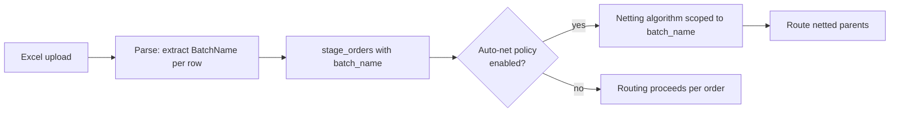

# BatchName Column

`BatchName` is a column commonly used in Excel-staged uploads ([[staging-via-excel]]) to identify all rows belonging to a single batch — distinct from `GroupID` and from hashtag-style display groupings, despite being frequently confused with them.

## Purpose

Identify the **scope of batch operations** — chiefly auto-netting ([[netting-auto-via-excel]]), bulk update/route ([[bulk-order-update-route]]), and batch-level audit. Critical because mixing up `BatchName`, `GroupID`, and tag-groupings is the most common source of "why didn't these orders net" questions.

## The three concepts side-by-side

| Concept | Field on order | Source | Semantic | Default behavior |
|---|---|---|---|---|
| **BatchName** | `batch_name` | Excel batch envelope; explicit at stage | Bag of orders submitted together. | Default scope of auto-netting + bulk operations. |
| **GroupID** | `group_id` | Explicit per-order field ([[group-id]]) | Cross-batch correlation key (e.g. parent program ID). | Not used by netting unless `#net-cross-batch` widens. |
| **Hashtag groups** | `tags: set<string>` | Free-form, per-order | Display / list grouping, automation triggers. | Does not affect netting; does drive UI groupings and rule-trigger filters. |

## When to use which

- **Same upload, want to net these together** → `BatchName=X`.
- **Multiple uploads, all part of one program (e.g. rebalance #42)** → `GroupID=program_42`.
- **Orders share a label for the trader's blotter / a "watch list"** → `tags: [#program-42]`.

All three can be set on the same order without conflict. `BatchName` and `GroupID` are scalar; `tags` are a set.

## Trigger / Entry Point

- Excel `BatchName` column on staged rows.
- API `stage_orders(options: { batch_name: "..." }, items: [...])`.
- Bulk operations (`bulk_amend`, `bulk_route`) addressing orders by `batch_name`.

## Steps (typical lifecycle)



## Inputs

- `batch_name: string` per row (Excel) or batch-level (API).
- Optional `batch_open` / `batch_close` semantics (some firms close batches explicitly to trigger auto-net).

## Outputs / Side Effects

- Persisted on each order's envelope.
- `BatchStaged { batch_name, order_ids }` event when the batch lands.
- `BatchClosed` event when the batch terminates (explicit or timeout).
- Drives [[netting-auto-via-excel|auto-netting]], [[bulk-order-update-route|bulk update/route]], and batch-level audit views.

## Edge Cases & Nuances

- **Empty / NULL BatchName.** Per firm policy: reject (force a batch name on every row) or accept as "ungrouped" — making auto-net inapplicable to those rows.
- **Same BatchName across different sources.** Two operators both upload with `BatchName=TREAS-20260605`. They merge into one batch by default unless `batch_name_owner_qualified=true` (firm option), which qualifies it with the source user's id.
- **BatchName collision across days.** `BatchName` includes a date by convention; many firms add a date prefix (`20260605-TREAS-001`) to avoid collision over time.
- **Bulk operations addressing by BatchName.** `bulk_amend(batch_name=X, fields={...})` applies to every order with that batch_name still in `STAGED`. Routed orders are excluded unless the operation explicitly targets routed.
- **Auto-net cross-batch.** Default is intra-batch only. Cross-batch netting requires `GroupID` + `#net-cross-batch` tag — see [[group-id]].
- **Display.** Blotter UIs group by `batch_name` as a default expand/collapse axis.

## API mapping

```
operation: stage_orders
options: { batch_name?: string, ... }
items: [{ ..., batch_name?: string }]   # optional per-row override (rarely used)

operation: list_batches(filter)
operation: close_batch
items: [{ batch_name }]
```

## Validator codes touched

`EMS-ORD-1080` (batch_name required by policy and missing), `EMS-ORD-1081` (batch_name collision across owners), `EMS-ORD-1082` (cannot reopen closed batch).

## Permissions

- `#trade-{asset_class}` for the orders themselves.
- `#bulk-batch-operator` for `close_batch` and bulk_amend by batch_name.

## Related

- [[arch-order-staged]] · [[arch-event-sourcing]]
- [[staging-via-excel]] · [[group-id]] · [[netting-auto-via-excel]] · [[bulk-order-update-route]]
- [[batch-creation]]
