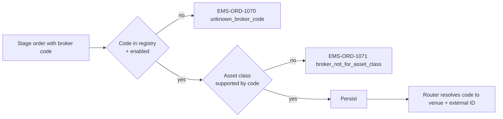

# Broker Codes

Orders frequently carry a **broker code** identifying the executing broker (or executing-and-clearing broker, depending on the asset class). The code is a controlled vocabulary maintained at firm level, mapped onto venue-side counterparty IDs by the venue adapter.

## Purpose

Standardize a single firm-wide broker identifier across order capture (UI/Excel/FIX), validation, routing, allocation, and reporting — so the same broker is referenced consistently from order entry through post-trade.

## Trigger / Entry Point

- Set on the staged order envelope at stage time.
- May default to user/desk preference if firm allows.
- Modifiable via [[amend-order]] before routing (post-routing typically requires cancel + re-route).

## Actors

- Trader / sales — selects.
- Firm admin — maintains the broker code registry.
- [[arch-validator]] — validates code, enablement, and per-asset-class restrictions.
- [[arch-router-layer]] — uses the code to choose the venue / adapter.

## Broker code registry shape

```
BrokerCode {
  code             string          # internal short code, e.g. "GS_US"
  long_name        string
  external_ids     map<system, id> # FIX SenderCompID variants, MIC codes, LEI
  asset_classes    set<AssetClass>
  enabled          bool
  default_routes   map<AssetClass, VenueRef>   # which venue this code maps to per asset class
}
```

## Steps



## Inputs

- `broker_code: string` on envelope.

## Outputs / Side Effects

- Persisted on order.
- Drives routing: the router consults `default_routes[asset_class]` to pick the venue / adapter when not explicitly overridden.
- Drives allocation cross-check (broker code must be consistent with the allocation template's PB — see [[allocation-prime-broker]]).
- Drives reporting (TRACE / MSRB / CFTC SDR field `executing_broker_id`).

## Edge Cases & Nuances

- **Multi-asset broker.** A broker code covering equity + FI uses different `external_ids` per asset class. The adapter looks up the right ID by asset class.
- **Broker decommissioning.** A code marked `enabled=false` rejects new orders but doesn't affect orders already staged with the code; those route normally until cancellation or completion.
- **Cross-firm broker code clashes.** Each firm has its own registry; codes are not portable. SaaS multi-tenant deployments scope the registry per firm.
- **Default broker by trader.** If a user has a desk-level default broker, the UI pre-fills it on new tickets; explicit selection overrides.
- **Broker code on an [[arch-aggregation|aggregated]] parent.** Aggregation eligibility requires same broker code; mixed broker codes don't aggregate.
- **Broker code on netted parent.** Same logic — see [[arch-fx-netting]].
- **Audit and reporting.** Outbound regulatory reports carry the broker code's canonical `external_ids[regulator]`; the validator confirms the regulator-system mapping is present before reporting.

## API mapping

```
order.broker_code: string

# Admin operations:
operation: register_broker_code
items: [{ code, long_name, external_ids, asset_classes, default_routes }]

operation: list_broker_codes(filter)
```

## Validator codes touched

`EMS-ORD-1070` (unknown broker code), `EMS-ORD-1071` (broker not for asset class), `EMS-ORD-1072` (broker code disabled), `EMS-ORD-1073` (broker code missing required external id for regulator), `EMS-ORD-1032` (PB/broker code mismatch with allocation template).

## Permissions

- `#trade-{asset_class}` (3-layer).
- `#broker-admin` for managing the registry.

## Related

- [[arch-order-staged]] · [[arch-router-layer]] · [[arch-validator]]
- [[allocation-prime-broker]] · [[pre-authorized-cptys]] · [[counterparty-enablement]]
- [[staging-via-ticket]] · [[staging-via-fix]] · [[staging-via-excel]]
