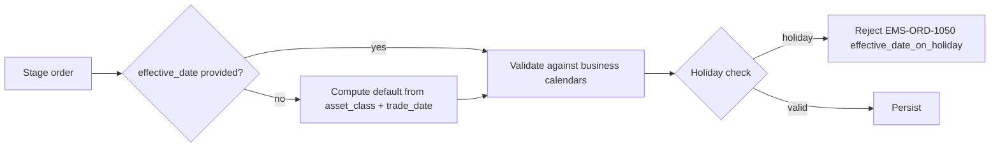

# Effective Date

The **effective date** of an order is the trade date for cash-equity-like instruments and the **value date / settlement date** for FX and fixed income. It governs settlement, netting eligibility, and trade-date roll behavior. The field is asset-class-specific and frequently confused with `trade_date`, `settle_date`, and `expiry_date`.

## Purpose

Capture the date on which the order's economic obligation takes effect. Used by:

- [[arch-fx-netting|FX netting]] (value date is part of the netting key).
- [[arch-validator]] (business-day arithmetic, holiday calendars).
- Settlement / clearing routing.
- Reporting (trade-date vs value-date for TRACE / regulator).

## Trigger / Entry Point

- Set on the staged order's envelope at staging.
- Default: derived from `trade_date` plus the asset-class's spot-days convention.
- Override permitted with permission tag.

## Actors

- Trader / sales / automation.
- [[arch-validator]] — business-day calendar checks.
- [[arch-time-replay-server|clock interface]] — provides reference for "today".

## Terminology by asset class

| Field name on envelope | Equity | FX | FI |
|---|---|---|---|
| `effective_date` | trade_date (T+0 trade-date roll) | value_date (T+spot_days, pair-dependent) | settle_date (T+1 or T+2 per regime; TRACE-relevant) |
| Default | today | today + spot_days(pair) | today + asset-class default (T+1 UST, T+2 corp bond, etc.) |

## Steps



1. If not provided, derive from asset-class defaults + business-day calendar.
2. Validator checks: not on a holiday for the relevant settlement system (DTC / Fedwire / Euroclear / triparty), not too far in the future (firm caps).
3. Persisted on the order.

## Inputs

- `effective_date: date` on the envelope (or asset-class default).
- `calendar`: implicit per instrument's home market; can be overridden with `#calendar-override`.

## Outputs / Side Effects

- Persisted; copied to routes.
- Drives [[arch-fx-netting|netting]] key composition.
- Drives auto-rolling at [[tradedate-roll|trade-date roll]].
- Reported on outbound regulatory messages.

## Edge Cases & Nuances

- **Spot days per pair.** Most majors are T+2; USD/CAD T+1; USD/TRY varies (T+1 / T+2 per venue). The derivation uses a per-pair convention table; user override required for non-default.
- **Cross-currency holiday composition.** EUR/USD value date requires both EUR and USD business days. If T+2 normally lands on a USD holiday but EUR is open, the value date rolls to T+3.
- **Forward-dated orders.** Some orders stage today but are intended for future activation. Use `effective_date` in the future + `activation_at` (separate field) for "stage now, become routable on date X" semantics.
- **FI settle date vs trade date.** US Treasuries trade T+1 since 2024; corp bonds T+1 since 2024 too (post the SEC-led move). Older systems may still default to T+2; the firm's per-instrument convention table is authoritative.
- **NDF semantics.** NDF "value date" is the fixing date for non-deliverable PnL calculation; the settle date is different (usually fixing + 2 BD).
- **Override permission.** Setting an arbitrary `effective_date` outside the asset-class default requires `#effective-date-override` (3-layer per [[arch-tag-permissions]]).
- **Replay.** Business-day arithmetic uses the order's persisted `effective_date`, not re-derived from current calendars; otherwise replay results would drift as holiday tables evolve.

## API mapping

```
order.effective_date: date
order.activation_at?: timestamp     # for future-dated orders
order.calendar_override?: CalendarRef
```

## Validator codes touched

`EMS-ORD-1050` (effective_date on holiday), `EMS-ORD-1051` (effective_date too far in future), `EMS-ORD-1052` (effective_date in the past), `EMS-ORD-1053` (cross-currency calendar conflict), `EMS-PRM-1101` (override requires tag).

## Permissions

- `#effective-date-override` for non-default values.
- `#calendar-override` for custom calendars.

## Related

- [[arch-order-staged]] · [[arch-validator]] · [[arch-fx-netting]] · [[arch-time-replay-server]]
- [[expiry-type]] · [[tradedate-roll]] · [[what-are-swaps]]
- [[staging-via-ticket]] · [[staging-via-excel]]
