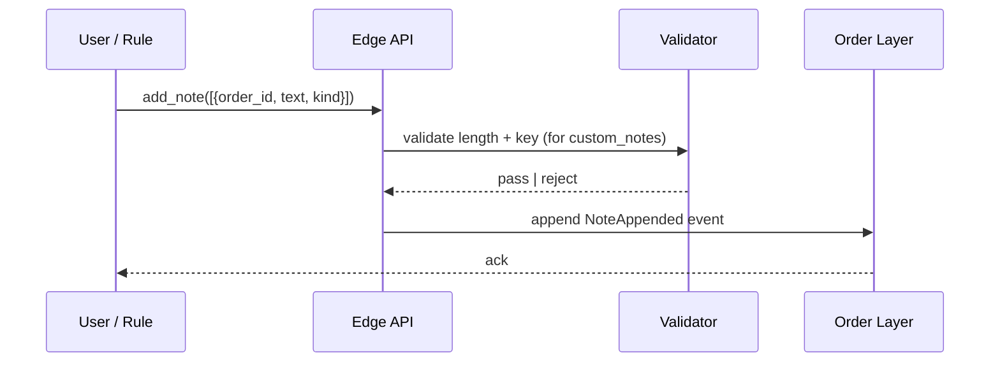

# Notes & Custom Notes

Orders carry a **structured notes** capability: free-form `notes` (chronological list) plus a **typed key-value** `custom_notes` map for firm-specific structured data. Both are non-routing fields — they never affect venue behavior — but are critical for sales/trader communication, compliance retention, and post-trade analysis.

## Purpose

Capture context that doesn't fit into structured order fields: the reason for an order, the originating client request, the compliance rationale, internal tags for downstream STP, etc. Notes are an append-only sub-event stream that respects the same audit guarantees as the rest of the order.

## Trigger / Entry Point

- Trader / sales typing a note on a staged order's UI.
- API `add_note([{order_id, text, kind?}])` from any caller.
- Automation rule attaching context (e.g. "auto-routed by TradeBest at midpoint").
- FIX message inbound with `58=Text` mapped to a note on the bridge.

## Two shapes

| Shape | Use | Validation |
|---|---|---|
| `notes: [Note]` | Chronological free-form notes. Each `Note { author, text, kind, created_at }`. | Length cap; tags policy may flag sensitive content. |
| `custom_notes: map<string, string>` | Firm-defined typed key-value. E.g. `{compliance_ack: "ack-2026-06-05-T0915-jdoe"}`. | Per-firm schema defines allowed keys, value type, and permissions to set each key. |

`notes` is conversational. `custom_notes` is structured metadata used by downstream systems.

## Actors

- Trader / sales — common authors.
- Compliance — appends approval/refusal notes.
- Automation — appends rule-firing rationale.
- Downstream STP — reads `custom_notes` keys.

## Steps



## Inputs

- `add_note`: `order_id`, `text` (or `key`+`value` for custom_notes), `kind` (`general`, `compliance`, `client_ref`, `auto`, `error_diagnostic`, etc.), `visibility` (default desk-wide).
- For custom_notes: per-firm allowed-key schema enforced by the validator.

## Outputs / Side Effects

- `NoteAppended` event ([[arch-event-sourcing]]).
- Possible downstream subscriber notification (e.g. compliance system).
- For specific `kind` values, automation rules may fire (e.g. `kind=compliance_ack` clearing a `NeedComplianceAck` pending action).

## Per-firm custom_notes schema

A firm declares allowed keys at the firm-admin level:

```
CustomNotesSchema {
  keys: [
    { name: "compliance_ack",      type: string, max_len: 200, required_for_assets: ["fixed_income"] },
    { name: "client_request_ref",  type: string, max_len: 100 },
    { name: "research_basis",      type: text,   max_len: 4000, permission: "#research-note-author" },
    { name: "trade_thesis",        type: text,   max_len: 8000 }
  ]
}
```

Setting an undeclared key → `EMS-ORD-1020 unknown_custom_note_key`.

## Edge Cases & Nuances

- **Notes are append-only.** No "edit". A correction is a new note. The previous text remains in the [[arch-event-sourcing|log]] and stays visible (or marked superseded in the UI).
- **Notes affect approval.** Some firms require a "trade thesis" custom note before [[two-step-approval]] can pass — surfaced as a `pending_action: NeedTradeThesis` on the order.
- **Sensitive content scanning.** Optional firm policy: notes are scanned for PII / MNPI keywords. Matches add a flag visible to compliance; the note is still saved.
- **FIX `58` mapping.** Inbound FIX `58=Text` becomes a note with `kind=fix_inbound`; outbound order updates may emit text into 58 (e.g. for `BusinessMessageReject` reasons).
- **Multi-language.** Notes are unicode; no enforced language. Sentiment / keyword rules must handle this.
- **Sales coordination.** Many notes are typed by sales on behalf of clients; `author` is the sales user but `client_request_ref` in `custom_notes` links to the originating IB chat.
- **Compliance retention.** Notes inherit the order's retention policy; typically multi-year. Cannot be deleted (only marked superseded).
- **Display vs. routing.** Routers never read `notes` or `custom_notes` — they don't shape venue interactions. Sole purpose is human + downstream-system context.

## API mapping

```
operation: add_note
items: [{
  order_id,
  kind:         "general" | "compliance" | "client_ref" | "auto" | "error_diagnostic" | ...,
  text:         string,                       # for chronological note
  custom?:      { key: string, value: any },  # for custom_notes
  visibility?:  "desk" | "firm" | "self_only"
}]

operation: list_notes
items: [{ order_id }]
returns: [Note]
```

## Validator codes touched

`EMS-ORD-1019` (note length cap exceeded), `EMS-ORD-1020` (unknown custom_note key), `EMS-ORD-1021` (custom_note value type mismatch), `EMS-PRM-1101` (note kind requires tag).

## Permissions

- Most note kinds: any user with `#trade-{asset_class}`.
- `kind=compliance` + visibility `compliance-only`: `#compliance-note-author`.
- Sensitive `custom_notes.research_basis`: `#research-note-author`.

## Related

- [[arch-order-staged]] · [[arch-event-sourcing]] · [[arch-validator]]
- [[staging-via-ticket]] · [[staging-via-fix]] · [[amend-order]]
- [[two-step-approval]] · [[internal-notes]]
