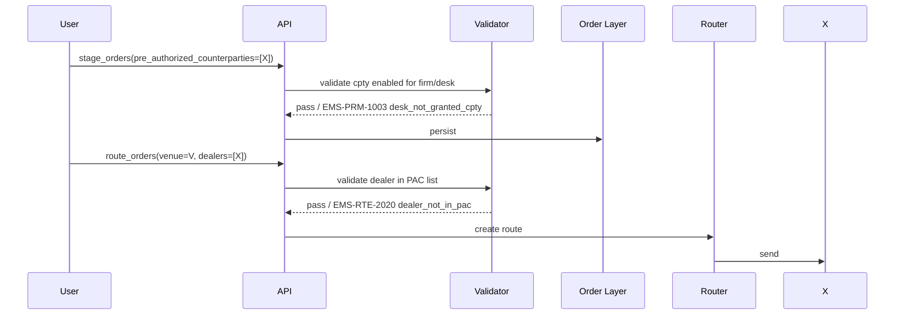

# Pre-Authorized Counterparties

A **pre-authorized counterparty (PAC)** is a counterparty the firm has explicitly pre-cleared an order (or a category of orders) to trade with. Setting a PAC on an order narrows the routing surface to that counterparty (or a list of pre-cleared ones) and signals downstream systems (netting, allocation, compliance) accordingly.

## Purpose

Capture a pre-trade business decision — "this order is intended for cpty X" — at staging time, so:

- The router cannot accidentally route elsewhere.
- [[arch-fx-netting|netting]] keys account for the PAC isolation (PAC-distinct orders don't net together).
- Sales coordination is preserved (the PAC may have been agreed verbally with the client).
- Compliance and reporting can validate the trade was indeed with the pre-cleared cpty.

## Trigger / Entry Point

- Sales/trader sets `pre_authorized_counterparties: [cpty_ref, ...]` on the staged order.
- A bulk batch ([[staging-via-excel]]) has a `pre_authorized_counterparties` column.
- An automation rule sets PAC for orders matching certain tags (e.g. `#client-omega` always routes to a specific PB).

## Actors

- Sales / trader.
- [[arch-validator]] — enforces the PAC restriction during routing.
- [[arch-router-layer]] — narrows routing decisions.
- Counterparty enablement service (per [[counterparty-enablement]]).

## Steps



1. Staging persists the PAC list as an envelope field.
2. Validator checks each PAC is enabled for the firm/desk.
3. On routing, the router checks that the chosen dealer(s) are a subset of the PAC list. Reject otherwise.
4. Netting incorporates the PAC into the key — see [[arch-fx-netting]].

## Inputs

- `pre_authorized_counterparties: [CounterpartyRef]` on the envelope.
- Optional `pac_fallback`: behavior when PACs are unreachable (`HOLD`, `WIDEN_TO_DEFAULT` requires permission).

## Outputs / Side Effects

- Persisted on order; copied to routes' validator contexts.
- Drives [[arch-fx-netting|FX netting]] key isolation.
- Cross-checked at allocation time against the PB referenced in [[allocation-prime-broker|allocation template]].

## Edge Cases & Nuances

- **PAC + non-PAC desk pool.** A PAC-set order does not net with non-PAC-set orders on the same pair / value date / account. PAC isolation prevails.
- **PAC unreachable at routing time.** Adapter to the PAC's venue is down. `pac_fallback: HOLD` keeps the order staged with `pending_action: PACUnreachable`; `WIDEN_TO_DEFAULT` requires `#pac-widen-on-failure` and emits a clear audit event.
- **PAC list of 1 vs N.** A single-cpty PAC is a strict gate. A multi-cpty PAC is effectively a curated dealer panel — routing can still execute multi-RFQ across just those PACs.
- **PAC inheritance.** When an order is split via [[partial-routes|partial routes]], every child route inherits the PAC list.
- **Sales-trader workflow.** Sales agrees a price with cpty X verbally; sets PAC=[X] on the order so the trader can only confirm with X. Combines with [[route-to-cnf]] for end-to-end accountability.
- **Allocation template PB mismatch.** If the order's allocation template PB is different from any PAC, validator returns `EMS-ORD-1032 pb_template_mismatch` at allocation time — caught early.
- **Counterparty enablement.** PAC validation is a real-time read of the counterparty enablement table (see [[counterparty-enablement]]); the table itself is event-sourced and can be replayed.

## API mapping

```
order.pre_authorized_counterparties: [CounterpartyRef]
order.pac_fallback: HOLD | WIDEN_TO_DEFAULT
```

## Validator codes touched

`EMS-ORD-1060` (PAC list empty when policy requires), `EMS-PRM-1003` (desk not granted cpty), `EMS-RTE-2020` (dealer not in PAC), `EMS-ORD-1061` (PAC + allocation PB mismatch), `EMS-RTE-2021` (PAC unreachable + HOLD).

## Permissions

- `#trade-{asset_class}` (3-layer).
- `#cpty-{counterparty}` for every cpty in the list.
- `#pac-widen-on-failure` for the WIDEN_TO_DEFAULT fallback.

## Related

- [[arch-order-staged]] · [[arch-router-layer]] · [[arch-validator]] · [[arch-fx-netting]] · [[arch-tag-permissions]]
- [[counterparty-enablement]] · [[broker-codes]] · [[allocation-prime-broker]] · [[route-to-cnf]] · [[route-to-rfq]]
- [[netting-auto-via-excel]]
