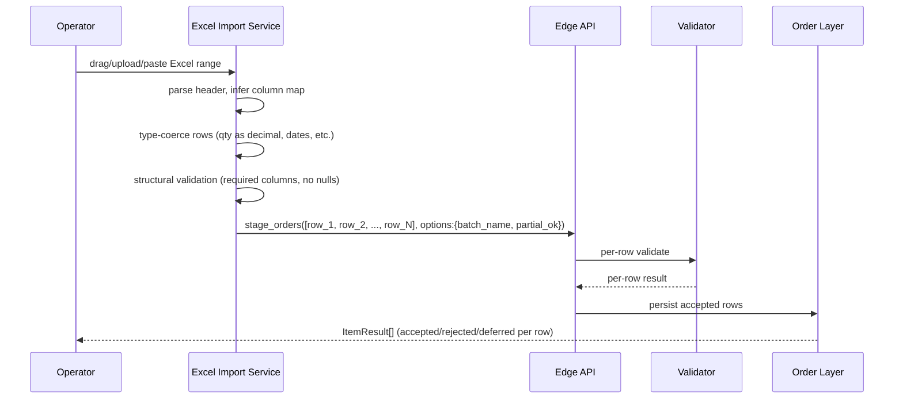

# Staging via Excel

Bulk-stage orders from a spreadsheet: drag/drop, copy-paste from clipboard, file upload, or FTP drop. Primary entry path for portfolio rebalances, treasury batches, and recurring funding flows. Heavily used in FXEL and similar buy-side flows.

## Purpose

Capture orders that originate in spreadsheets (most buy-side workflows do) without manual re-keying. Each Excel batch becomes a [[arch-api-first|batch API call]] under the same validator + audit machinery as everything else.

## Trigger / Entry Point

- Trader drags Excel file onto the EMS blotter or paste range from clipboard.
- File upload via "Import" dialog.
- FTP/SFTP drop into a watched directory (server-side ingestion).
- All four routes converge on the same API endpoint.

## Actors

- Operator / trader.
- Excel import service (parses, type-coerces, validates structurally).
- [[arch-api-first|API]] — receives `stage_orders` batch.
- [[arch-validator]] — per-row gating.
- [[arch-order-staged|order layer]] — persists.

## Steps



1. **Parse.** Header row matched against a known column map; unknown columns are noted but not fatal.
2. **Type-coerce.** Decimals, dates, enums (BUY/SELL); coercion failures map to per-row rejects.
3. **Structural validate.** Required columns present, no missing keys, identifier types consistent (don't mix CUSIP and ISIN in the same column).
4. **Build batch.** Form `stage_orders([row, ...])` with batch-level options (`batch_name`, `partial_ok`, `net_within_batch`).
5. **Submit.** API runs full validator per row. Partial-success per [[arch-api-first|batch envelope rules]].
6. **Report.** Per-row result returned: accepted (with `order_id`) / rejected (with code) / deferred (e.g. waiting on symbology resolution).

## Inputs

- Excel range with at least: instrument identifier, side, qty, account.
- Optional: limit_price, tif, value_date, batch_name, group_id, notes, tags.
- Batch-level options: `partial_ok` (default true), `net_within_batch` (default desk-policy), `dry_run` (validate-only).

## Outputs / Side Effects

- One `BatchStaged` event with the batch summary.
- `OrderStaged` per accepted row.
- Per-row reject events for failures.
- Excel-source metadata preserved on each order (`origin=EXCEL`, `source_filename`, `source_row_number`).

## Edge Cases & Nuances

- **Column auto-detect failure.** If the header doesn't match any known map, the UI asks the user to map columns manually; saved as a per-user template.
- **Mixed asset classes in one batch.** Validator branches per-row; allowed.
- **Symbology mass-resolve.** Many rows reference SEDOL/CUSIP/ISIN. The batch is symbology-resolved in one call to [[arch-symbology-figi]] (license-metered); rows whose identifiers don't resolve return `EMS-REF-2001 unknown_figi`.
- **Auto-netting on import.** If `net_within_batch=true` and the desk's auto-net policy applies, the import flow chains into [[netting-auto-via-excel]] post-stage.
- **`BatchName` vs `GroupID`.** Many spreadsheets carry both columns. [[batchname-column]] explains the distinction — `batch_name` is the netting scope; `group_id` is cross-batch correlation.
- **Large batches (10k+).** Server enforces a per-batch row cap (firm-policy); larger uploads must split. The cap is high but finite to prevent DoS.
- **Duplicate detection.** A `client_order_id` column allows detection of accidental re-uploads; duplicates within the day return `EMS-SES-1004 duplicate_request_id`.
- **FTP path.** Watched-directory uploads identify themselves with a "client cert" or user-binding so identity propagates. They are treated identically to interactive uploads at the validator boundary.
- **Dry-run.** `dry_run=true` returns the would-be results without persisting; used by traders to validate a batch before committing.

## API mapping

```
operation: stage_orders
options: {
  batch_name?: string,
  group_id?: string,
  partial_ok?: bool,           // default true
  net_within_batch?: bool,     // default desk-policy
  dry_run?: bool
}
items: [{ row 1 }, { row 2 }, ..., { row N }]   # batch by default per [[arch-api-first]]
```

## Validator codes touched

All standard codes. Common Excel-flow ones: `EMS-REF-2001` (unknown FIGI), `EMS-REF-1001` (license denied), `EMS-ORD-1010` (missing required field), `EMS-ORD-1014` (missing limit), `EMS-SES-1004` (duplicate), per-row.

## Permissions

- `#trade-{asset_class}` (3-layer per [[arch-tag-permissions]]) — per row.
- `#bulk-upload` may be required by some firms.
- `#ftp-drop` for FTP-source paths.

## Related

- [[arch-api-first]] · [[arch-validator]] · [[arch-symbology-figi]] · [[arch-order-staged]]
- [[staging-via-ticket]] · [[staging-via-fix]] · [[netting-auto-via-excel]]
- [[batchname-column]] · [[group-id]] · [[bulk-order-update-route]]
