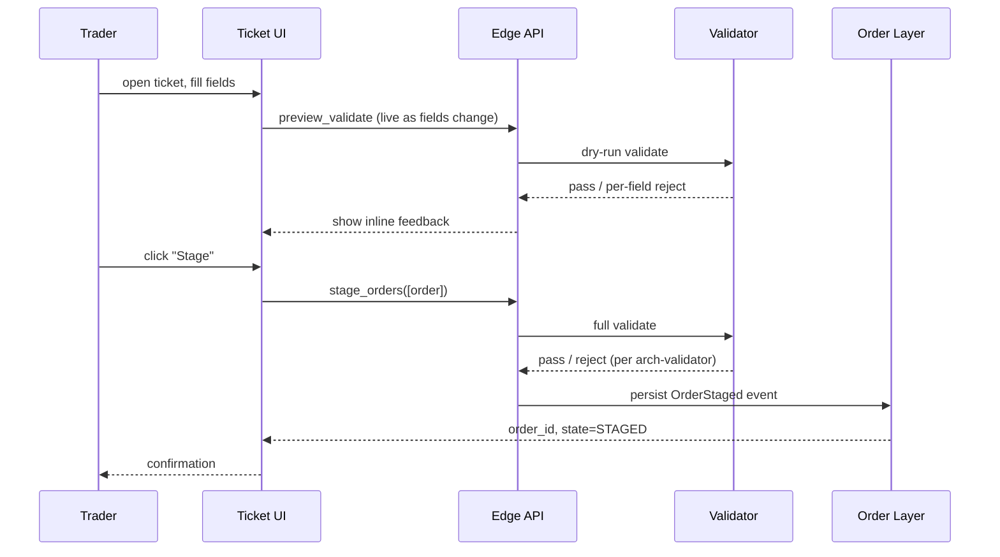

# Staging via Ticket

The interactive UI form for staging a single order. Most common entry point for traders working one order at a time at a desk terminal. Distinguished from bulk paths ([[staging-via-excel]], [[staging-via-fix]]) by being human-driven and one-at-a-time.

## Purpose

Provide a guided, validated, asset-class-aware form for staging a single order. The ticket UI is a thin client over the [[arch-api-first|API]]: every field maps to an attribute on the `stage_orders` request, and every validation rendered in the UI is a preview of the validator's actual rules.

## Trigger / Entry Point

- Trader opens "New Ticket" in the UI (or `<Ctrl+N>` equivalent).
- Sales-trader receives a client request and opens a ticket pre-populated from a client-IB ([[bloomberg-ib]]) message.
- A right-click on an order on the blotter spawns a "Clone Ticket" with the source order's fields populated.

## Actors

- Trader / sales-trader.
- UI thin client.
- [[arch-api-first|API]] — receives the `stage_orders` call.
- [[arch-validator]] — gates.
- [[arch-order-staged|order layer]] — persists.

## Steps



1. UI offers asset-class-aware field set (FX shows ccy pair + value date; FI shows CUSIP + settle date; equity shows symbol + lot).
2. As the user types, the UI calls a `preview_validate` endpoint that runs the validator dry-run and returns per-field feedback. Server-authoritative; no client-only rules.
3. On "Stage", a full `stage_orders` call is issued. Same validator path as FIX/Excel inputs.
4. Result: `order_id`, current state, any `pending_actions` (e.g. `NeedApproval2` if [[two-step-approval]] applies).

## Inputs

Same core envelope as any staging path (see [[staging-via-fix]] for the cross-asset field list), with UI-helpful additions:

- `ticket_template_id` — optional saved template to pre-populate (e.g. "EURUSD spot to Citi DEFAULT").
- `client_ref` — trader's free-text reference, copied to a `tags` set.
- `client_request_id` — when ticket originates from a client-IB integration.

## Outputs / Side Effects

- `OrderStaged` event ([[arch-event-sourcing]]).
- Possible immediate `RuleFired` events from [[arch-automation-layer]] (auto-route, two-step-approval init, validation pass).
- UI receives `OrderStaged` push and renders the new ticket on the blotter.

## Edge Cases & Nuances

- **Preview-validate drift.** A field passes preview-validate but fails final-stage validate (e.g. a limit reference that updated between preview and submit). The UI must re-render the validator's reject without trusting prior preview success.
- **Pre-trade quote staleness.** UI shows market context (last, bid/ask, spread). If the order references "spot + 5 ticks" the UI uses [[arch-quote-server]] L1 reference; staleness threshold per asset class.
- **Pasted CUSIP/SEDOL/ISIN.** UI resolves via [[arch-symbology-figi|symbology]]; if the user's firm doesn't have the relevant license, the field reject includes the licensing admin's name.
- **Template containing stale defaults.** Saved templates may reference retired brokers / accounts. Loading a template runs preview-validate; stale references surface as per-field reject.
- **Account picker scope.** The account dropdown shows only accounts the user's identity has permission for (subject to [[arch-tag-permissions]]); fewer accounts visible = less risk of mistakes.
- **Two-step approval pre-warning.** UI signals "this will require approval" before the user clicks Stage, by previewing the would-be `pending_actions`.
- **Saved drafts.** Tickets can be saved as drafts client-side; **drafts are not orders** — no validator pass, no event. They become orders only on Stage.

## API mapping

```
operation: preview_validate
items: [{ partial_order_envelope }]
returns: per-field { ok | code | hint }

operation: stage_orders
items: [{ order envelope, origin: TICKET }]
```

## Validator codes touched

All standard `EMS-*` codes the validator can return (see [[arch-validator]]). Most surface to the UI as per-field hints during preview-validate.

## Permissions

- `#trade-{asset_class}` (3-layer per [[arch-tag-permissions]]).
- Account-visibility tags.

## Related

- [[arch-api-first]] · [[arch-validator]] · [[arch-order-staged]] · [[arch-quote-server]]
- [[staging-via-fix]] · [[staging-via-excel]] · [[notes-and-custom-notes]] · [[allocation-prime-broker]]
- [[two-step-approval]] · [[auto-route]]
