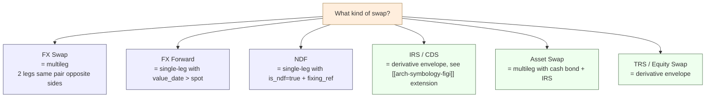

# What are Swaps?

"Swap" means different things across asset classes — and even within FX, "swap" overloads multiple structures. This note untangles the terminology used in EMS workflows and links each meaning to its representation in the order model.

## Purpose

Avoid silent semantic drift between "FX swap", "swap point", "interest rate swap", "credit default swap", and "asset swap" — each has different leg structures, lifecycles, and venue interactions. The order model handles them with distinct extensions; conflating them is a frequent source of validator confusion.

## The taxonomy

| "Swap" term | Asset class | What it is | Legs |
|---|---|---|---|
| **FX swap** | FX | Spot leg + forward leg in same pair, opposite sides, same notional. Used for liquidity/rolling. | 2 |
| **FX forward** | FX | Single-leg forward (no spot). Not really a swap, but often mis-called one. | 1 |
| **NDF** (non-deliverable forward) | FX | Cash-settled forward against a fixing reference. | 1 + fixing |
| **NDF swap** | FX | Two NDFs forming a roll structure. | 2 |
| **Interest Rate Swap (IRS)** | Rates derivatives | OTC derivative: exchange fixed for floating (or basis) cashflows over a tenor. | 2 (fixed leg, float leg) |
| **Credit Default Swap (CDS)** | Credit derivatives | OTC derivative: protection buyer pays premium, receives credit-event payout. | 2 cashflow streams |
| **Asset swap** | FI | Bond + IRS package converting fixed bond cashflow to floating. | 2 (cash bond, IRS) |
| **Total Return Swap (TRS)** | Equity derivatives | Swap of total return on an asset for a financing leg. | 2 |
| **Equity swap** | Equity derivatives | Variant of TRS or single-stock equity-return-vs-funding swap. | 2 |

## EMS order model representation

- **FX swap**: modelled as [[arch-multileg|multileg]] with `multileg_kind = SWAP`. Two legs, same FIGI pair, opposite sides, different value dates. See [[arch-multileg]] for the envelope and [[arch-fx-netting]] for swap-aware netting.
- **FX forward**: single-leg order with `value_date > spot_value_date`. Not multileg; lives in the FX extension block of the standard staged order.
- **NDF**: single-leg with `is_ndf=true`, `fixing_reference`, `settlement_currency`. The "fixing" is a date event, not a leg.
- **IRS / CDS**: separately-typed derivative envelope on the order — `extension.deriv = { fixed_leg, float_leg, index, tenor, payment_freq, ... }`. Cleared via CCPs (LCH, ICE Clear) — see [[arch-venue-connectivity]].
- **Asset swap / TRS / equity swap**: multileg with a cash leg and a derivative leg. The legs may route to different venues with different timing.

## Workflow implications

- **Staging:** asset-class extension differs per kind. Validator dispatches based on the typed extension. See [[arch-validator]].
- **Routing:** FX swaps route as a package to a swap-capable venue or as sequenced legs ([[spot-first]]). IRS / CDS route to SEFs ([[sef-platforms]]).
- **Netting:** FX swap netting is **leg-aware** — two FX swaps can collapse only if all four legs net. See [[arch-fx-netting]] swap section.
- **Documentation:** OTC derivatives require ISDA + asset-specific annexes ([[isda]], [[csa]]).
- **Reporting:** IRS/CDS → CFTC DTCC SDR ([[cftc-sdr]]). FX swap reporting varies by jurisdiction.

## Edge Cases & Nuances

- **"Spread" trade vs "swap".** A futures roll or options spread is sometimes loosely called a swap. EMS terminology reserves "swap" for the structures above; spreads are modelled as multileg with `multileg_kind = SPREAD` or `ROLL`.
- **Forward points vs swap points.** "Swap points" are the price difference between spot and forward legs of an FX swap. Order envelope captures them on the forward leg's `forward_points` field; UI may display them as the order's package price.
- **Tenor conventions.** "1M swap" means rolling spot to 1-month forward in FX; "1Y IRS" means a swap with one-year tenor in rates. The same shorthand has very different envelope implications.

## Related

- [[arch-multileg]] · [[arch-fx-netting]] · [[arch-symbology-figi]] · [[arch-validator]]
- [[netting-swap-net]] · [[spot-first]] · [[effective-date]] · [[spot-limit-price]]
- [[interest-rate-swaps]] · [[credit-default-swaps]] · [[fx-swap]] · [[fx-forward]] · [[fx-ndf]]
- [[isda]] · [[csa]] · [[cftc-sdr]] · [[sef-platforms]]
