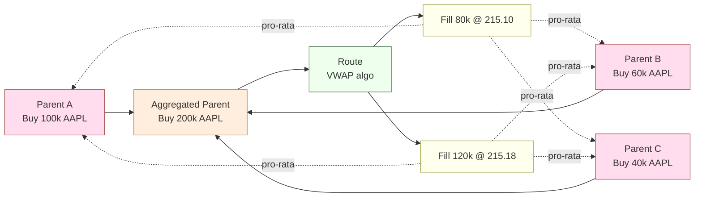
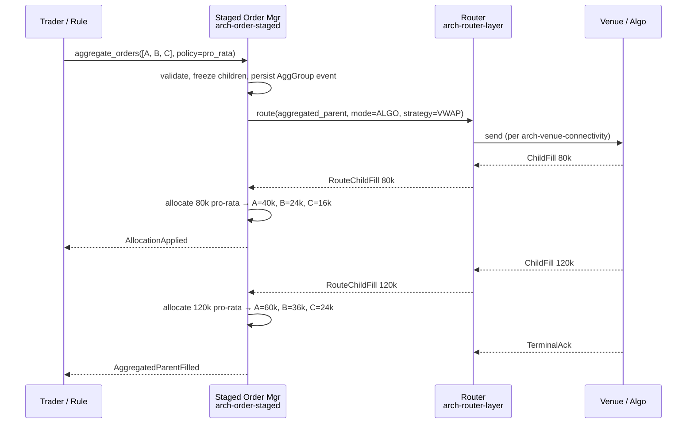

# Order Aggregation

Aggregation **combines N parent orders into one execution unit** so they trade as a single block, then allocates the result back to the parents. This is structurally different from [[arch-fx-netting|netting]] (which can collapse opposing sides into a smaller residual) and from [[arch-multileg|multileg]] (which is one order with N legs).

## When aggregation applies

- A buy-side firm wants to execute a VWAP for many client accounts as **one block** to ensure fair pricing across clients.
- A trader running a basket where each line is its own parent order wants a single market footprint.
- A portfolio rebalance where multiple desks contribute orders on the same instrument.

Aggregation is **trader- or rule-initiated**, not implicit. The EMS does not silently aggregate.

## Concepts

| Concept | Definition |
|---|---|
| Parent order | The aggregated child — the original order from a client/account. Its lifecycle continues to track allocation. |
| Aggregated parent | The new execution-facing order that the router sees. |
| Allocation rule | How fills are distributed back to parents — pro-rata, average-price, sequenced, custom rule. |

## Aggregation vs netting vs multileg

| Property | Aggregation | Netting | Multileg |
|---|---|---|---|
| Sides combine | Same side only | Opposing sides cancel | Any (legs are independent) |
| Output qty | Sum of children | Net of children | Same as parent |
| Parents survive | Yes (allocated back) | Yes (with split allocations) | N/A — there's only one parent |
| Typical trigger | Block execution policy | Treasury/FX policy | Inherent instrument shape |

## Relationship diagram



## Sequence (aggregate → execute → allocate)



## Envelope

```
AggregatedOrder {
  order_id           UUID
  child_order_ids    [UUID]
  agg_policy {
    eligibility:     EligibilityPredicate     // same instrument, same side, same trade date, etc.
    allocation_rule: PRO_RATA | AVG_PRICE | SEQUENCED | CUSTOM(ruleref)
    rounding:        ROUND_HALF_UP | ROUND_DOWN | DISTRIBUTE_RESIDUAL
  }
  agg_qty            decimal                  // sum of children
  state              STAGED | READY | ROUTING | FILLED | CANCELLED
  // standard envelope: identity, tags, batch_name, group_id, etc.
}
```

## Eligibility

A child can only join an aggregation when it satisfies the policy's `EligibilityPredicate`. Typical predicates:

- Same instrument (FIGI equal — `composite_figi` not enough; share class matters).
- Same side.
- Same effective/trade/value date.
- Compatible TIF (DAY+DAY, but mixing DAY and GTC requires explicit policy override).
- Same firm / desk (cross-desk aggregation needs `#cross-desk-aggregator`).

Predicate failure → `EMS-ORD-5001 ineligible_for_aggregation` with the failing predicate named.

## Lifecycle interactions

- **Child cancel during aggregation.** Children become read-only on aggregation. To cancel, the trader must `unaggregate_orders([agg_id])` first (only if no fills yet) or accept partial allocation on the cancelled child's behalf.
- **Aggregated parent cancel.** Cancels all child allocations not yet booked. Children return to `STAGED`.
- **Mid-life new child.** Adding a child to a working aggregation requires `extend_aggregation` and depends on the venue's behaviour (e.g. POV algo can accept size; some sweepers cannot).
- **Replace.** Replacing the aggregated parent's `qty` re-derives pro-rata weights from the new total and forward-applies them.

## Allocation rules

| Rule | Behaviour |
|---|---|
| `PRO_RATA` | Allocate by weight of original child qty; carry residual to last child per `rounding`. |
| `AVG_PRICE` | All children get the same average fill price; quantities allocated whole. |
| `SEQUENCED` | Fills allocated in declared child order until each child's qty is satisfied. |
| `CUSTOM(rule_id)` | A rule from [[arch-automation-layer]] computes allocations. Audit captures the rule decision. |

## Validator codes touched

`EMS-ORD-5001` (ineligible child), `EMS-ORD-5002` (rounding policy required), `EMS-PRM-1601` (cross-desk aggregator missing), `EMS-RTE-1007` (route incompatible with aggregation policy).

## Permissions

- `#aggregator` (3-layer per [[arch-tag-permissions]]).
- Cross-desk: `#cross-desk-aggregator`.
- Custom-rule allocation: `#custom-allocation-rule-binder`.

## Related

- [[arch-order-staged]] · [[arch-router-layer]] · [[arch-automation-layer]] · [[arch-validator]]
- [[arch-multileg]] · [[arch-fx-netting]]
- [[allocation-prime-broker]] · [[batch-creation]] · [[bulk-order-update-route]]
