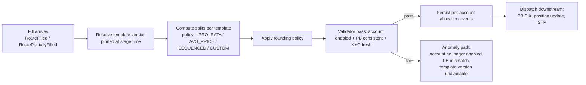

# Allocation Service

Splits parent fills into per-account allocations per the order's [[allocation-prime-broker|allocation template]]. Operates **per fill**, not per order, and handles partial fills, rounding residuals, deferred ("allocate later") workflows, multi-PB splits, and re-allocations triggered by post-fill busts.

## Position in the system

```
Route Fills -> Allocation Service -> Per-account allocation events -> Prime Broker / Custodian
                                                                     -> [[arch-position-service]]
                                                                     -> [[arch-stp-pipeline]] downstream
                                                                     -> [[arch-tca]] (per-account TCA)
```

Allocation is a **first-class post-trade pipeline stage** owned by this service. The order layer attaches the template; this service derives allocations from each fill.

## Inputs

- `RouteFilled` / `RoutePartiallyFilled` events from [[arch-router-layer]].
- `OrderFilled` parent-level events (for aggregated parents where fills come up the chain).
- `AllocationTemplate` reference data (from order at stage time, pinned to version).
- `TradeBust` / `TradeCorrect` events for reversal cascades.
- Account / PB / KYC reference data.

## Allocation pipeline



## Allocation events

```
AllocationRequested {
  fill_id, order_id, route_id,
  template_id, template_version,
  policy, rounding_policy
}

AllocationApplied {
  allocation_id, fill_id, account, qty, price, settle_target
}

AllocationDeferred {
  fill_id, reason: "block_now_allocate_later" | "missing_account_mapping"
}

AllocationReversed {
  original_allocation_id, reason: trade_bust | trade_correct | amendment
}

AllocationAnomaly {
  fill_id, reason, suggested_action
}
```

## Rounding policies

For 5 accounts at 20% each and a fill of 17 lots:

| Policy | Behaviour |
|---|---|
| `ROUND_HALF_UP` | 3, 3, 3, 4, 4 (rounds nearest with bias up) |
| `ROUND_DOWN` | 3, 3, 3, 4, 4 with residual 0 if exact division; otherwise drop fractional |
| `DISTRIBUTE_RESIDUAL` | 3, 3, 3, 4, 4 — residual goes to largest-share account(s) |
| `LARGEST_SHARE_FIRST` | Residual to highest-share account |

Asset-class precision rules: equity (whole shares typical), FX (10K minimum on majors, configurable), FI (denomination minimums per CUSIP).

## Late / deferred allocation

For "block-now-allocate-later" workflows ([[allocation-prime-broker]]):

- Order stages with `allocation_template_id=DEFERRED`.
- Fills park in a "house" allocation pending instructions.
- Operator calls `set_allocation_template(order_id, template)` once available.
- Service back-allocates all parked fills to the template.

State machine for deferred allocation:

```
DEFERRED_PENDING -> TEMPLATE_SET -> APPLIED
                                  -> REJECTED (validator fail at apply time)
```

## Multi-PB allocations

Templates may split across prime brokers. Each PB receives its own portion via its FIX session / API:

- One `AllocationApplied` per (account, PB) tuple.
- Outbound FIX `35=J AllocationInstruction` to each PB independently.
- Reconciliation tracks per-PB acks separately.
- PB rejection of a portion is an `AllocationAnomaly`; ops triages.

## Aggregation interaction

For aggregated orders ([[arch-aggregation]]): the aggregated parent's fills allocate **down to child orders first**, then each child's allocation template applies. Two-level allocation in one event chain.

```
aggregated_parent_fill -> allocate to child orders pro-rata
                       -> each child applies its own template
                       -> per-account allocations
```

The allocation service handles both levels atomically — failure at child level rolls back the parent-level split for that fill (per child).

## Bust / correct reversal

[[arch-fix-appendix-d|Trade Bust]] (`ExecType=H`) and [[arch-fix-appendix-d|Trade Correct]] (`ExecType=G`) require reversal of the original allocation:

- Bust: emit `AllocationReversed` for every `AllocationApplied` that traced to the busted fill. Cascades to position service (decrements), STP (cancel allocation instruction with PB), reg-reporting (amend).
- Correct: emit `AllocationReversed` then `AllocationApplied` with corrected price/qty. Reg-reporting amends.

## Pre-allocation validation

Before applying:

- Account is enabled for firm/desk ([[arch-tag-permissions]]).
- Account PB matches template PB (or template is PB-agnostic).
- KYC current for the account.
- Allocation qty respects per-account caps from [[arch-validator|validator]] / [[arch-compliance]].

Failures → `AllocationAnomaly` to ops; the fill stays unallocated and the order's `pending_actions` gains `NeedAllocationReview`.

## Determinism / replay

Allocations are pure functions of (fill, template version, ref data at fill time). [[arch-time-replay-server|Replay]] reproduces identical splits. The template version is pinned on the order at stage time so retroactive template edits don't change historical allocations.

## API surface

```
operation: set_allocation_template
items: [{ order_id, template_id, template_version, reason }]

operation: list_unallocated_fills(filter)

operation: replay_allocation              # ops triage tool
items: [{ allocation_id, alt_template? }]

operation: query_allocation_history(filter)
```

## See also

- [[allocation-prime-broker]] · [[arch-aggregation]] · [[arch-fx-netting]] · [[stp-summary]]
- [[arch-position-service]] · [[arch-stp-pipeline]] · [[arch-tca]] · [[arch-validator]]
- [[arch-event-sourcing]] · [[arch-fix-appendix-d]] · [[arch-router-layer]] · [[arch-order-staged]]
- [[counterparty-enablement]] · [[bloomberg-fit]] (PB FIX channel)
