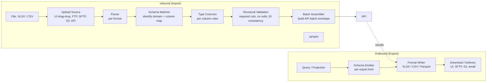

# Bulk Import / Export (Excel + CSV)

A first-class **bulk I/O engine** for importing and exporting EMS data in spreadsheet formats. Used by traders / operators / compliance / ops for: bulk staging orders (the [[staging-via-excel|Excel staging workflow]]), recording manual / voice fills, allocations, reference data updates (allow lists, broker codes, accounts), TCA exports, regulatory exports, and ad-hoc query results.

Excel / CSV is unglamorous infrastructure but is **the most-used inbound surface** in real buy-side operations. Treating it as a first-class architectural concern — rather than glue code per use case — pays off.

## Purpose

A single engine handling all import/export needs with consistent:

- **Format support** (XLSX, XLSM, CSV, TSV; possibly Parquet for large exports).
- **Schema management** — typed column maps versioned per data domain.
- **Validation** — structural + semantic, surfacing per-row results.
- **Batch semantics** — partial-success per [[arch-api-first]] batch envelope.
- **Audit** — every import / export logged as an event.
- **Replay determinism** — re-importing the same file produces the same result.

## What can be imported

| Data domain | Typical use | Downstream effect |
|---|---|---|
| Orders | Bulk stage from buy-side OMS exports, treasury batches, portfolio rebalance | `stage_orders` per row |
| **Fills** | Manual / voice trades not captured electronically; out-of-band fills from cpty | `record_fill` per row → attaches to existing order or creates a phantom order |
| Allocations | Late-allocation booking; allocation amendments | `apply_allocation` per row |
| Reference data | Allow / restricted / watch list updates ([[arch-compliance]]); broker codes; accounts | per-domain admin operation |
| Compliance overrides | Bulk release of stuck blocks (e.g. after a policy change) | per-block override |
| Routes (rare) | Recording out-of-band confirmation trades | `record_route` analogous |

## What can be exported

| Output | Consumer |
|---|---|
| Order blotter snapshot | trader, ops |
| Open orders + routes | EOD reconciliation |
| Fill history / trade ticket book | ops, compliance |
| TCA reports | best-ex committee, clients |
| Regulatory submissions (pre-format) | ops |
| Allocation breakdowns | PB reconciliation |
| Position snapshots | risk, portfolio mgmt |
| Audit slices | compliance, regulators |

## Architecture



## Schema management

Each importable domain has a **versioned schema** declaring:

```
ImportSchema {
  domain                 ORDERS | FILLS | ALLOCATIONS | REFDATA_LIST | ...
  version                int
  required_columns       [ColumnSpec]
  optional_columns       [ColumnSpec]
  primary_key?           [column_name]      // for upsert/idempotency
  identifier_rules       per-column type + format (e.g. CUSIP regex, ISIN check digit)
  enums                  named value lists (e.g. side: BUY|SELL|SHORT)
  cross_field_rules      list of constraints (e.g. limit_price required when ord_type=LIMIT)
  column_aliases         common header variants -> canonical column
}
```

Schemas are reference data. New columns are additive minor-version bumps; structural changes are major. Old uploaded files keep working under their schema version.

### Auto-detect

When a file arrives without an explicit schema selection, the engine:

1. Inspects the header row.
2. Matches against known schemas via column-alias dictionaries.
3. If unique match: use it (with confidence score).
4. If multiple plausible: present to user for selection (saved as per-user / per-firm preference for next time).
5. If no match: structural failure, surfaced to uploader.

## Type coercion

Per-column rules handle the messy reality of spreadsheets:

| Issue | Coercion |
|---|---|
| `"1,000"` (comma thousands) | strip and parse as number |
| `"1.5M"` shorthand | parse with multiplier suffix |
| Excel date serial | convert to ISO date |
| `"BUY"` / `"B"` / `"Buy"` | canonicalize per enum alias map |
| Blank cells in optional columns | treat as null |
| Leading apostrophe on CUSIP (Excel forces text) | strip |
| Trailing whitespace | trim |

Coercion failures produce per-row errors with the specific cell location — the uploader can fix in Excel and re-submit.

## Idempotency / re-import

Each import has a `request_id` and each row a derived row id (typically from the file's primary-key columns). Re-importing the same file:

- Same `request_id` → returns the prior result (the import service is idempotent).
- Different `request_id`, same primary keys → per-domain duplicate-detection (e.g. orders with the same `client_order_id` within the day are rejected as duplicates per [[arch-fix-api-bridge|FIX session rules]]; reference data updates upsert by key).

Crucial for the recoverability of "did my upload get through?" scenarios.

## Validation pipeline

```
File -> Parse (format failure -> reject file)
     -> Structural Validate (required cols missing -> reject file)
     -> Per-row Type Coerce (per-row failures collected)
     -> Per-row Domain Validation (via [[arch-validator]])
     -> Per-row Compliance Check (via [[arch-compliance]])
     -> Build API batch
     -> Submit to domain operation (e.g. stage_orders)
     -> Per-row API result
     -> Compose UploadResult { accepted, rejected, deferred per row, file_id, upload_id }
```

Standard partial-success semantics per [[arch-api-first]]. The uploader sees a result CSV / report with the original rows plus a status column.

## Inbound sources

The engine accepts uploads from:

- **UI drag-drop / file picker** — interactive, immediate feedback.
- **FTP / SFTP** — watched directories; identity bound to the SFTP user.
- **S3 bucket drop** — cloud-native upload; IAM identity → EMS identity.
- **API direct** — bytes uploaded over HTTPS / API.
- **Email-to-EMS** — rare; controlled accounts; treated as low-trust.

Each source carries identity propagation to the validator — the upload happens **as** an identity, and per-row permissions apply.

## Outbound delivery

Exports are produced as scheduled jobs or on-demand:

- **Download in UI** — interactive.
- **SFTP push** — to client / regulator endpoints.
- **S3 upload** — for archival or downstream pipeline ingestion.
- **Email delivery** — limited; sensitive data flag prevents.

Output filename conventions are templated (`{firm}_{domain}_{period}_{timestamp}.xlsx`).

## Excel / CSV-specific concerns

- **Macros**: XLSM files allowed only from trusted senders; macros stripped on import; `requires_macros_for_template` flag rejects non-XLSM upload of a template that needs them.
- **Formatting preservation**: import path strips formatting (data only); export path applies firm-template formatting (cell types, header styling, frozen panes, summary row).
- **Multi-sheet workbooks**: schema can declare which sheet (by name or index) carries the data.
- **Cell precision**: floats from Excel can lose precision; the engine reads as strings and parses, not as floats.
- **Encoding**: UTF-8 default; supports legacy encodings for older files.
- **Large file handling**: streaming parse for >100k rows; backpressure to avoid OOM.

## Audit events

```
FileUploaded { upload_id, file_id, source, sender_identity, format, byte_size, row_count }
SchemaSelected { upload_id, schema, version, confidence, auto_or_manual }
RowValidated { upload_id, row_index, result }
UploadCompleted { upload_id, summary: { accepted, rejected, deferred }, result_file_id }
FileExported { export_id, domain, period, requester_identity, delivery_target }
```

Plus per-row downstream events (`OrderStaged`, `FillRecorded`, etc.).

## Replay determinism

Imports are deterministic functions of (file bytes, schema version, validator/compliance versions at time-of-import). [[arch-time-replay-server|Replay]] re-imports the same file under the same versions and produces identical outcomes. Useful for audit reconstruction.

## API surface

```
operation: upload_file
items: [{ source, file_bytes_or_ref, schema_hint?, options: { dry_run, partial_ok } }]
returns: UploadResult

operation: schedule_export
items: [{ domain, filter, period, format, delivery }]

operation: list_uploads(filter)
operation: list_exports(filter)
operation: register_import_schema(...)
operation: amend_import_schema(...)
```

## Permissions

- `#bulk-upload-{domain}` per data domain (e.g. `#bulk-upload-orders`, `#bulk-upload-fills`).
- `#bulk-export-{domain}` for exports.
- `#sftp-source-{name}` per registered SFTP source.
- `#sensitive-export-data` for exports including identifying / position data.

## Anti-patterns

- **Per-feature bespoke importers.** Defeats the engine's purpose; each ad-hoc path skips standard audit / validation. Always go through the engine.
- **Skipping per-row validation for speed.** A file with one bad row fails the whole batch. Always validate per row; report per row.
- **Exports without identity-scoped filters.** A user can pull data they shouldn't see. Exports are always permission-scoped at the row level.
- **Silent type coercion.** A "qty=1.5M" silently becoming 1.5 instead of 1,500,000. Always log coercion choices; surface ambiguities.
- **Letting Excel macros run server-side.** Strip on import. Document templates separately if macros are needed for user-side prep.

## See also

- [[arch-api-first]] · [[arch-validator]] · [[arch-compliance]] · [[arch-event-sourcing]]
- [[arch-symbology-figi]] (license metering on imported identifiers)
- [[staging-via-excel]] · [[bulk-order-update-route]] · [[batchname-column]] · [[group-id]]
- [[netting-auto-via-excel]] · [[allocation-prime-broker]] · [[counterparty-enablement]]
- [[arch-firm-desk-user]] · [[arch-tag-permissions]] · [[arch-time-replay-server]]
