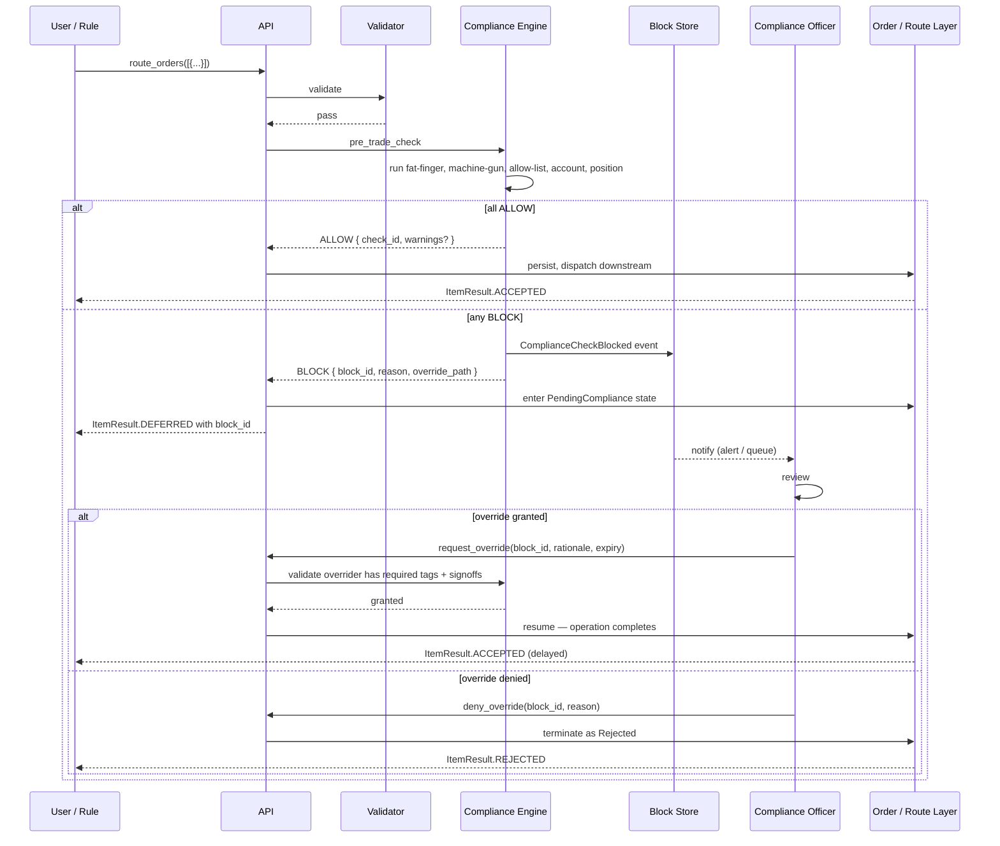

# Compliance Engine

An **overarching pre-trade and continuous compliance layer** that taps into the inputs and outputs of every operational component (Order, Route, SOR, Venue, Automation) and can **block** an action pending human override — distinctly different from [[arch-validator|Validation]], which produces hard rejects with no override path.

## Validation vs Compliance — the core distinction

| Property | [[arch-validator\|Validation]] | Compliance |
|---|---|---|
| **Decision** | `ACCEPT` / `REJECT` | `ALLOW` / **`BLOCK`** / `WARN` |
| **On failure** | Hard reject with `EMS-*` code | Pause action; require human override |
| **Override** | Never | Yes — authorized identity with rationale, audited, time-bound |
| **Rule set** | Closed, codified, FIX-protocol & permission-driven | Open, configurable, jurisdiction & firm-policy-driven |
| **Trigger surface** | One action at a time | One action **plus** cross-event patterns over windows |
| **When evaluated** | Synchronously inline before persistence | Synchronously inline **and** asynchronously on the event stream |
| **Author** | Engineering | Compliance officer / Best Execution Committee |
| **Versioning** | Code release | Config change with sign-off |

You can think of it as: **Validation answers "is this operation well-formed and permitted?"** while **Compliance answers "should this operation happen right now given everything we know?"**

A user who lacks `#trade-fx` is hard-rejected by the validator — no override exists. A user whose order has an apparent fat-finger notional gets a compliance **block** — a desk supervisor with `#compliance-override-fat-finger` can release it after eyeballing.

## Engine architecture

```mermaid
flowchart TB
  subgraph Inputs
    OP[Operations<br/>stage / amend / route / cancel]
    EV[Event Bus<br/>arch-sbe-aeron-transport<br/>all entity events]
  end

  subgraph "Compliance Engine"
    PT[Pre-trade Synchronous Checks<br/>inline gate]
    SUR[Stream Surveillance<br/>async patterns]
    BS[Block Store<br/>pending blocks awaiting review]
    OS[Override Service<br/>review + release / deny]
    AL[Alert Generation]
  end

  subgraph "Reference Data"
    PR[Pricing Service]
    LL[Allow / Block / Watch Lists]
    AC[Account / KYC]
    HC[Historical Counters<br/>(rolling windows)]
    POS[Position Service<br/>arch-position-service]
  end

  subgraph Outputs
    O1[ALLOW → operation proceeds]
    O2[BLOCK → PendingCompliance state]
    O3[Compliance officer queue]
    O4[Alerts / Notifications]
    O5[Audit log via arch-event-sourcing]
  end

  OP --> PT
  EV --> SUR
  PT --> O1
  PT --> O2
  O2 --> BS
  BS --> O3
  O3 --> OS
  OS --> O1
  OS --> O5
  SUR --> AL
  AL --> O4
  AL --> O5
  PR --> PT
  LL --> PT
  AC --> PT
  HC --> PT
  HC --> SUR
  POS --> PT
  POS --> SUR
  PT --> O5
  SUR --> O5
```

Compliance is a **subscriber** to the event bus (it sees everything that happens) **and** an **interceptor** on specific operations (it can block before they persist). The interception path is the synchronous "gate"; the subscription path is the asynchronous "surveillance".

## Decision shape

```
ComplianceDecision {
  decision:      ALLOW | BLOCK | WARN
  check_id:      UUID                   // for audit linkage
  block_id?:     UUID                   // if BLOCK; used to track the override
  rule_results:  [{ rule_id, kind, outcome, severity, rationale }]
  override_path?: {
    required_tags: [Tag],               // e.g. [#compliance-override-fat-finger]
    required_signoffs: int,             // four-eyes if 2
    expiry: duration,                   // release valid for this long
    requires_rationale: bool
  }
}
```

A `BLOCK` doesn't "reject" the operation. The operation is **suspended** — the order enters `PendingCompliance` (an EMS sub-state of `New`; FIX-paired clients see `OrdStatus=9 Suspended` with text explaining the block). It stays there until override or deny.

## What Compliance taps into

Compliance subscribes to events at **every layer** and runs gates at specific decision points:

| Layer | Events subscribed | Operations gated |
|---|---|---|
| [[arch-fix-api-bridge]] | inbound `35=D`/`E`/`G`/`F` | inbound `stage_orders`, `amend_orders` |
| [[arch-order-staged]] | `OrderAccepted`, `OrderReplaceRequested`, `OrderCancelRequested` | `stage_orders`, `amend_orders`, `mark_ready` |
| [[arch-router-layer]] | `RouteSent`, `RouteWorking`, fills | `route_orders` (pre-route gate) |
| [[arch-smart-order-router]] | child-route dispatch | per-child gate |
| [[arch-venue-connectivity]] | wire-level out | (read-only — wire egress is too late to gate) |
| [[arch-automation-layer]] | `RuleFired` | `bind_rule` for sensitive rules |

This is the "**overarching component that taps into input and output of each component**" property — compliance is not a layer in the stack, it's a cross-cutting concern subscribed everywhere.

## Pre-trade synchronous checks (the inline gates)

These are the checks that **block** an operation. They run synchronously in the validator-adjacent path — after the validator passes (the operation is well-formed) and before the operation persists.

### Fat-finger check

The user's example. An operator types `12.50` as `125.0` or qty `100,000` as `1,000,000`. Notional explodes; pre-trade compliance catches it.

```
fat_finger_check(operation, context):
  ref_price = price_with_fallback(operation.instrument)
  if ref_price.kind == NONE and policy.block_on_no_reference:
    return BLOCK { reason: "no_reference_price",
                   override: required_tags=[#compliance-override-no-ref] }

  effective_price = operation.limit_price or ref_price.value
  notional = operation.qty * effective_price * instrument.contract_multiplier

  # Fat-finger by absolute notional
  if notional > fat_finger_threshold(instrument, desk, firm):
    return BLOCK {
      reason: "notional_exceeds_fat_finger_threshold",
      details: { computed_notional: notional,
                 threshold: fat_finger_threshold(...),
                 ref_price_used: ref_price },
      override: required_tags=[#compliance-override-fat-finger]
    }

  # Fat-finger by price deviation from market
  if operation.limit_price:
    deviation_bps = abs(operation.limit_price - ref_price.value) / ref_price.value * 10000
    if deviation_bps > price_deviation_threshold(instrument):
      return BLOCK { reason: "limit_price_deviates_from_market", ... }

  # Fat-finger by qty vs typical order size
  if operation.qty > typical_qty_99th_percentile(instrument, desk):
    return WARN { reason: "qty_above_99th_percentile" }   # warn, not block, by default

  return ALLOW
```

#### Price fallback strategy

The "price fallback strategy" the question mentioned — `price_with_fallback()` walks a configurable chain:

```
price_with_fallback(instrument):
  for source in policy.fallback_chain:
    case source:
      LIVE_L1:
        if quote_age < freshness_threshold:
          return { kind: LIVE, value: mid }
      LAST_TRADE:
        if last_trade_age < tolerance:
          return { kind: LAST_TRADE, value: last_price }
      PREVIOUS_CLOSE:
        return { kind: PREV_CLOSE, value: prev_close }
      INDICATIVE:
        if pricing_service.has(instrument):
          return { kind: INDICATIVE, value: pricing_service.get(instrument) }
      CONSERVATIVE_UPPER_BOUND:
        return { kind: UPPER_BOUND, value: pricing_service.upper_bound(instrument) }
  return { kind: NONE }
```

The chain is **per asset class** (FX has different sources from corp bonds), **per instrument-quality tier** (liquid majors vs. illiquid CUSIPs), and **per firm policy** (conservative firms include `CONSERVATIVE_UPPER_BOUND` for the block path; aggressive firms might allow LIVE-only with no fallback). All sources go through [[arch-quote-server]] / a dedicated pricing service; both feed the same fallback function.

Critical: the **chosen source is captured on the check event** so audit can reconstruct what data the decision was based on.

### Machine-gun check (rate + aggregation)

The user's other example. System sends 50 small routes in 30 seconds, each individually below the single-order cap, but in aggregate massively exceeding desk policy.

```
machine_gun_check(route_attempt, history):
  window = policy.window  # e.g. 60s
  same_signature = (instrument: route_attempt.instrument,
                    side: route_attempt.side,
                    actor: route_attempt.actor.firm_desk)

  recent = history.routes_in_window(same_signature, window)

  # Rule 1: count threshold
  if len(recent) + 1 > policy.max_routes_per_window:
    return BLOCK { reason: "machine_gun_route_count_exceeded",
                   details: { count: len(recent) + 1, window, max: policy.max_routes_per_window },
                   override: required_tags=[#compliance-override-rate-limit] }

  # Rule 2: aggregated notional threshold
  aggregated_notional = sum(r.notional for r in recent) + route_attempt.notional
  if aggregated_notional > policy.max_aggregated_notional_per_window:
    return BLOCK { reason: "machine_gun_aggregated_notional_exceeded",
                   details: { aggregated, window, max: ... }, ... }

  # Rule 3: cancel-replace churn (potential layering / spoofing surveillance hand-off)
  cancel_replace_count = history.replace_events_in_window(actor=route_attempt.actor, window)
  if cancel_replace_count > policy.max_replaces_per_window:
    return BLOCK { reason: "cancel_replace_churn", ... }

  return ALLOW
```

The `history` projection is a **rolling-window counter** per `(actor, signature)` derived from the [[arch-event-sourcing|event log]] continuously. Different windows for different rules; per-firm tunable.

### Allow / restricted / block lists

```
restricted_list_check(operation, context):
  instrument = operation.instrument

  # Hard block: firm-level restricted list (e.g. corporate-action conflict, MNPI)
  if instrument in firm.restricted_list:
    return BLOCK {
      reason: "instrument_on_restricted_list",
      list_name: "firm_restricted",
      reviewed_at: firm.restricted_list.last_updated,
      override: required_tags=[#compliance-override-restricted-instrument],
      requires_signoffs: 2          # four-eyes for restricted-list overrides
    }

  # Desk-level allow list (positive list — only these are permitted)
  if desk.uses_allow_list and instrument not in desk.allow_list:
    return BLOCK {
      reason: "instrument_not_on_desk_allow_list",
      override: required_tags=[#compliance-override-add-to-allow-list]
    }

  # Watch list — heightened monitoring; emit a flag but don't block
  if instrument in firm.watch_list:
    return WARN {
      reason: "instrument_on_watch_list",
      side_effect: emit ComplianceAlertRaised("watch_list_activity")
    }

  return ALLOW
```

Lists are **versioned reference data** managed by compliance; every change is an event. Effective dates / expiries supported. Per-desk allow lists let one desk trade equities while another only trades FX — orthogonal to permission tags ([[arch-tag-permissions]]).

### Account validity / KYC for ID markets

```
account_check(operation, context):
  account = operation.account
  instrument = operation.instrument

  # Some markets require valid investor ID per regulator (e.g. CSI ID for China A-shares,
  # OBO IDs for certain ASEAN markets, LEI for derivatives, MiFID II national ID for equity)
  required_ids = id_requirements_for(instrument.market, instrument.asset_class)
  for id_kind in required_ids:
    if not account.identifiers.has(id_kind) or expired(account.identifiers[id_kind]):
      return BLOCK {
        reason: f"account_missing_{id_kind.lower()}",
        details: { required: id_kind, account: account.id },
        override: required_tags=[#compliance-override-missing-id]
      }

  # KYC freshness
  if account.kyc.last_refreshed < kyc_freshness_threshold(account.tier):
    return BLOCK { reason: "kyc_stale", ... }

  return ALLOW
```

ID requirements are reference data per market/regulator; the check is mechanical lookup.

### Position-aware checks

These pull from [[arch-position-service]]:

- **Concentration limit**: position in instrument / sector / issuer over caps.
- **Short-sale eligibility**: short-selling restrictions per instrument and per regime (Reg SHO, Hong Kong shortable list).
- **Wash trade prevention** (pre-trade): would this fill create matched buy + sell at the same beneficial owner?
- **Borrow availability** (short equity): is borrow sourced?

```
position_check(operation):
  pos = position_service.get(operation.account, operation.instrument)
  if would_violate_concentration(pos, operation):
    return BLOCK { ... override: [#compliance-override-concentration] }
  ...
```

## Netted vs un-netted — critical for correctness

The user flagged this. Compliance **must** see the underlying activity, not just the netted parent.

**The principle:** compliance subscribes to events at the **un-netted level** (the original child orders) **and** observes the netted parent — both. Different checks use different views:

| Check | View used |
|---|---|
| Fat-finger | Both. Per-child and per-parent. A child of 100M EURUSD that nets to zero on the parent **still triggers** fat-finger on the child (the operator did type that number; if it was a typo, downstream netting doesn't fix the input error). |
| Machine-gun (count) | Un-netted. 50 child orders are 50 routes' worth of intent regardless of netting. |
| Machine-gun (aggregate notional) | Un-netted **and** parent. Both are reported on the alert. |
| Allow-list per instrument | Un-netted children — the user submitted those instruments. |
| Account ID validity | Per-child — each child has its own account. |
| Concentration / position limits | Net of netting — position effect is net. |
| Wash-trade detection | Net of netting **but** per beneficial-owner mapping (which is per-child). |

The event-sourcing model makes this clean: the compliance engine subscribes to `OrderAccepted` / `OrderReplaced` events directly — the un-netted view. It also separately subscribes to `NetGroupFormed` events to know which children formed which parent. It can then run checks per child, per parent, or cross-projection as the rule demands.

> An anti-pattern to avoid: checking only the netted-parent view "for efficiency". A trader typing `1000` instead of `100` on a child that nets to zero against another child still produces an alarming audit signal — and tomorrow's typo on a non-zero-net case is hidden until it's not.

## The block-and-override flow



### Override mechanics

- **Pending state.** Until override, the order/route lives in `PendingCompliance`. FIX clients see `OrdStatus=9 Suspended` with text.
- **Authorized identity.** The overrider must hold the specific `#compliance-override-{check_kind}` tag (per [[arch-tag-permissions|3-layer AND-gate]]). Tag grants are typically scoped to senior traders, supervisors, or compliance officers.
- **Four-eyes (optional).** Some blocks require N signoffs (`requires_signoffs: 2`). The release happens only when N distinct authorized identities each sign off.
- **Rationale required.** Every override carries a free-text rationale. Rationale is persisted on the override event.
- **Time-bound release.** An override is valid for `expiry` (e.g. 10 minutes). If the operation hasn't proceeded by then, the release expires and the operation must be re-checked.
- **Re-check on resume.** When the operation resumes after override, the check runs again — if conditions have changed (e.g. notional now exceeds even more after market move), block again.

### Anti-patterns

- **One generic `#compliance-override-all` tag.** Defeats the purpose. Each check kind has its own override tag; supervisors get granular grants.
- **Permanent overrides.** "Override forever for this user" → effectively turning compliance off. Always time-bound.
- **Silent rationale.** A free-text rationale of "ok" is technically compliant but useless on audit. UI should encourage structured reasons.

## Stream surveillance (asynchronous)

Continuous patterns that span many events:

| Pattern | Detection |
|---|---|
| **Wash trade** | Buy + Sell on same beneficial owner within window; flag for review. |
| **Quote stuffing** | High rate of `Replaced` events relative to `Filled`. |
| **Layering / spoofing** | Cancels of large orders on one side, followed by trades on the opposite. |
| **Front-running** | Own-account trade ahead of client trade in same instrument and direction. |
| **Marking the close** | Large activity in last N minutes of the session in instruments where the firm has known positions / interests. |
| **Cross-venue wash** | Same beneficial owner trading both sides across different venues. |

Surveillance doesn't block in real time (these are post-hoc patterns); it raises **alerts** that compliance officers triage. High-severity alerts can trigger automatic blocks on future operations from the same actor pending investigation (an `#actor-frozen` flag).

## Reference data the engine needs

| Data | Source | Freshness |
|---|---|---|
| Live mid / last trade / previous close | [[arch-quote-server]] + pricing service | sub-second to T+0 |
| Allow / block / watch lists | compliance reference data, event-sourced | T+0 to T-1 |
| Account / KYC / IDs | account master | T+0 to T-1 |
| Position state | [[arch-position-service]] | continuous, derived from fills |
| Historical activity counters | rolling-window projection from event log | continuous |
| Beneficial-owner mapping | client master | T+0 to T-1 |
| Borrow availability (short equity) | borrow service | T+0 |

All reads go through versioned interfaces. Replay determinism: the values read at decision time are captured on the check event so a replay re-derives the same decision.

## Replay & determinism

Compliance decisions, like everything else, must be replay-reproducible. The compliance check event records:

- The full input operation envelope.
- The reference data values used (price chosen + source, list versions, position snapshot).
- The rule set version evaluated.
- The output decision.

A replay through [[arch-time-replay-server]] feeds the same events through the same compliance rules at the same version and produces the same `ALLOW` / `BLOCK` / `WARN` results.

## Audit events

```
ComplianceCheckRequested  { check_id, operation_ref, rules_in_scope, context_snapshot }
ComplianceCheckPassed     { check_id, decision: ALLOW, warnings? }
ComplianceCheckBlocked    { check_id, decision: BLOCK, rule_results, block_id, override_path }
ComplianceOverrideRequested { block_id, by, rationale, requested_expiry }
ComplianceOverrideGranted { block_id, by, rationale, expiry, signoffs }
ComplianceOverrideDenied  { block_id, by, reason }
ComplianceOverrideExpired { block_id }
ComplianceAlertRaised     { alert_id, kind, severity, subject_events: [event_ids] }
ComplianceListUpdated     { list_id, change_kind, change_reason, signed_off_by }
ActorFrozenByCompliance   { actor, frozen_at, reason, expires_at? }
```

All flow into the standard [[arch-event-sourcing|event log]]. Compliance has its own stream alongside `order.*`, `route.*`, etc.

## API surface

```
operation: pre_trade_check          # called internally by stage / route / amend paths
items: [{ operation, context }]
returns: ComplianceDecision

operation: list_pending_blocks(filter)
operation: request_override
items: [{ block_id, rationale, requested_expiry? }]
operation: deny_override
items: [{ block_id, reason }]

operation: register_compliance_list
items: [{ list_kind, instruments, effective_date, expiry_date?, change_reason }]
operation: amend_compliance_list
items: [{ list_id, ops, change_reason, signed_off_by }]

operation: freeze_actor               # heavy hammer; admin
items: [{ actor, reason, expires_at? }]
operation: unfreeze_actor
items: [{ actor, reason }]
```

## Permissions

- Block override: `#compliance-override-{check_kind}` per check (fat-finger / machine-gun / restricted / kyc / position / etc.).
- List management: `#compliance-list-admin`.
- Freeze actor: `#compliance-freeze-admin` (rare; usually requires four-eyes).
- View blocked items: `#compliance-officer` (typically firm-wide).

## See also

- [[arch-validator]] — sibling concept; the hard-reject layer
- [[arch-event-sourcing]] · [[arch-sbe-aeron-transport]] · [[arch-tag-permissions]] · [[arch-firm-desk-user]]
- [[arch-quote-server]] · [[arch-position-service]] · [[arch-risk-engine]] · [[arch-surveillance]]
- [[arch-fx-netting]] · [[netting-auto-via-excel]] (netted-vs-unnetted semantics)
- [[arch-time-replay-server]] · [[arch-jmx-introspection]]
- [[arch-order-staged]] · [[arch-router-layer]] · [[arch-smart-order-router]] · [[arch-automation-layer]]
