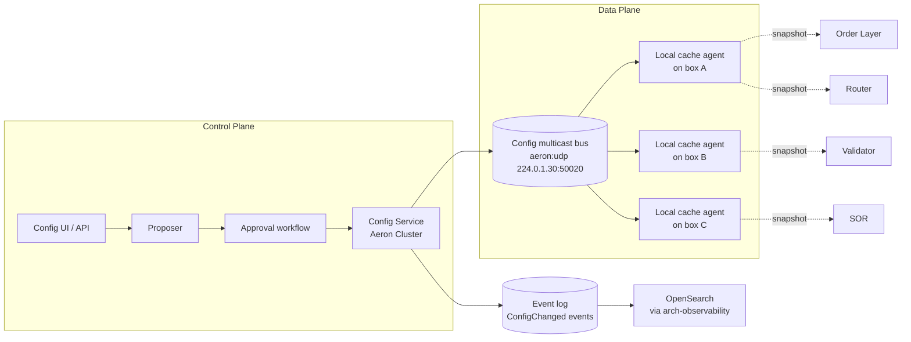
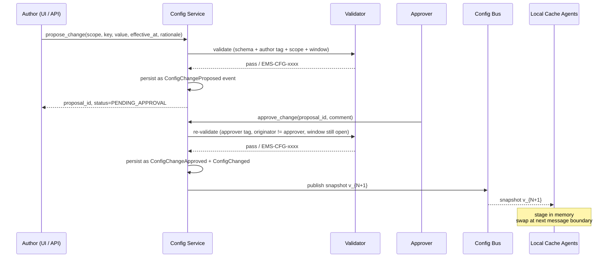

# Configuration Service — Replay-Deterministic, Push-Without-Bounce

The Configuration Service is the dedicated, dedicated-component, append-only source of every runtime-tunable value in the EMS. It exists to satisfy **three constraints simultaneously**:

1. **Replay determinism** — every event in [[arch-event-sourcing|the log]] must resolve to the **same configuration values it was processed against**, even months later, even if the key has since been "removed."
2. **Publish-without-bounce** — operations must be able to roll forward limits, weights, fallback chains, and feature gates **without restarting components**, because in [[arch-resilience-24x7|24/7 markets]] there is no maintenance window for some asset classes.
3. **Auditable two-person control** — material changes in UAT/PROD require a second human, with cryptographic non-repudiation, indistinguishable in the audit chain from an order approval.

Everything else in this note is a consequence of those three constraints.

## The dominant constraint is replay, not change-speed

The most counter-intuitive rule — **keys are never deleted, only archived with a default value** — is not a hygiene preference. It is forced by [[arch-event-sourcing|event sourcing]]'s replay contract.

Consider event `E` processed at time `T0` against key `K = V0`. Months later, ops decides `K` is no longer needed and removes it. If replay of `E` at `T1` resolves `K` to "undefined" and the code path crashes (or worse, branches differently), replay diverges and the determinism contract is broken.

The discipline:

- **Schema-level removal is forbidden.** A key, once defined in the config schema, exists forever.
- **Archival sets `archived: true` and locks `default_value`.** Old code paths still call `cfg.get("K")` and receive `default_value`; behaviour is deterministic.
- **Replay resolution is config-at-event-time.** The local cache supports `cfg.get("K", as_of=event.occurred_at)` for replay; the live hot path uses the current snapshot.

This is the *why* behind every other rule below.

## Architecture — control plane + data plane + local cache



- **Config Service** is itself an [[arch-sbe-aeron-transport|Aeron Cluster]] component — Raft-replicated, snapshotted, leadership-electable. Same continuity model as the Order Layer.
- **Config multicast bus** is a dedicated Aeron channel. Every box subscribes.
- **Local cache agent** runs as a sidecar on every host. It is the **only** thing components talk to for config reads — components never reach across the network on the hot path.
- Every change is a `ConfigChanged` event on [[arch-event-sourcing|the admin stream]]. Search and query reuse [[arch-observability|OpenSearch]] — no separate query engine.

## The hot-path access pattern

Components do **not** call into a config map mid-decision. The pattern is:

1. Producer (Config Service leader) publishes a new **snapshot version** on the multicast bus.
2. Each box's local cache agent stages the new snapshot in memory.
3. At the **next message boundary** in the consuming component — between `handleMessage()` calls in the FSM dispatcher, never inside one — the working thread **atomically swaps its snapshot pointer**.

This is the load-bearing rule: **one message → one config view**. All decisions inside a single message see the same config; no half-applied update can split a decision. It matches the same single-writer-per-partition discipline that [[arch-fix-fsm-design|the FSM]] depends on.

The local cache is an immutable struct, code-generated from the config schema. Reads are field accesses — not map lookups, not string lookups, not network calls. Cost in cycles, not microseconds.

```
// Codegen output (illustrative)
struct ConfigSnapshot {
    version:                u64,
    effective_at:           Timestamp,
    fat_finger_bps:         u32,
    machine_gun_per_sec:    u32,
    sor_wheel_weights:      Map<BrokerCode, u32>,
    venue_credentials:      Map<VenueId, FenceTokenRef>,
    // ... thousands of typed fields, all from the schema
}

// Hot path
fn handle_message(msg: Message) {
    let cfg = self.config.load();  // atomic load of Arc<ConfigSnapshot>
    if msg.notional > cfg.fat_finger_bps * ref_price { ... }
    // ... entire message uses the same cfg
}
```

## Hierarchical key resolution

Keys cascade through a fixed resolution order — **not** a template inheritance system. The resolver walks the order and returns the first defined value:

```
1. global.default
2. environment.{dev|qa|uat|prod}
3. region.{ny|ldn|tyo|hkg}
4. pod.{pod_id}
5. asset_class.{equity|fi|fx|...}
6. firm.{firm_id}              ← matches arch-firm-desk-user
7. desk.{firm_id}.{desk_id}
8. user.{firm_id}.{desk_id}.{user_id}
9. order-override (rare, per-order tag)
```

Three rules keep this honest:

- **Each level only carries overrides.** Levels are sparse; missing values fall through.
- **The resolution path for every read is captured in audit.** When a fat-finger check fires using `desk.acme-fx.tokyo`'s threshold rather than the firm default, that fact is queryable.
- **Adding a new level is forbidden.** The nine-level cascade is the schema. New scopes are new keys, not new levels.

## Schema vs values — separate disciplines

| Concern | Mechanism | Cadence |
|---|---|---|
| **Schema** — what keys exist, their types, defaults, scope levels | Ships with code via the SBE schema-evolution rules (see [[arch-sbe-aeron-transport]]). New keys have `sinceVersion`. Old keys never disappear; archived keys gain `archived: true` + locked `default_value`. | Per release |
| **Values** — what the current setting is at each scope | Published at runtime via the config bus. Atomically swapped at message boundaries. | Continuous |

Conflating the two is the most common confusion. **Schema changes are code changes.** **Value changes are config changes.** Reviewers, approval workflow, and risk profile differ accordingly.

## Change pipeline — propose → review → approve → publish



Every step is an event. The full lifecycle is queryable from [[arch-observability|OpenSearch]] just like an order's lifecycle.

## Two-person control — distinct roles, distinct tags

**`#config-author-{scope}` and `#config-approver-{scope}` are different tags.** The validator enforces:

1. Author holds `#config-author-{scope}` under the [[arch-tag-permissions|3-layer AND-gate]].
2. Approver holds `#config-approver-{scope}` under the same gate.
3. **`proposal.author.identity != approval.approver.identity`** — same-person approval is rejected outright with `EMS-CFG-1201 self_approval_not_allowed`.
4. In UAT/PROD this is mandatory. In Dev/QA it can be turned off via a config setting (which is, recursively, itself two-person-approved — bootstrap is signed at install time).

This is the same pattern as [[two-step-approval|two-step order approval]], specialized for configuration. Reuse, not parallel.

### Scope-aware approvers

Approvers are scoped: `#config-approver-desk-acme-fx` can approve desk-level overrides for that desk only, not firm-level changes. Permission-tag scope matches resolution-cascade scope.

### Why role-separated tags rather than "two approvers"

Because "two approvers" degrades to "one person with two tags" the moment compliance ergonomics get rough. Distinct tag families make the role separation auditable and revocable. A user who needs to approve their own work for an emergency must temporarily acquire `#emergency-config-approver` — itself two-person-granted and time-bound — leaving a clear audit trail.

## Window-aware changes

The change pipeline consults the [[arch-resilience-24x7|asset-class maintenance window table]]:

| Change class | Window discipline |
|---|---|
| Risk limit tightening (fat-finger, machine-gun, notional cap) | Allowed any time; tighter limits cannot harm in-flight orders. |
| Risk limit loosening | Default: blocked outside maintenance window. Override requires `#config-approver-window-emergency` (a separate tag — fourth signature). |
| Algo wheel weights | Allowed any time; transition affects only new selections, [[arch-best-execution|best-ex audit]] captures the version. |
| Venue credentials / fence tokens | Allowed any time but staged with explicit fence-handover protocol — see [[arch-deployment|switchover]]. |
| Validator rule changes | Default: blocked during market hours for the affected asset class. |
| Feature gates (new code path enable) | Default: blocked outside maintenance window unless `dark_launch=true` (visible only to test identities). |

The window discipline lives in config itself — meta-configuration about how configuration changes propagate.

## Replay-time resolution

When [[arch-time-replay-server|replay]] processes a historical event stream, the cache agent enters **replay mode**:

- Snapshot pointer is swapped at event boundaries (same atomicity rule), but the snapshot is the one that was **effective at `event.occurred_at`**, not "current."
- The `ConfigChanged` events on the admin stream drive the snapshot transitions — replay just consumes them in order.
- Archived keys resolve to their locked default; behaviour matches what live execution would have done.
- The replay output is `diff`ed against the original; any divergence is a determinism bug.

Golden replay over a release boundary catches: schema-evolution bugs, default-value drift on archived keys, missing window enforcement, and any code path that read config outside the snapshot abstraction.

## Pod isolation

Per [[arch-deployment|the deployment model]]:

- **Dedicated pods** have their own Config Service cluster. Cross-pod tag/value leakage is impossible by construction (separate Aeron channels, separate event logs, separate OpenSearch indices).
- **Shared pods** run one Config Service cluster, but the cache snapshot delivered to each component is **scoped to that component's `firm_id` set**. The local cache agent filters at receipt; components see only their tenants' values.

UAT pod mimicry (see [[arch-deployment]]) works by **replaying the target PROD pod's `ConfigChanged` stream into UAT's Config Service** with secrets substituted. Per-rule audit asserts that the UAT snapshot's hashes match PROD's for every non-secret key.

## Blue/green switchover

On a [[arch-deployment|blue/green switch]], the new active **reads from the same config event log**. There is no separate snapshot handoff for configuration — the log is the source of truth, and the new cluster's projection of it is identical by construction. Avoids a class of "config drift across the switch" bugs.

## What's queryable in OpenSearch

Every `ConfigChange*` event flows through [[arch-observability|the observability pipeline]] into OpenSearch:

- "Who changed `desk.acme-fx.fat_finger_bps` in the last 30 days, with rationale and approver?"
- "Every fat-finger override decision and the config version it was made against."
- "All changes pending approval, grouped by approver."
- "Effective value of `K` at scope `S` on date `D`." (Point-in-time resolution.)
- "Diff between PROD pod A and UAT-2's mimic of pod A."

No bespoke config query UI; OpenSearch dashboards and saved queries cover it.

## Trace context on config changes

A `ConfigChanged` event carries the same `trace_id`, `parent_span_id`, and `actor` envelope as every other event ([[arch-observability]]). The proposer's session `trace_id` propagates through approval and into publication, so a single trace links the UI click → API call → validator decision → approval → bus publish → first hot-path read on every component.

## Validator codes (new family)

| Code | Meaning |
|---|---|
| `EMS-CFG-1001` | Unknown key (not in schema). |
| `EMS-CFG-1002` | Type mismatch (value does not match schema type). |
| `EMS-CFG-1003` | Out-of-band value (below/above schema-declared range). |
| `EMS-CFG-1101` | Author lacks `#config-author-{scope}` tag. |
| `EMS-CFG-1102` | Approver lacks `#config-approver-{scope}` tag. |
| `EMS-CFG-1201` | Self-approval not allowed (author == approver). |
| `EMS-CFG-1301` | Change requires maintenance window; currently outside window. |
| `EMS-CFG-1302` | Effective_at is in the past (only future-dated allowed except for emergency tag). |
| `EMS-CFG-1401` | Attempt to delete an existing key (schema removal forbidden). |
| `EMS-CFG-1402` | Archive without `default_value` (replay determinism would be broken). |
| `EMS-CFG-1501` | Proposal expired (not approved within TTL). |

See [[arch-validator]] for the standard reject envelope.

## API mapping

```
operation: propose_config_change
items: [{
  scope: { level: DESK, firm_id, desk_id },
  key: "fat_finger_bps",
  value: 2500,
  effective_at: "2026-06-10T17:00:00Z",
  rationale: "Q2 vol regime: widening to absorb headline-driven spikes per RM-2026-0231"
}]

operation: approve_config_change
items: [{ proposal_id, comment }]

operation: reject_config_change
items: [{ proposal_id, reason }]

operation: archive_config_key
items: [{ key, default_value, rationale }]   # cannot delete; must archive with default
```

## Permissions

- `#config-reader` — read access. Every component holds this implicitly via its identity.
- `#config-author-{scope}` — propose changes within the scope. Scopes match the resolution cascade.
- `#config-approver-{scope}` — approve changes within the scope. **Must be distinct** from author tag on the same identity for any single change.
- `#config-approver-window-emergency` — fourth signature for out-of-window loosening. Time-bound (typically 4 hours). Granted by ops-on-call.
- `#config-schema-owner` — propose schema changes (which go through code review, not the runtime pipeline).

## Anti-patterns

- **Hot-path reads through a network/RPC call.** Config is local snapshot or it does not exist.
- **Mutating the snapshot in place** instead of swapping pointers. Breaks single-writer determinism.
- **Reading config inside the middle of a message handler** to "pick up a late change." There is no "late" — the snapshot is fixed for the message.
- **Building a query engine on the config service.** Use OpenSearch; the events are already there.
- **Allowing key deletion "just this once."** Even archived keys are kept; even tests don't delete. The schema is forever.
- **One tag for author and approver.** This is the failure mode the design exists to prevent.
- **Bypassing approval in PROD "for an emergency."** Use the four-signature `#config-approver-window-emergency` tag and leave the audit trail. Bypass is a control-plane breach, not an emergency.

## See also

- [[arch-event-sourcing]] (ConfigChanged events; replay contract)
- [[arch-sbe-aeron-transport]] (Aeron Cluster for the service; multicast bus for the data plane)
- [[arch-resilience-24x7]] (window discipline; service continuity)
- [[arch-deployment]] (pod isolation; UAT mimicry; blue/green log-shared config)
- [[arch-tag-permissions]] (author/approver tag family; 3-layer AND-gate)
- [[arch-validator]] (EMS-CFG-* family; reject envelope)
- [[arch-observability]] (OpenSearch as the query surface; trace propagation)
- [[arch-firm-desk-user]] (scope hierarchy)
- [[arch-time-replay-server]] (point-in-time config resolution)
- [[arch-reference-data-service]] (calendars / market microstructure data — read-only counterpart to the writable config service)
- [[two-step-approval]] (sibling pattern; configuration approval is a specialization)
- [[arch-fix-fsm-design]] (single-writer message-boundary atomicity)
