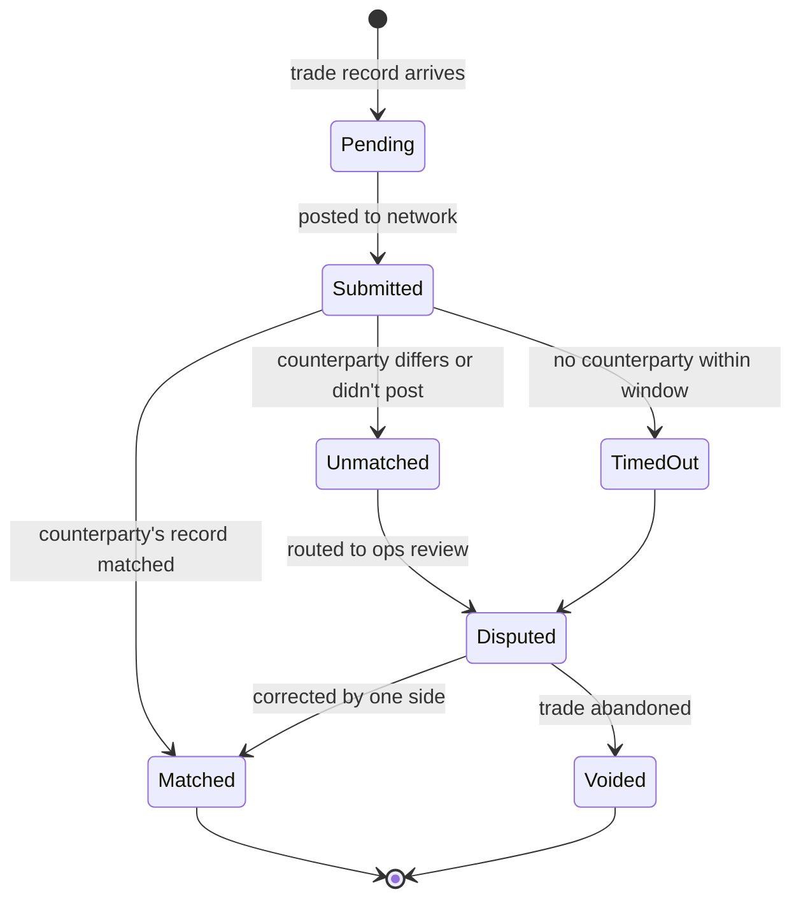
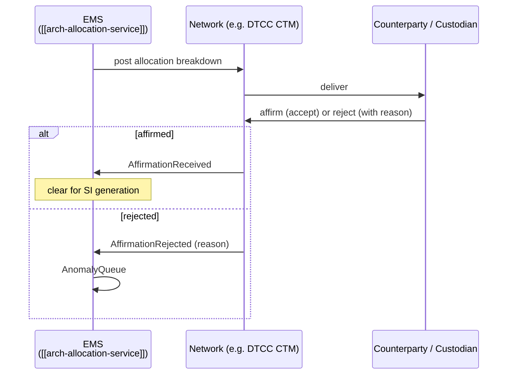

# Confirmation / Affirmation Service

Matches **both sides of a trade** electronically so settlement can proceed. For off-platform trades (voice, IB, CNF — see [[route-to-cnf]]) confirmation is the first electronic acknowledgement. For on-venue trades, confirmation is implicit (venue is authoritative) but **affirmation** (buy-side ack of allocation breakdown) is still required for many flows.

## Purpose

- **Confirmation**: dealer and counterparty each independently report the trade; matching service confirms they agree on price / qty / settlement / counterparty / value date.
- **Affirmation**: counterparty acknowledges receipt of the allocation breakdown (account-level splits).
- **Disputes**: when sides disagree, route to manual investigation.

Without this layer, trades may settle on bad assumptions or fail at the clearer; both are expensive errors.

## Architecture

```mermaid
flowchart LR
  subgraph "Trade Sources"
    CNF[CNF Routes<br/>[[route-to-cnf]]]
    EV[Venue Trades<br/>via [[arch-venue-connectivity]]]
    BL[Block Trades / Voice Tickets]
  end

  subgraph "Confirmation Service"
    NORM[Normalize trade record<br/>to canonical envelope]
    REGADAPT[Per-network adapter<br/>BBG VCON, MarkitSERV, etc.]
    MATCH[Match engine<br/>tolerance windows + key fields]
    DISP[Dispute Resolution Queue]
  end

  subgraph "Networks"
    BBG[Bloomberg VCON]
    MS[MarkitSERV]
    OASYS[OASYS / SWIFT]
    DTCC[DTCC CTM]
  end

  CNF --> NORM
  EV --> NORM
  BL --> NORM
  NORM --> REGADAPT
  REGADAPT --> BBG
  REGADAPT --> MS
  REGADAPT --> OASYS
  REGADAPT --> DTCC
  BBG --> MATCH
  MS --> MATCH
  OASYS --> MATCH
  DTCC --> MATCH
  MATCH -->|matched| DOWN[Downstream STP]
  MATCH -->|unmatched| DISP
```

## Confirmation matching key

Match comparison runs on a tuple per asset class. Examples:

| Asset class | Match keys (tolerance in parens) |
|---|---|
| Cash equity | instrument, side, qty, price (0 bps), trade date, settle date |
| Corp bond | CUSIP, side, qty, price (within ½ tick), trade date, settle date, accrued |
| FX spot | ccy pair, side, qty, rate (within pips configured per pair), value date |
| IRS | floating leg index, fixed rate (exact), notional, effective + maturity dates, payment freq |
| MBS TBA | pool type, coupon, qty, price, settle date |

Match keys + tolerance windows are reference data per asset class + counterparty.

## Pluggable network adapters

Each confirmation network is a separate plugin:

- **Bloomberg VCON** — Bloomberg's confirmation matching.
- **MarkitSERV** — primary affirmation/confirmation for OTC derivatives.
- **OASYS / SWIFT** — equity / FI cross-border.
- **DTCC CTM** — central trade matching for equities.
- **MarketAxess Post-Trade** — for corp bond confirmation.

Per-network adapters handle the network's wire format; the canonical trade record stays the same.

## State machine



`Matched` events trigger downstream [[arch-stp-pipeline|STP]] continuation. `Disputed` events queue for ops.

## Affirmation flow (allocation level)



Affirmation timeouts are stage-specific (CTM has explicit T+1 deadlines for US equities).

## Dispute resolution

When records don't match, an investigator works through:

- Field-by-field comparison.
- Decision: amend EMS side, request counterparty amend, or void.
- Outcome event captured with full audit (who decided, why, what changed).

## Events

```
ConfirmationSubmitted { confirmation_id, trade_ref, network, posted_to }
ConfirmationMatched { confirmation_id, matched_at }
ConfirmationUnmatched { confirmation_id, reason, fields_differing }
ConfirmationDisputed { confirmation_id, disputed_by, fields }
ConfirmationVoided { confirmation_id, reason, by }
AffirmationRequested { affirmation_id, allocation_ref, network }
AffirmationReceived { affirmation_id, affirmed_at }
AffirmationRejected { affirmation_id, reason, by }
```

## Determinism / replay

Confirmation decisions are pure functions of `(our record, counterparty record, tolerance config version)`. [[arch-time-replay-server|Replay]] reproduces identical match outcomes.

## See also

- [[route-to-cnf]] · [[stp-summary]] · [[arch-stp-pipeline]] · [[arch-allocation-service]]
- [[markitserv]] · [[bloomberg-toms]] · [[dtc]] · [[ficc-clearing]] · [[lch]] · [[ice-clear]]
- [[arch-event-sourcing]] · [[arch-venue-connectivity]] · [[arch-time-replay-server]]
