# Corporate Actions

Service handling **corporate actions** — splits, dividends, mergers, spin-offs, name changes, exchanges, rights issues, redemptions, ratings changes — that affect positions, prices, and reference data over time. Critical for [[arch-position-service|position]] accuracy, [[arch-pricing-service|pricing]] continuity, and [[arch-symbology-figi|symbology]] continuity through name changes.

Corporate actions are **events on instruments** that ripple through every dependent projection. Mis-handling causes position errors that compound: a split missed today is a 100% wrong position tomorrow.

> Corporate actions are also the **driver of security-master supersession** — see [[arch-security-master]]. Each applied corporate action produces a new instrument version with `caused_by_corporate_action_event_id` pointing at the action, and `effective_from` matching the action's effective date.

## Action types

| Type | Effect |
|---|---|
| **Cash dividend** | Position unchanged; cash distributed; pre-ex date price adjusts (in some markets). |
| **Stock split / reverse split** | Position quantity multiplied by ratio; cost basis adjusted; price adjusted. |
| **Stock dividend** | Additional shares issued in same instrument. |
| **Spin-off** | Position in parent unchanged; new position in spun entity. |
| **Merger / acquisition** | Position replaced by acquirer's shares or cash. |
| **Name change / ticker change** | Symbology updated; FIGI may or may not change per OpenFIGI rules. |
| **Rights issue** | Holders receive rights; election to subscribe or sell. |
| **Tender offer** | Holders elect to tender; tendered shares retired. |
| **Redemption (FI)** | Bond matures or is called; position retired; cash distributed. |
| **Conversion (convertible bond)** | Bond converts to equity; positions transformed. |
| **Coupon (FI)** | Periodic cash distribution. |
| **Reorganization / restructuring** | Various, complex; modelled case-by-case. |

## Data model

```
CorporateAction {
  ca_id                       UUID
  ca_type                     enum (above)
  source                      DTCC | Bloomberg CACS | EDI | manual
  source_ref                  external identifier
  instruments_affected        [FIGI]                # source instrument(s)
  ex_date                     date                  # day of effect
  record_date                 date                  # holders as-of
  pay_date                    date                  # if cash distribution
  effective_date              date
  ratio?                      decimal               # for splits
  cash_amount?                Money                 # for dividends, redemptions
  new_instrument?             FIGI                  # for spin-offs, mergers
  options?                    [Option]              # holder elections (rights, tenders)
  state                       ANNOUNCED | LOCKED | APPLIED | CANCELLED
}
```

Multiple sources may report the same action; the service de-duplicates and prefers authoritative source (DTCC for US equity actions, etc.).

## Lifecycle

```mermaid
stateDiagram-v2
  [*] --> Announced: source reports
  Announced --> Locked: T-1 before ex_date<br/>(no more changes accepted)
  Locked --> Applied: ex_date reached;<br/>positions adjusted
  Locked --> Cancelled: issuer withdraws action
  Announced --> Cancelled
  Applied --> [*]
  Cancelled --> [*]
```



The **Locked** state freezes the action definition. Changes after Locked require explicit operator override (rare; emits audit event).

## Application to positions

On `ex_date`:

- [[arch-position-service]] receives `CorporateActionApplied` event.
- Position projection applies the action's effect:
  - Split 2:1 → `qty *= 2; avg_cost /= 2`.
  - Cash dividend → cash account credited; equity position unchanged.
  - Spin-off → new position in child entity at allocated cost basis.

The application function is deterministic per `ca_type` + parameters. Replay reproduces identically.

## Application to symbology

Name/ticker changes update [[arch-symbology-figi|symbology]] records. FIGI assignment policy:

- **Same instrument, new ticker**: FIGI unchanged.
- **Merger producing new entity**: new FIGI; old FIGI marked as `superseded_by`.

Symbology consumers see the rename event and update displays.

## Application to pricing

[[arch-pricing-service|Pricing]] curves / surfaces may need adjustment:

- Split adjustment to historical prices for charting / TCA continuity.
- Dividend adjustment to total-return calculations.
- Discontinuity flags on charts at the action's ex date.

Each kind handled by a per-action-type rule.

## Application to open orders

Existing orders on the affected instrument may need:

- **Cancel and re-stage** (common for splits — old qty / price no longer valid).
- **Auto-adjust** (rare; some firms auto-rescale, but most cancel for trader review).

Per-firm policy via [[arch-reference-data-service|settings cascade]].

## Open orders side-effects published

```
OrderCorpActionAffected {
  order_id, ca_id, suggested_action (CANCEL_AND_RESTAGE | AUTO_ADJUST_DETAILS)
}
```

Sent to trader queues via [[arch-notification-service]] for review.

## Determinism / replay

Corporate actions are reference data events. [[arch-time-replay-server|Replay]] applies the historical events in order. Importantly: replay must not pull "current" corporate actions reference data — it pulls the action set known at replay's simulated time.

## Sources

Pluggable adapters per source:

- **DTCC** (US equity) — authoritative.
- **Bloomberg CACS** — broad coverage, latency varies.
- **EDI / Markit corporate actions** — industry feed.
- **Exchange announcements** — earliest signal, less structured.
- **Manual entry** — operator-keyed for missing or unusual actions.

Multi-source reconciliation: same `(instrument, action_kind, effective_date)` from multiple sources → flag for review if details differ.

## Audit

```
CorporateActionAnnounced { ca_id, source, details }
CorporateActionUpdated { ca_id, fields_changed, source }
CorporateActionLocked { ca_id }
CorporateActionApplied { ca_id, applied_at, affected_positions: count }
CorporateActionCancelled { ca_id, reason }
CorporateActionDiscrepancy { ca_id, sources_disagreeing, fields }
```

## See also

- [[arch-position-service]] · [[arch-symbology-figi]] · [[arch-pricing-service]] · [[arch-reference-data-service]]
- [[arch-event-sourcing]] · [[arch-time-replay-server]] · [[arch-notification-service]]
- [[arch-order-staged]] · [[arch-router-layer]] · [[order-manager]]
