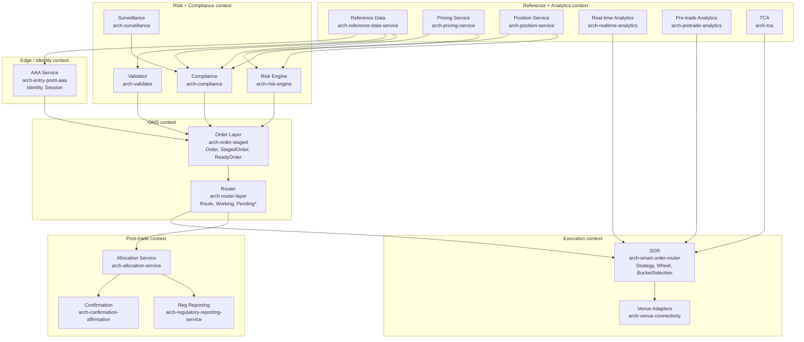
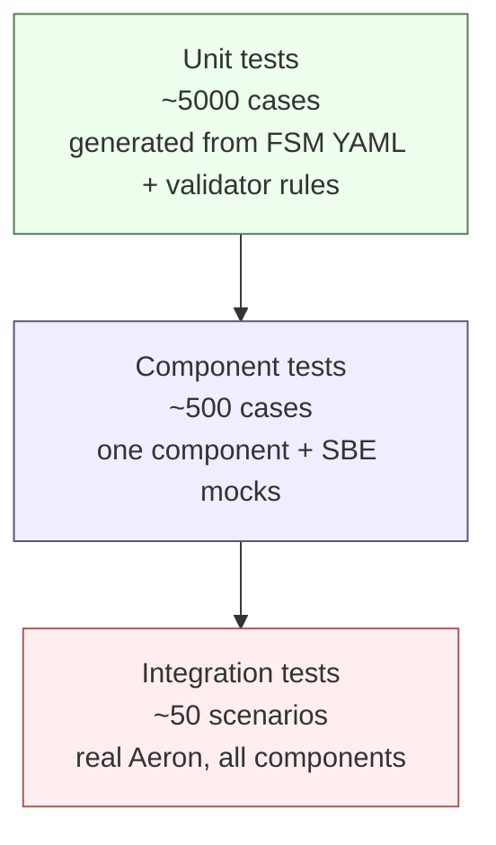

# DDD + TDD — Domain-Driven, Test-First Development

The methodology backbone for building the EMS: **Domain-Driven Design** gives the team one shared vocabulary derived from industry terminology, used in every layer from trader UI through SBE schema to test names. **Test-Driven Development**, **test-first**, anchors every component contract before the implementation exists. The two reinforce each other — tests written in DDD ubiquitous language **are** the executable specification of the trading workflow.

## Why these two together

Trading domain knowledge is dense and inconsistent across the industry — every desk uses slightly different terminology for the same concept (CXL vs Cancel vs Pull; ClOrdID vs Order Ref vs Client Order Number). Without a deliberate ubiquitous language, code talks past traders. Without TDD, edge cases — exactly the ones [[arch-fix-appendix-d|Appendix D]] documents — go uncovered until production at 03:00 on a Sunday.

Combining them yields a property that's rare in trading systems: **the tests are readable to a trading desk** without translation. A new trader looking at the integration tests for "spot-first sequenced FX swap with partial spot fill" reads it as a trading scenario, not Java/Rust syntax. And every test was written before the production code, so coverage of the documented FIX state machines, FSM transitions, race conditions, and cascading-cancel paths is by construction.

## DDD — ubiquitous language

### The vocabulary

The vocabulary is **the shared single-source-of-truth dictionary** drawn from the existing market vocabulary:

| Domain term | Where it lives |
|---|---|
| Order, Route, Fill, Replace, Cancel, Bust, Correct | [[arch-order-route-lifecycle]] state names, SBE message types, code class names, log fields, test scenario names |
| Pending Replace, Pending Cancel, Working, PartiallyFilled, Filled | FIX OrdStatus values used verbatim |
| ChainID, InitialOrderId, InitialClOrdId, OrigClOrdID | [[arch-identity-chaining]] — same names in API, FIX wire, SBE schema, logs, traces |
| RFQ, IOI, BWIC, OWIC, TBA, NDF | [[arch-rfq]], [[arch-ioi]] — verbatim industry terms |
| Tag Permission, Three-Layer AND-Gate | [[arch-tag-permissions]] — phrase used in code, comment, docs, and trader-facing error messages |
| Allocation Template, Pro-Rata, Average Price | [[allocation-prime-broker]] — verbatim |
| Best Execution, RTS 27, RTS 28 | [[arch-best-execution]] — verbatim regulatory terminology |
| Algo Wheel, Performance Tier | [[arch-smart-order-router]] — industry terms |
| Fat-finger, Machine-gun | [[arch-compliance]] — industry terms |
| Trace ID, Span Link, Sampled Bit | [[arch-observability]] — verbatim from W3C trace context spec |

Every name on this list appears identically in:
- The SBE schema field name (`initial_order_id`).
- The Java / Rust / Go / Python codegen output (no language-idiomatic rename to `firstOrderId`).
- The integration test scenario titles ("an OrderReplaceRequested under PartiallyFilled with new qty above CumQty transitions to PendingReplaceAtVenue").
- The log line JSON field name (`"initial_order_id"`).
- The trader-facing reject text ("ChainID `chn-5a4f...` exceeded the desk's daily order count limit").
- The Mermaid diagram labels.

**One word per concept, one concept per word.** When the same word means two different things in two contexts, both get qualified (e.g. `RouteCanceled` vs `OrderCanceled` — never just "Canceled" floating without context).

### Bounded contexts

The architecture is decomposed into **bounded contexts** — each owns its language and model:



Each context has:

- Its own **bounded vocabulary**. Inside the Risk context, `Limit` means a risk cap. Inside the Order context, `Limit` is a price type. Same word, different meaning — bounded contexts let both exist without confusion.
- Its own **SBE schema namespace** (`ems.oms.order.v1`, `ems.risk.v1`, etc.).
- **Translation contracts** (anti-corruption layer) at context boundaries — explicit mapping when concepts cross.

### Domain events as the public surface

Every context publishes **domain events** (per [[arch-event-sourcing]]) — past-tense, intention-revealing, named in the ubiquitous language:

- `OrderAccepted`, `OrderReplaceRequested`, `OrderReplaced`, `OrderReplaceRejected`, ...
- `RouteSent`, `RouteAcknowledged`, `RouteReplacePendingAtVenue`, ...
- `ComplianceCheckBlocked`, `ComplianceOverrideGranted`, ...
- `RiskBreachWarned`, `RiskBreachBlocked`, ...

Events are **the contract between bounded contexts**. A consumer never reads another context's internal state; it consumes the published events. This is what makes the system replay-correct, scalable, and testable.

## TDD — test-first

### The discipline

Every component, every transition in the [[arch-fix-fsm-design|shared FSM]], every validator rule, every SOR strategy, every compliance check is written **test first**:

1. Write the integration test in DDD vocabulary expressing the user story.
2. Watch it fail (red).
3. Write the minimum production code to make it pass (green).
4. Refactor without changing behavior.

Three test layers:

| Layer | Style | What it asserts |
|---|---|---|
| **Unit** | xUnit, fast, isolated | One transition in the FSM, one validator rule, one strategy decision |
| **Component** | xUnit, single component + in-process SBE/Aeron mock dependencies | One component's end-to-end behavior on a sequence of events |
| **Integration** | BDD-style scenario, real Aeron media driver, all components | One user story end-to-end across bounded contexts |

The integration tests are where DDD pays off most.

### Integration tests as user stories

Integration tests are written in **scenario form** using ubiquitous language. Example:

```
Scenario: A spot-first FX swap with partial spot fill
  Given an enabled trader at the FX G10 desk with #fx-trade and #multileg-sequenced tags
  And the GBP/USD pair has a fresh L1 quote of 1.2750/1.2752
  When the trader stages a multileg sequenced order
    | leg_id | side | qty   | ccy_pair | value_date |
    | spot   | BUY  | 10M   | GBPUSD   | T+2        |
    | fwd    | SELL | 10M   | GBPUSD   | T+90       |
  And policy is partial_policy=SCALE
  Then the order is OrderAccepted with state STAGED
  And only the spot leg is dispatched as a Route
  When the spot route receives a partial fill of 6M
  Then the order is OrderPartiallyFilled at the spot leg
  And the forward leg's qty scales to 6M
  And LegReady fires for the forward leg
  And the forward route is dispatched
```

Notice every term — *trader*, *desk*, *tag*, *staged*, *multileg*, *spot leg*, *forward leg*, *partial fill*, *scale*, *LegReady*, *Route* — comes from the [[arch-order-route-lifecycle]] vocabulary. The scenario is **readable to a trader** without translation. A new desk member or compliance auditor can read the tests to understand what the system does.

These scenarios are the executable specification. If the requirement changes, the scenario changes; the code change required to make it pass falls out.

### Coverage by FSM construction

Every transition declared in the [[arch-fix-fsm-design|FSM YAML]] gets:

- One unit test per `(from, on)` pair asserting the resulting `(to, emit, effects)` — generated from the FSM definition.
- One scenario test per documented [[arch-fix-appendix-d|Appendix D]] race condition.
- One property test asserting state-machine invariants (every reachable state, no orphan transitions, terminal states are terminal).

This is why the FSM is declared in YAML and codegen'd — the tests come from the same source as the implementation, and divergence is impossible at compile time.

### Test pyramid



The pyramid is **load-bearing on its bottom layer**. Most coverage is in unit tests generated from the FSM and rule definitions; this is cheap, fast, and exhaustive. Integration tests are reserved for cross-context scenarios.

## Standardized SBE + Aeron interfaces — mock & replay for free

The architectural property that makes TDD scale to a system of this complexity: **every component contract is an SBE schema over an Aeron channel**.

```
Component A  --[SBE schema X]-->  Component B
```

When you replace `Component A` with a test driver, the test driver just writes the same SBE schema messages onto the same Aeron channel (or an in-memory simulated channel using the same codec). `Component B` cannot tell the difference. **Mocking is the natural state**, not an instrumentation effort.

### In-process Aeron for tests

For component tests and integration tests, an **in-process Aeron media driver** runs in the test JVM / process. Components and test drivers publish/subscribe normally. Latency is microseconds; setup is milliseconds.

For unit tests, the test substitutes the publisher/subscriber with a direct in-memory queue using the same SBE codecs. Even faster — but still uses the production SBE schemas, so any schema drift is caught.

### Replay as a natural consequence

Because every component reads SBE events from Aeron channels, **replay mode** (per [[arch-time-replay-server]]) is just one more way to feed the same events:

```
Live mode    : Real network -> Aeron live channels -> Components -> Live state
Test mode    : Test driver  -> In-process Aeron   -> Components -> Asserted state
Replay mode  : Archive read -> In-process Aeron   -> Components -> Re-derived state (must equal historical)
```

The components don't know which mode they're in. They consume SBE messages on Aeron channels and respond per their FSM. Replay determinism is a **property of the architecture**, not a feature to implement.

## Anti-Corruption Layer for upstream FIX

When integrating with upstream OMSs (per [[buy-side-oms-integration]]), the FIX wire vocabulary doesn't always match our ubiquitous language exactly — different OMSs encode the same concept differently (extension tags, custom enumerations). The [[arch-fix-api-bridge|FIX bridge]] is our **anti-corruption layer**: it translates incoming FIX semantics into our domain events. Inside the EMS, no component speaks the upstream's dialect — they only speak the canonical SBE schema.

This is a classic DDD pattern: a translation boundary that prevents foreign concepts from polluting the domain model.

## Test data — the same SBE schemas, deterministic generation

Test data is **generated deterministically from the SBE schemas** using property-based testing (Quickcheck-style, with type-driven generators per SBE type). The shrinker on failure produces minimal counter-examples in domain vocabulary — `"failed: OrderReplaceRequested with new_qty=0 from PartiallyFilled(cum_qty=3)"` — readable, actionable.

For integration tests, test data uses **named fixtures** (`an_order_in_partially_filled`, `a_fast_market_quote`, `a_busted_fill`) that are themselves DDD vocabulary.

## Concrete benefits compounding

- **No-translation traceability**: regulator subpoenas a trade — the audit log uses the same terminology as the test scenarios as the FIX wire as the code. The path from "what regulator wants" to "where in code" is mechanical.
- **Onboarding**: a new engineer reads a representative scenario suite and understands the trading domain without a separate trader-translator step.
- **Refactor safety**: tests express intent in domain terms, not implementation details. Renaming, reorganizing, or rewriting components doesn't invalidate tests as long as domain behavior is preserved.
- **Replay-as-test**: any historical incident is replayed through the same components in test mode. The test result *is* the regression test for the fix.

## Anti-patterns

- **Different names for the same concept across layers.** `firstOrderId` in code, `initial_order_id` in SBE, `chain_id` in logs, `ClOrdLinkID` in FIX — even if mappings exist, the cognitive load destroys the ubiquitous-language property.
- **"We'll write tests after."** They never get written, and edge cases get discovered in production. The FSM-driven generation makes test-first cheap.
- **Mocking by stubbing internal classes.** SBE + Aeron is the contract; mocking inside that is fragile and breaks under refactor. Mock at the schema boundary.
- **Tests written in Java/Rust-flavored language**, not domain language. `whenOrderReceivedThenStateBecomesNew()` reads like Java; `An OrderAccepted event places the order in New state` reads like trading.
- **Bounded contexts blurred.** Risk's `Limit` and Order's `Limit` are different; if the same Java class represents both, debugging becomes a maze.

## See also

- [[arch-fix-fsm-design]] (FSM YAML is the single source of generated unit tests)
- [[arch-fix-appendix-d]] (every documented race condition → scenario test)
- [[arch-sbe-aeron-transport]] (the contract surface for mocking and replay)
- [[arch-event-sourcing]] (domain events as the inter-context contract)
- [[arch-time-replay-server]] (replay determinism as architectural property)
- [[arch-order-route-lifecycle]] · [[arch-identity-chaining]] · [[arch-observability]] (vocabulary sources)
- [[arch-validator]] · [[arch-compliance]] · [[arch-risk-engine]] · [[arch-smart-order-router]] · [[arch-best-execution]]
- [[buy-side-oms-integration]] (FIX bridge as anti-corruption layer)
