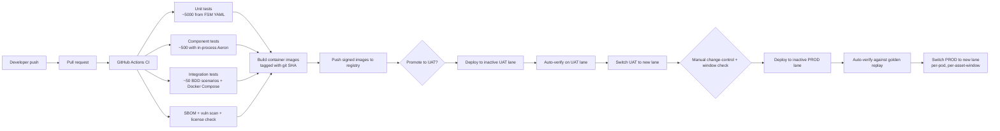
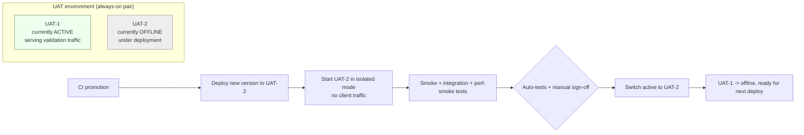
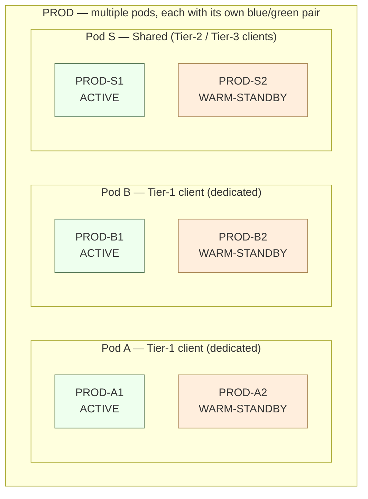
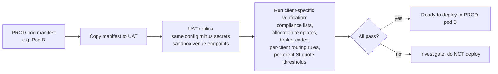

# Deployment — CI/CD, Environments, Blue/Green, Pods

The deployment topology spans four environment tiers (Dev / QA / UAT / PROD), all built from the same containerized images, all promoted through a strict blue/green pattern with hot-warm-pair safety mechanisms that guarantee **no dual-live state, no missed messages, no duplicates** during switchover. PROD scales horizontally by **pod** — a fully self-contained EMS instance dedicated to a single client tier or shared across smaller tenants — with per-pod resource budgets and per-pod blue/green pairs.

This note ties together [[arch-resilience-24x7|24/7 continuity]] (which describes the *runtime* hot-warm model) with the *deployment-time* hot-warm model. Both are blue/green at heart but operate at different cadences.

## Environment matrix

| Env | Purpose | Compute | Hosting | Promotion gate |
|---|---|---|---|---|
| **Dev** | Local development, contributor inner loop | Laptop / workstation | Docker Compose | Push to PR branch |
| **QA / CI** | Automated unit + component + integration tests | GitHub Actions ephemeral runners | Docker on Actions runners | PR check passes |
| **UAT-1 / UAT-2** | Pre-production validation, client-specific mimicry, perf smoke | Small AWS instances (right-sized for verification, not throughput) | Cloud — blue/green pair | Manual sign-off after auto-tests |
| **PROD-1 / PROD-2** | Live trading | Aeron-tuned AWS instances, per-pod isolated | Cloud — blue/green pair, per-pod | Change-control + window-aware |

All four environments run the **identical container images** produced by CI. The only differences are configuration (endpoints, credentials, resource budgets, compliance-list versions) injected at runtime per environment.

## Containerization

Every component ships as an **OCI container image** built via deterministic, reproducible builds:

- One base image per language runtime (JDK / Rust / Go / Python / Node) — tagged with sha256 digest.
- Per-component image layers cached in a registry (ECR or equivalent).
- Image tags follow `{component}:{semver}-{git-sha}` for traceability.
- Image signing (cosign / Notary) — only signed images are admitted to UAT and PROD.
- Aeron media driver runs in a sidecar container, sharing memory via tmpfs / shared volume.
- Aeron Archive runs as its own service container with persistent volume.

Configuration injection:

- **Bootstrap config** (image tag, cluster endpoints, AAA roots, vault address): ConfigMap-equivalent (env vars, mounted files), versioned alongside the image release. Just enough to start and connect.
- **Runtime config** (tenants assigned, limits, compliance-list versions, algo wheel weights, venue routing tables, regulatory regimes per [[arch-jurisdictional-compliance]]): delivered through [[arch-configuration-service]] — published on the config bus, snapshot-swapped at message boundaries on every component without restart. The per-pod manifest **is** a curated set of `ConfigChanged` events scoped to that pod.
- Secrets (venue credentials, sanctions-list API keys, regulator endpoints): vault-backed, retrieved at startup with short-lived tokens; their config keys reference vault paths rather than carrying the secret value.

## CI / CD pipeline



### What runs in GitHub Actions

- **Unit tests** (every PR push): generated from FSM YAML + validator rule sets; ~5000 cases in a few minutes.
- **Component tests** (every PR push): one component + in-process Aeron + SBE mocks per [[arch-ddd-tdd]] test pyramid.
- **Integration tests** (merge to main): full Docker Compose stack — AAA + Order + Router + SOR + Validator + Compliance + Risk + sample venue mock — runs every [[arch-fix-appendix-d|Appendix D]] race-condition scenario.
- **Performance smoke** (nightly): bounded load test against the integration stack to catch regressions.
- **Security**: SBOM generation, CVE scan, license compliance check, container image signing.

GitHub Actions runners are ephemeral; everything is rebuilt from scratch per run. No persistent state. Test data is generated deterministically.

### What does NOT run in GitHub Actions

- **Full perf testing** — needs Aeron-tuned bare-metal-like AWS instances per the Aeron AWS performance testing guidance (placement groups, ENA, NUMA pinning, kernel tuning). Runs on a dedicated UAT-perf cluster nightly.
- **Cross-region failover drills** — requires multi-region setup; runs in a dedicated drill environment.
- **Full Reg report cycle** — exercises real regulator sandbox endpoints; runs on UAT only.

## UAT — blue/green pair (UAT-1, UAT-2)



- **Always one active**, the other offline. Roles alternate per release.
- **UAT-2 deployed while UAT-1 serves traffic** — no validation pause.
- **Automated verification** on the inactive lane before switch: smoke tests, FIX session sanity, sample order through the full lifecycle, sample reg report dry-run, [[arch-time-replay-server|golden replay]] of a recorded UAT day to ensure determinism.
- **Switch** is a configuration / DNS / load-balancer change taking the inactive lane online and the active lane offline atomically.
- **Smaller compute budget than PROD** by design — UAT is for correctness validation, not throughput.

## PROD — blue/green pair (PROD-1, PROD-2) per pod

PROD is more complex because of multi-tenancy (per-pod isolation) and the operational stakes.



- **One ACTIVE + one WARM-STANDBY per pod**, always. Roles alternate per release.
- **WARM-STANDBY** is **fully running** — it consumes the Aeron Archive of the active, applies the same events in the deterministic FSM, reaches byte-identical state. It is *not* "ready to start"; it is *already up* and continuously caught up.
- **Per-pod blue/green** means deployments can roll **per client** — a Tier-1 client may opt for a slower release cadence than the shared pod.

### Pod tenancy

| Pod kind | Use | Resource isolation |
|---|---|---|
| **Dedicated pod** | Single Tier-1 client | Own Aeron Cluster, own Archive, own venue connections, own database, own observability namespace, own compliance-list overlay |
| **Shared pod** | Multiple Tier-2 / Tier-3 clients | Shared Aeron Cluster with `firm_id`-keyed isolation in the FSM state, shared Archive (partition by firm_id), shared venue connections (multiplexed by firm_id), shared DB with row-level tenant isolation |

Pod assignment is reference data in [[arch-reference-data-service]] — clients can be moved between pods with sign-off; assignment cannot change mid-trading-day.

### Aeron-tuned AWS placement

Following the Aeron Cloud Performance Testing AWS guidance:

- **Instance type**: c-series with high-bandwidth ENA networking for the Aeron cluster nodes; storage-optimized i-series for Archive nodes.
- **Placement groups**: cluster nodes in the same partition for low-latency inter-node consensus; spread across AZs for resilience.
- **Network**: SR-IOV (ENA), jumbo frames where supported, dedicated NICs for Aeron traffic (separate from management traffic).
- **OS tuning**: NUMA-aware pinning, kernel `net.core.rmem_max` / `net.core.wmem_max` tuned, CPU isolation via `isolcpus` for hot-path threads, transparent huge pages disabled (Aeron prefers explicit huge pages), `nohz_full` for jitter reduction.
- **JVM** (where applicable): G1 or ZGC depending on heap, `-XX:+AlwaysPreTouch`, `-XX:+UseTransparentHugePages` per guide.

These tunings apply to PROD only; UAT runs the same images but **without** the kernel/NUMA tuning — UAT verifies correctness, not maximum throughput.

## Blue/green switchover — high-precision protocol

The switchover guarantees: **no message duplicated, no message lost, no two clusters serving the same pod simultaneously, sub-second client-perceived window**.

The protocol leverages Aeron Archive's position-precise replay (per [[arch-sbe-aeron-transport]]) and an **active-lease fence token** held by exactly one cluster at any moment.

```mermaid
sequenceDiagram
  participant OLD as Old Active (e.g. PROD-A1)
  participant NEW as New Active (e.g. PROD-A2)
  participant LEASE as Cluster Lease Service<br/>(strongly consistent)
  participant NET as Network / DNS / LB
  participant CLI as Clients
  participant VEN as Venues

  Note over OLD,NEW: NEW has been warm-standby<br/>consuming OLD's Archive<br/>state is byte-identical
  NEW->>NEW: pre-switch self-check: golden replay matches, FSM version matches
  Note over OLD: switchover initiated by ops
  OLD->>OLD: 1. begin drain — refuse new client sessions
  OLD->>VEN: 2. stop emitting new venue traffic (existing in-flight ok)
  OLD->>OLD: 3. final snapshot at Archive position P
  OLD->>LEASE: 4. release active lease at position P
  LEASE-->>OLD: lease released
  Note over OLD: OLD is now FENCED — egress to venues blocked,<br/>credentials downgraded to observer-only
  NEW->>NEW: 5. replay Archive to position P (already caught up)
  NEW->>LEASE: 6. acquire active lease, with prerequisite "position >= P"
  LEASE-->>NEW: lease acquired (fence token T_new)
  NEW->>VEN: 7. resume venue connections with credentials carrying T_new
  NEW->>NET: 8. update DNS / LB to point clients at NEW
  CLI->>NEW: 9. clients reconnect; session recovery handles in-flight
  Note over OLD,NEW: total switchover latency: typically &lt; 500 ms<br/>messages neither lost nor duplicated
  OLD->>OLD: 10. become warm-standby — consume NEW's Archive
```

### Why no duplication or loss

1. **Position-precise lease handoff**: the active lease is released *at* a specific Archive position. The new cluster acquires it only after confirming it has replayed to that position. There is no time window where both clusters can emit events with the same `(global_seq, position)`.
2. **Fence tokens on venue credentials**: each cluster's venue credentials carry a fence token. After lease release, the old cluster's tokens are revoked — venue gateways reject its outbound traffic. Even a runaway thread on OLD cannot send an order.
3. **Identity chaining**: every event carries [[arch-identity-chaining|`initial_order_id` and `initial_cl_ord_id`]]. If a race did somehow occur, downstream consumers detect duplicate `(initial_*, stream_seq)` and reject the second.
4. **Client-side session recovery**: clients reconnecting see standard [[arch-sequence-recovery|FIX-style session recovery]] — gaps and duplicates handled with declared `next_expected_seq`.
5. **No-fly window for shared resources**: the Archive is single-writer per pod (the active cluster). The new cluster cannot write to the Archive until the lease is acquired. By construction, only one writer at a time.

### What "active lease" means concretely

A small **strongly-consistent lease service** (e.g. ZooKeeper / etcd / Aeron Cluster-of-Clusters) holds the per-pod active lease. Properties:

- Exactly one holder at any time per pod.
- Holder must heartbeat to retain.
- Release is explicit (graceful switchover) or via heartbeat timeout (failure).
- Each holder gets a monotonically-increasing fence token.
- Venue gateways, Archive writer, and downstream services check the fence token on every operation; outdated tokens are rejected.

This is the same pattern as a leader-lease in distributed systems; we apply it at the **cluster-of-clusters** level rather than within a single cluster.

### 24/7 trading-window awareness

Switchover is **window-aware**: it consults the [[arch-resilience-24x7|maintenance-window table]] before initiating.

- **Crypto pod**: no safe global window — switchover must be designed to be sub-second invisible. Rolling switchover never paused.
- **FX pod**: prefer weekend (Sat / Sun before Tokyo open). Mid-week switchover allowed but must be sub-second.
- **Futures pod**: prefer 17:00–18:00 NY pause for Globex contracts.
- **Equity pod**: after-hours.
- **Per-asset-class pods**: window-aware per their dominant asset.

Ops console refuses to schedule a non-emergency switch outside the asset's preferred window.

## UAT pod mimicry

A critical operational requirement: **UAT must be able to mimic any PROD pod's configuration** so client-specific behaviour can be validated before deployment to that pod.



### What gets mimicked

- Per-tenant **compliance-list overlay** (restricted lists, watch lists, sanctions screening rules).
- **Allocation templates** registered by the client.
- **Broker codes** + per-client venue enablement.
- **Per-client trading limits** + risk caps.
- **Per-client tag permission grants**.
- **SI quote-publication thresholds** (for MiFID II SI flows).
- **Algo wheel** weights specific to the client.
- **Best-ex policy** version.

### What does NOT get mimicked

- **Production credentials** — UAT uses sandbox / dev endpoints with synthetic credentials.
- **Real client orders** — UAT uses generated test fixtures.
- **Real venue connectivity** — UAT routes to venue sandboxes or in-process simulators.
- **PII** — UAT account data is synthetic; KYC data is fake.

### Workflow

1. Ops selects "Mimic Pod B for UAT-2".
2. Pod B's manifest is copied to UAT-2 (without secrets); secrets replaced with UAT-sandbox equivalents.
3. UAT-2 brought up with that overlay.
4. Synthetic-but-shaped-like-real test traffic runs against UAT-2 exercising the client-specific config.
5. Per-rule audit asserts: "compliance list X version 17 in production = compliance list X version 17 in UAT", "allocation template Y matches", etc.
6. Outcome recorded; only on full pass does the production deployment to Pod B proceed.

## Deployment rollback

Blue/green makes rollback **the same operation in reverse**:

- The previous lane (now warm-standby) is already running the prior version.
- Switchover protocol runs the other direction.
- Rollback completes in the same sub-second timing as forward switch.

The same lease + fence + position discipline applies. Rollback is **never not an option** if observability ([[arch-observability]]) flags anomalies on the new lane.

## Schema and config evolution

- **SBE schemas** evolve per [[arch-sbe-aeron-transport|append-only rules]] — old and new clusters can interoperate during transition.
- **FSM definitions** ([[arch-fix-fsm-design]]) are versioned. The warm-standby must be on the *same FSM version* as the active for state replication to be byte-identical. A FSM-version bump is a coordinated deployment: warm-standby deployed first, verified via golden replay, then switch.
- **Reference data** ([[arch-reference-data-service]]) has effective dates; updates roll independently of code.
- **Validator rules** + **compliance lists** can update without code changes; both sides see the same updated rules.

## Anti-patterns

- **"Dual-write" between active and standby.** Don't — that's how split-brain happens. Standby reads the active's Archive, applies events deterministically. One writer per pod, always.
- **Switching without a fence token.** Even with Raft within each cluster, the cluster-of-clusters level needs the lease; without it, network partitions can produce dual-active.
- **Skipping the UAT mimicry step for "small" changes.** Client-specific config bugs are the most common cause of post-deploy incidents.
- **Deploying during the wrong asset window without explicit override.** Ops console enforces; the override path is logged and reviewed.
- **Sharing the Archive between PROD lanes.** Each pod has its own Archive. The warm-standby reads it via Aeron replication, not via shared storage. Shared-storage Archive across active+standby invites lock contention and recovery confusion.
- **Letting CI deploy directly to PROD.** UAT verification + manual sign-off + window check are non-negotiable.
- **Different container images between UAT and PROD.** Same artefact, different config. Otherwise UAT validation is meaningless.

## Per-environment observability

Each environment has its own [[arch-observability|observability stack]] but with consistent labelling:

- `env=dev | qa | uat-1 | uat-2 | prod-A1 | prod-A2 | prod-S1 | ...`
- `pod=A | B | S | ...`
- Logs / traces / metrics carry these labels; dashboards filter by them.
- PROD-active vs PROD-standby clearly distinguished — standby's metrics should mirror active's, with a thin lag indicator.

A discrepancy between active and standby on the same pod is itself an observability signal — investigated before switchover.

## See also

- [[arch-resilience-24x7]] (the runtime hot-warm model; this note covers the deployment-time model)
- [[arch-sbe-aeron-transport]] (Aeron Cluster + Archive primitives + AWS tuning context)
- [[arch-fix-fsm-design]] (FSM version coordination for replicated state machine)
- [[arch-identity-chaining]] (duplicate-detection backbone during switchover)
- [[arch-sequence-recovery]] (client-side session recovery on reconnect)
- [[arch-observability]] (per-environment labelling) · [[arch-jmx-introspection]] (deployment readiness probes)
- [[arch-reference-data-service]] (per-pod overlay storage) · [[arch-jurisdictional-compliance]] (per-pod regulatory regime)
- [[arch-ddd-tdd]] (CI test pyramid that gates promotion)
- [[arch-validator]] · [[arch-compliance]] · [[arch-risk-engine]] (per-pod rule overlays)
- [[arch-best-execution]] (per-client policy overlay for UAT mimicry) · [[arch-tca]]
- [[crypto-spot]] · [[crypto-perpetual]] (24/7 pod examples requiring sub-second switch)
