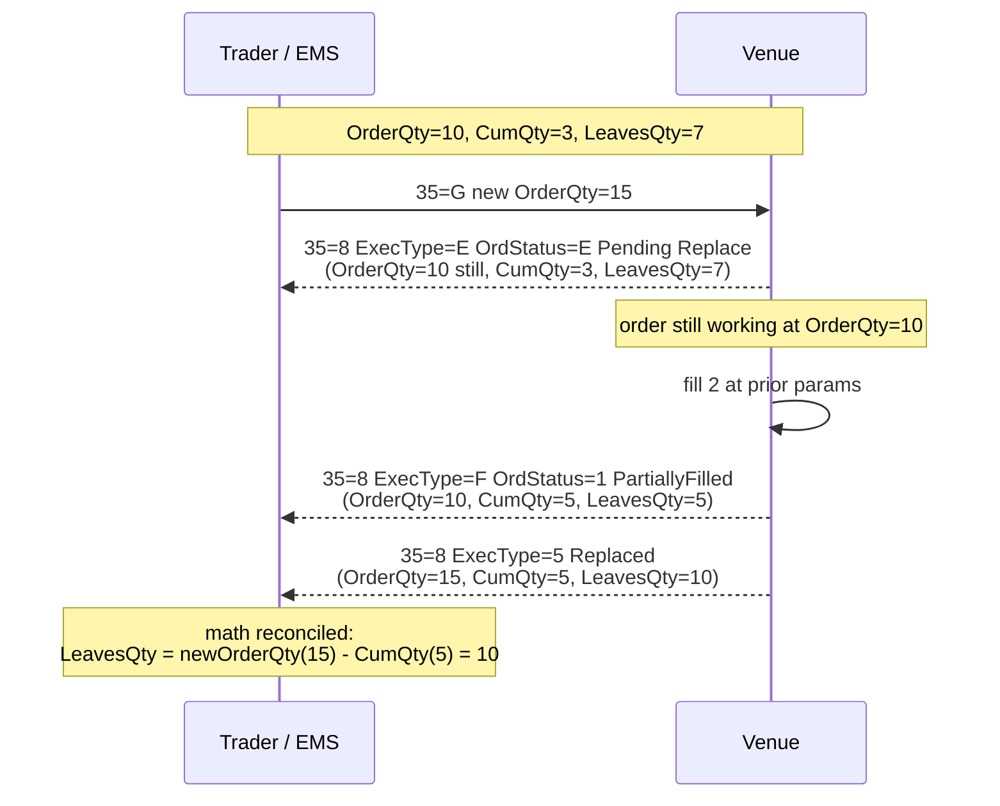
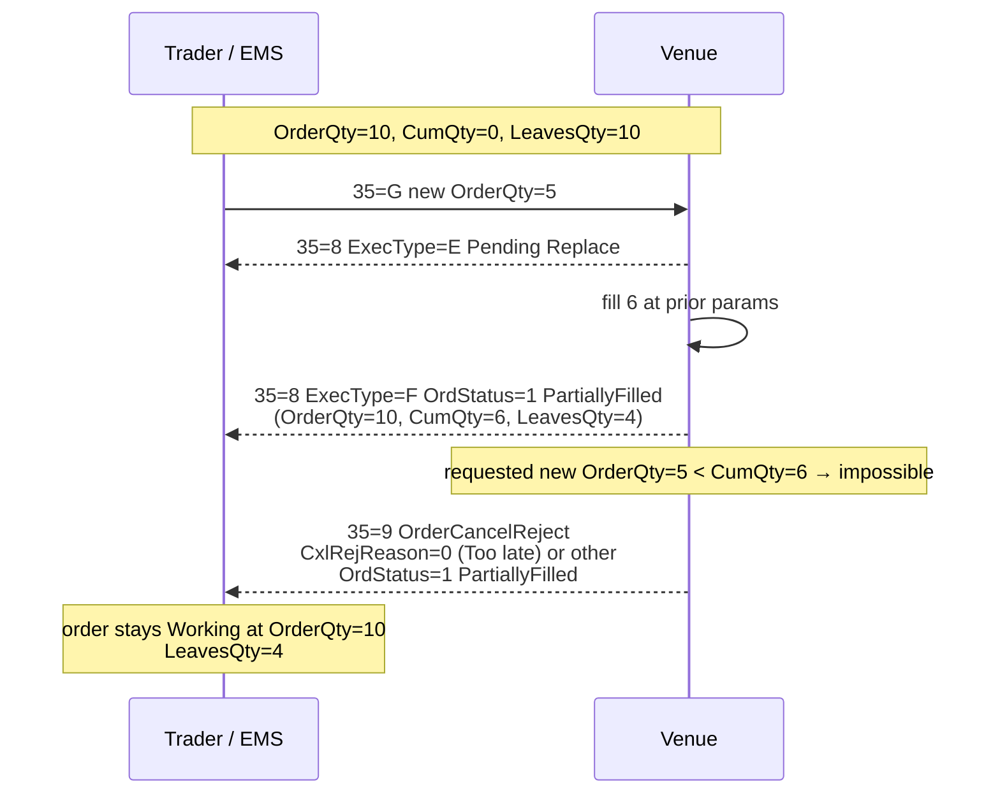
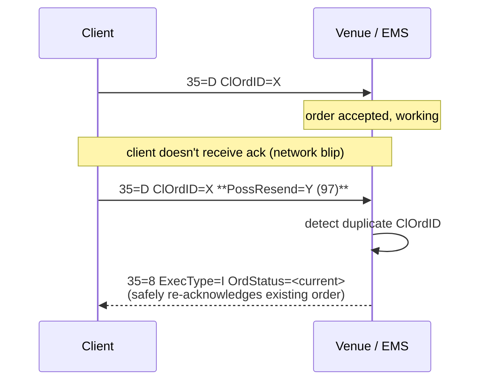
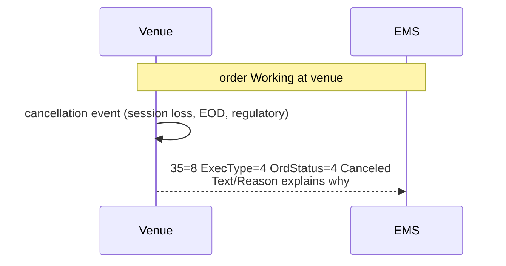
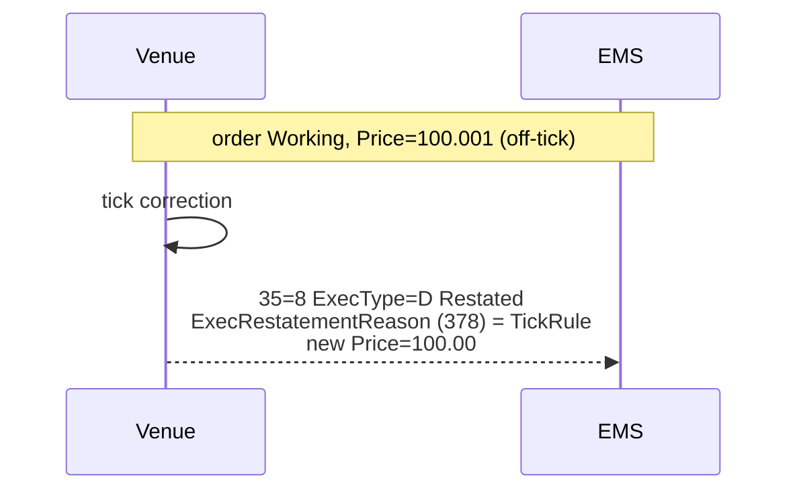
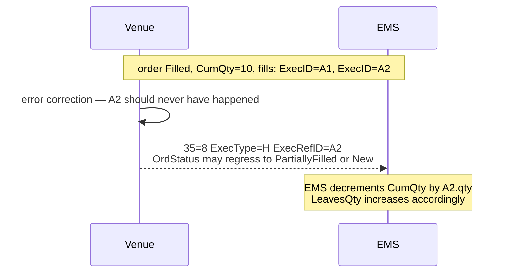
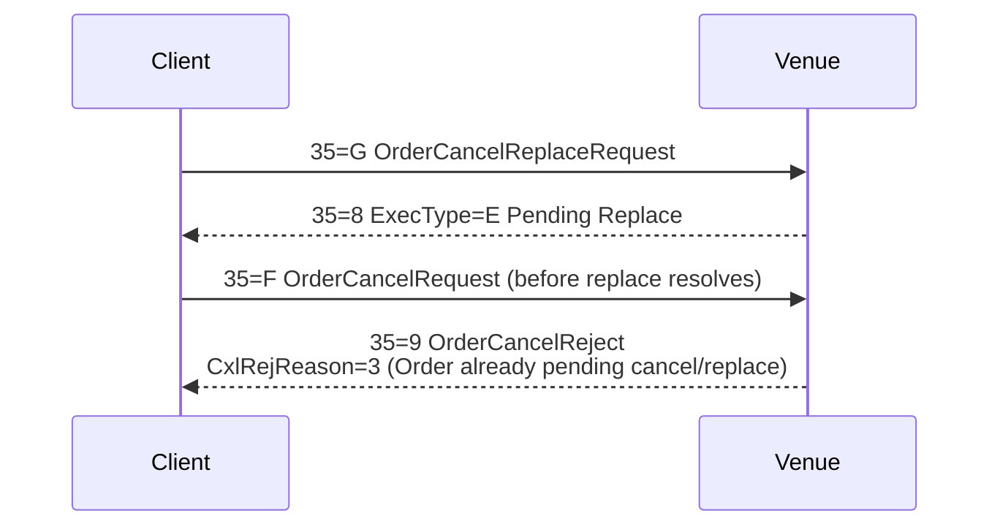

# FIX Appendix D Edge Cases & Race Conditions

The order/route state machines in [[arch-order-route-lifecycle]] cover the happy path. **FIX Protocol Appendix D** (the *Order State Change Matrices*) catalogues the race conditions that make production EMS implementation hard: messages crossing each other in flight, partial fills sneaking in during replaces, duplicate-suppression on resends, and post-fill busts that re-write history.

This note enumerates the scenarios the EMS **must** handle correctly and documents the implementation contract for each. Every scenario here has been a real-world outage at some firm — they are not theoretical.

> Reference: OnixS *Appendix D – Order State Change Matrices* (FIX 4.4 / 4.2 / 4.1).

## Quantity invariants (must hold at all times)

Three FIX tags carry the running quantity state:

| Tag | Name | Definition |
|---|---|---|
| `38` | `OrderQty` | Currently-requested total quantity (changes via `35=G` replace). |
| `14` | `CumQty` | Cumulative quantity filled so far on this order/route. |
| `151` | `LeavesQty` | Quantity remaining to fill. |

The invariant on every emitted `35=8` ExecutionReport:

```
LeavesQty = OrderQty - CumQty   (for working states)
LeavesQty = 0                    (for terminal states: Filled / Canceled / Expired / Rejected)
```

A replace mutates `OrderQty`; fills mutate `CumQty`; `LeavesQty` is derived. **The EMS recomputes `LeavesQty` on every state transition** — never carries it as independent state. Any divergence is a bug.

---

## Scenario D4/D5 — Too Late to Cancel (cancel/replace loses to a fill)

> Client sends `35=F` OrderCancelRequest (or `35=G` OrderCancelReplaceRequest). At the exact same window, the venue fills the order. The fill wins.

```mermaid
sequenceDiagram
  participant T as Trader / EMS
  participant V as Venue

  Note over T,V: Order Working, OrderQty=10, CumQty=0
  T->>V: 35=F OrderCancelRequest
  Note over V: cancel in flight
  V->>V: order fills (CumQty=10, LeavesQty=0)
  V-->>T: 35=8 ExecType=F OrdStatus=2 Filled<br/>(CumQty=10, LeavesQty=0)
  V-->>T: 35=9 OrderCancelReject<br/>CxlRejReason=0 (Too late to cancel)<br/>OrdStatus=2 Filled
  Note over T: EMS MUST process Filled first;<br/>the 35=9 is informational
```

### What the EMS must do

- **Do not block waiting for `Canceled`.** As soon as `35=8 ExecType=F OrdStatus=2 Filled` arrives, the order is terminal `Filled`. Process fill, fire downstream allocation / STP.
- **The 35=9 with `CxlRejReason=0 (Too late to cancel)` is informational.** Record it as `RouteCancelRejected { reason: too_late_to_cancel }` in the audit log. Do **not** revert the terminal state.
- **A pending `RouteCancelRequested` event** in the audit log stays — it records that the cancel was issued, just that it raced and lost.
- **FIX-paired client gets both echoes:** the Filled ExecutionReport first (drives their state), then the 35=9 (records the failed cancel attempt).

### Why this matters

A naive implementation that holds the order in `PendingCancel` until it sees a `Canceled` will **freeze forever**. The order is already Filled — the client's blotter, allocations, and reporting must reflect that.

### Same scenario for replace

Identical pattern with `35=G` instead of `35=F`. Fill wins; the replace is rejected with `35=9 CxlRejReason=0`; order is `Filled`.

---

## Scenario D7/D10 — Fill during Pending Replace

> Order has `CumQty=3` of `OrderQty=10` (`LeavesQty=7`). Client sends `35=G` to change `OrderQty=10 → OrderQty=15`. While in `Pending Replace`, a fill of 2 prints at the prior parameters.



### What the EMS must do

- **Honour the venue's ExecutionReport sequence exactly.** Don't try to predict what `LeavesQty` should be — read it from each `35=8` and update local state.
- **The order's `OrderQty` field must reflect the venue's view at all times.** Until `ExecType=5 Replaced` confirms, `OrderQty` is still the prior value.
- **Fill events are processed against the prior `OrderQty`**. The fill of 2 is "against" the 10-qty order, not the 15-qty replacement.
- **After `Replaced`, recompute every dependent quantity:** `LeavesQty`, `available_to_route` on the parent order, allocation expectations.

### Anti-pattern

Computing `LeavesQty` locally as `requested_new_qty - prior_CumQty` will be wrong as soon as a fill races in. **Always derive from the venue's reported state**, never from the client's request alone.

---

## Scenario — Replace below CumQty (over-allocation prevention)

> Order `OrderQty=10`, `CumQty=0`. Client sends `35=G` requesting `OrderQty=5`. Before the replace is accepted, the venue fills 6 lots.



### What the EMS must do

- **Recognise the 35=9 reject as `RouteReplaceRejected { reason: qty_below_cum_qty }`** — log it.
- **Do not terminate the order.** State remains the pre-replace state — Working with `LeavesQty = original_OrderQty - CumQty`.
- **Pre-flight check.** When the EMS itself originates the replace (not a passthrough), the validator runs `EMS-RTE-2030 replace_qty_below_cum_qty` before sending if `CumQty` is already known to exceed the requested new `OrderQty`. (Pre-flight may still miss the race; the venue's 35=9 is the final authority.)
- **Surface the math clearly to the user.** Blotter shows `OrderQty=10, CumQty=6, LeavesQty=4`, not the failed `OrderQty=5` request.

---

## Scenario D31 — PossResend / Duplicate ClOrdID

> Client doesn't receive the EMS's ack for a `35=D NewOrderSingle`. Believes it was lost. Retransmits with `PossResend=Y` (tag `97`) and the **same ClOrdID**.



### What the EMS must do

- **Detect duplicate `ClOrdID` keyed per `(SenderCompID, ClOrdID, trade_date)`.** Already in the [[arch-sequence-recovery|session layer]].
- **`PossResend=Y` → reply with status, not a new order.** Emit `35=8 ExecType=I (Status)` with the current `OrdStatus` and full quantity state. **Do not create a duplicate order.**
- **`PossResend` not set on a duplicate → reject as duplicate.** `EMS-SES-1004 duplicate_request_id`. The duplicate is treated as an error, not a recovery hint.
- **`PossDupFlag=Y` (tag 43)** is different and session-level — it indicates a session-layer resend (potentially seen before in the same session). The EMS handles it via the [[arch-sequence-recovery|sequence recovery]] path; if the message is a true duplicate, it is silently dropped; if it's a gap fill, it's processed.

### Distinguishing the three tags

| Tag | Name | Meaning |
|---|---|---|
| `97` | `PossResend` | "This message may be a resend at the *application* layer — you may already have seen the underlying business event." Used for retransmits across reconnects/sessions. |
| `43` | `PossDupFlag` | "This message may be a resend at the *session* layer." Set automatically by the FIX engine on session-level recovery. |
| `122` | `OrigSendingTime` | The original send time on a `PossDupFlag=Y` message, so receivers can deduplicate. |

The EMS's session layer ([[arch-sequence-recovery]]) handles `PossDupFlag`; the application layer (this bridge) handles `PossResend`.

---

## Scenario — Unsolicited Cancel from venue

> No client `35=F` was sent, but the venue cancels the order (session disconnect, EOD purge, regulatory hold, etc.).



### What the EMS must do

- **Treat as terminal `Canceled`.** Record `RouteCanceled { reason: venue_unsolicited }`.
- **Capture the venue's reason** (FIX `Text 58`, or proprietary field) on the event.
- **No client cancel request was issued → no `OrderCancelReject` will ever come.**
- **Propagate to FIX-paired client** as a normal `35=8 ExecType=4 Canceled` so their blotter reflects the venue's action.
- **`available_to_route`** on the parent order increases by the canceled `LeavesQty`; the order can be re-routed.

### Common reasons

| Trigger | Typical FIX text |
|---|---|
| Session disconnect with `CancelOnDisconnect=Y` | "Session disconnected" |
| End-of-day purge of `DAY` orders | "Day order purge" |
| Regulatory hold | "Regulatory action" |
| Self-trade prevention | "Self-trade prevention triggered" |
| Risk limit breach | "Position limit exceeded" |

---

## Scenario — Unsolicited Restate (ExecType=D)

> Venue modifies the order without a client request — e.g. clamps price to a valid tick, splits notional across pools, or rebases on a corporate action.



### What the EMS must do

- **Update local state to match the venue's restatement.** Original parameters logged; the venue's view becomes truth.
- **Record `RouteRestated { reason }` event.** `ExecRestatementReason` (`378`) carries the venue's enumerated reason — preserve it.
- **Surface to client.** Echo the `35=8 ExecType=D` to any FIX-paired client; for API/UI clients, surface as a notification with the restatement reason.

### Common `ExecRestatementReason` values

| 378 | Meaning |
|---|---|
| 0 | GT corporate action |
| 1 | GT renewal / restatement |
| 2 | Verbal change |
| 3 | Repricing of order |
| 4 | Broker option |
| 5 | Partial decline of OrderQty |
| 6 | Cancel on Trading Halt |
| 7 | Cancel on System Failure |
| 8 | Market (Exchange) Option |
| 9 | Canceled, not best |
| 99 | Other |

---

## Scenario — Trade Bust (`ExecType=H`) and Trade Correct (`ExecType=G`)

> A fill that already incremented `CumQty` is later busted (treated as if it never happened) or corrected (price/qty restated). The venue uses `ExecRefID` (tag `19`) to reference the original fill's `ExecID` (tag `17`).

### Trade Bust



### Trade Correct

```mermaid
sequenceDiagram
  participant V as Venue
  participant T as EMS

  Note over T,V: fill A2 booked at price=100.05
  V->>V: actual price was 100.00
  V-->>T: 35=8 ExecType=G ExecRefID=A2<br/>LastPx=100.00 (corrected)
  Note over T: EMS replaces A2's price record;<br/>recomputes avg_px
```

### What the EMS must do

- **Maintain fill identity by `ExecID`.** Every fill is uniquely identified; `TradeCorrected` and `TradeCanceled` events reference the prior fill, not a delta.
- **Recompute `CumQty`, `LeavesQty`, `avg_px`** from the post-bust/correct fill set.
- **State regression is allowed.** A `Filled` order whose last fill is busted becomes `PartiallyFilled` (or even `New` if all fills bust). The state machine in [[arch-order-route-lifecycle]] explicitly permits these transitions.
- **Downstream STP must replay.** Allocation, settlement instruction, and regulatory reporting may have already fired against the busted fill. The bust/correct event cascades:
  - `AllocationReversed` event.
  - Possible `RegReportAmended` outbound to TRACE / SDR / etc.
- **Idempotency by `ExecRefID`.** A duplicate bust message for the same `ExecID` must be detected and ignored.

### Why this is hard

Post-fill busts violate the "events are forever" intuition. The audit log still keeps everything — the bust is itself an event — but the derived state (`CumQty`, `avg_px`) reverts. Anything reading derived state must use the latest projection, not cached values.

---

## Scenario — Concurrent cancel + replace

> Client sends `35=G` (replace) followed quickly by `35=F` (cancel) before the venue has acked the replace.



### What the EMS must do

- **Enforce "one pending modification at a time" on outbound.** When the EMS originates the replace, it queues subsequent cancel/replace requests until the in-flight one resolves.
- **For pass-through FIX inbound:** the EMS may relay the second request optimistically; if the venue rejects with `CxlRejReason=3`, surface to the FIX client transparently.
- **After the in-flight replace resolves**, the EMS automatically issues the queued cancel (or amend) against the resulting state.

---

## Scenario — Late ack arrives after local terminal

> EMS times out waiting for a venue ack and locally marks the route `Rejected` after a configurable timeout. Then the venue ack arrives.

### What the EMS must do

- **Never silently merge.** The route is locally `Rejected`; the venue's late ack arrives saying the order is `Working`. This is a **`RouteAnomaly`** — record both events with explicit causality; queue for ops triage.
- **Do not auto-cancel the late-but-now-working order** without explicit ops decision — it may be active at the venue and a silent cancel would create a real risk position. Ops decides: confirm-cancel-at-venue, or reconcile and accept the venue's view.
- **Surface clearly to all consumers.** The route's state is "anomalous"; downstream automation pauses.

This is one of the highest-severity ops scenarios; the [[arch-venue-connectivity]] adapter health monitor (per [[arch-jmx-introspection]]) tracks anomaly rate as a top-line metric.

---

## Scenario — Self-trade prevention

> Two orders from the same firm would cross at a venue with self-trade prevention enabled. The venue either cancels one side, decrement-routes, or rejects.

### What the EMS must do

- **Treat as venue-issued cancel or reject** depending on the venue's behaviour. Record reason `self_trade_prevention`.
- **`available_to_route`** on the parent order(s) returns the canceled `LeavesQty`.
- **Internal-crossing eligibility check** (see [[route-to-local]]) may want to detect the cross before sending and offer a local cross instead.

---

## Implementation contract checklist

For each EMS code path that handles routes, the implementation must satisfy:

- [ ] Reads `OrderQty` / `CumQty` / `LeavesQty` from the latest `35=8` from the venue; never carries `LeavesQty` as independent state.
- [ ] Handles `35=9 OrderCancelReject` without terminating the original order/route. Preserves prior state.
- [ ] Handles `35=8 ExecType=F Filled` arriving immediately before or after `35=9` (Scenario D4/D5). Order becomes terminal Filled; the 35=9 is informational.
- [ ] Recomputes `LeavesQty` after every state transition, including post-`ExecType=5 Replaced`.
- [ ] Handles `PossResend=Y` (tag 97) on duplicate `ClOrdID` by replying `35=8 ExecType=I` Status, not by creating a new order.
- [ ] Distinguishes `PossDupFlag` (session-layer, tag 43) from `PossResend` (application-layer, tag 97).
- [ ] Handles unsolicited venue `Canceled` (`ExecType=4`) and `Restated` (`ExecType=D`) without a corresponding client request.
- [ ] Handles `TradeBust` (`ExecType=H`) and `TradeCorrect` (`ExecType=G`) by reverting / restating `CumQty` / `avg_px` and cascading to allocation, STP, and reporting.
- [ ] Enforces one-pending-modification at venue (per FIX convention) on outbound to prevent venue `CxlRejReason=3`.
- [ ] Surfaces `RouteAnomaly` for late acks after local terminal; never silently merges.
- [ ] Idempotent on `ExecID` (tag 17) for fills and `ExecRefID` (tag 19) for busts/corrects.
- [ ] Replay mode reproduces every scenario byte-identically.

This checklist is the basis of the route-handling integration test suite. Every new venue adapter (per [[arch-venue-connectivity]]) must demonstrate passing all scenarios before going live.

---

## See also

- [[arch-order-route-lifecycle]] (state machines + ExecType/OrdStatus mapping)
- [[arch-fix-api-bridge]] · [[arch-router-layer]] · [[arch-order-staged]] · [[arch-sequence-recovery]]
- [[arch-event-sourcing]] · [[arch-venue-connectivity]] · [[arch-time-replay-server]]
- [[amend-order]] · [[route-to-resting]] · [[route-single]] · [[stp-summary]]
