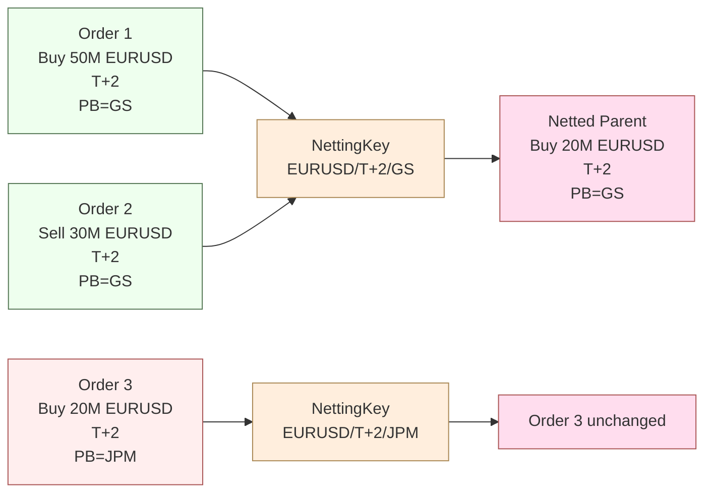
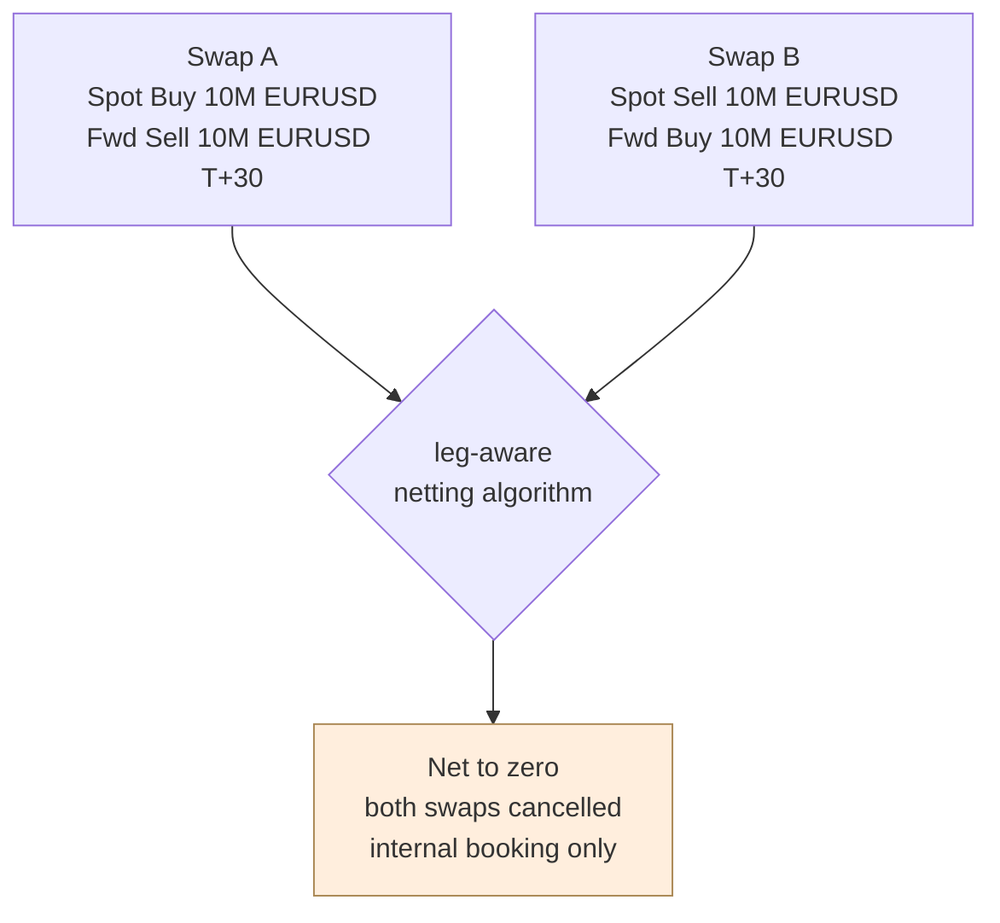

# FX Netting — Full Semantics

FX netting collapses orders sharing a **netting key** into fewer market-facing parents while preserving per-child accountability. FX is the most nuanced netting case because value dates, prime brokers, pre-authorized counterparties, swap-leg structure, and rolling-forward conventions all participate in the key.

The user-facing workflow lives in [[netting-auto-via-excel]] and [[netting-swap-net]]; this note captures the architectural rules.

## Netting key

```
NettingKey(order) =
    ( ccy_pair               # e.g. EURUSD; CCY order matters, not normalized
    , value_date             # see "value date arithmetic" below
    , account_group          # PB-or-internal account bucket
    , pre_authorized_cpty?   # if set, isolates from other-cpty-pool
    , policy_layer           # FIRM | DESK | TAG — see overrides below
    )
```

Two orders **net** when their keys are equal **and** at least one of them has the opposite side. Same-side orders sharing a key **aggregate** instead — see [[arch-aggregation]].

## Value date arithmetic

FX value date is computed from trade date plus the spot-days convention of the pair, observing currency-specific holiday calendars:

| Pair | Spot days | Reason |
|---|---|---|
| Most majors | T+2 | global convention |
| USD/CAD | T+1 | regional convention |
| USD/TRY | T+1 (some venues), T+2 (others) | venue-dependent |
| Forwards | T + spot + tenor offset | tenor-driven |
| Same-day (TOD), next-day (TOM) | T+0, T+1 | explicit |

Two orders with the same nominal pair but different value dates **do not net**. They may form legs of an [[arch-multileg|FX swap]] instead.

## Prime broker isolation

Orders allocated to different prime brokers cannot net even if all else matches, because settlement obligations are PB-specific.



## Pre-authorized counterparty (PAC) constraint

Some orders carry a pre-authorized counterparty hint (corp treasury workflows commonly do). When set, the netting algorithm prefers grouping orders sharing the same PAC. Two PACs not present in each other's compatibility set isolate.

| PAC on order | Behaviour |
|---|---|
| Unset | Eligible for netting with any other unset-PAC order in the same key. |
| Set | Forms a sub-bucket; only nets with orders sharing the PAC or those that have no PAC and accept the default fallback. |

See [[pre-authorized-cptys]].

## Swap netting

An FX swap is structurally a multileg ([[arch-multileg]]) — spot + forward — on opposing sides of the pair. Swap netting handles:

- Two swaps with **opposite** spot legs and **opposite** forward legs of the same tenors → both swaps collapse fully.
- A swap + outright on the spot leg side → only the spot leg's nettable portion collapses; the forward remains alone.
- Two swaps where only **one** pair of legs net → result is a partial collapse plus residual legs that may form a new (smaller) swap.

This is "swap-aware netting" and requires the netting algorithm to walk leg structures, not just envelopes. See [[netting-swap-net]] and [[what-are-swaps]].



## Policy layers and overrides

Netting policy cascades per [[arch-firm-desk-user|settings hierarchy]]:

| Level | Typical setting |
|---|---|
| Firm | `default_netting_policy: AUTO` or `MANUAL_REVIEW` |
| Desk | `net_window_minutes` (how long to hold orders open for netting before flush) |
| Tag | `#corp-treasury` may force longer windows, `#latency-sensitive` may set window=0 |
| User | Limited overrides: opt-out per order via `do_not_net=true` |

A desk-level cap cannot be widened by a user override. Per [[arch-validator]] discipline, narrowing only.

## Pre-net vs post-net validation

Limits, exposure caps, and counterparty checks are evaluated **both** before and after netting:

| Failure timing | Resolution |
|---|---|
| Pre-net fail (individual child) | Child rejected; rest continue. |
| Post-net fail (parent fails after collapse) | All children revert to `STAGED` un-netted; trader notified. Audit captures the post-net check failure. |

## Rolling forward (date roll)

At end-of-day, partially-filled FX orders intended for the next trade-date roll their value date forward following the spot-days convention. The roll is an event (`OrderRolled`) with the old/new value date. Netting groups are recomputed under the new keys; previously-netted groups may dissolve.

See [[tradedate-roll]].

## Sequence: full-cycle netting

```mermaid
sequenceDiagram
  participant U as Operator / Excel upload
  participant O as Staged Order Mgr<br/>[[arch-order-staged]]
  participant V as Validator<br/>[[arch-validator]]
  participant N as Netting Engine
  participant R as Router<br/>[[arch-router-layer]]

  U->>O: stage_orders([batch], net_within_batch=true)
  loop per child
    O->>V: pre-validate (per-child limits)
    V-->>O: pass / reject
  end
  O->>N: net(batch_id)
  N->>N: compute NettingKey per child
  N->>N: bucket, collapse, account for PB/PAC
  N->>V: post-net validate (parent limits)
  V-->>N: pass / fail
  alt success
    N-->>O: NetGroupFormed; children -> STAGED_NET_CHILD; parents -> STAGED
    O-->>R: route_orders([netted_parents])
  else fail
    N-->>O: NettingRejected; revert children
    O-->>U: surface reason
  end
```

## Validator codes touched

`EMS-ORD-2201` (post-net limit breach), `EMS-ORD-2202` (heterogeneous value date), `EMS-ORD-2203` (net-to-zero blocked by policy), `EMS-ORD-2204` (PB-isolation prevented netting), `EMS-ORD-2205` (PAC mismatch), `EMS-ORD-2210` (cannot un-net routed parent).

## Permissions

- `#fx-trade` (3-layer per [[arch-tag-permissions]]).
- `#net-cross-batch` if `group_id` is used to widen the netting scope beyond a single `batch_name`.
- `#corp-treasury` for FXEL-staged flows with their own netting defaults — see [[fxel]].
- `#leg-aware-netting` for swap-aware netting; some firms restrict this to senior FX traders.

## See also

- [[arch-order-staged]] · [[arch-router-layer]] · [[arch-validator]] · [[arch-automation-layer]]
- [[arch-multileg]] · [[arch-aggregation]]
- [[netting-auto-via-excel]] · [[netting-swap-net]] · [[what-are-swaps]] · [[tradedate-roll]]
- [[pre-authorized-cptys]] · [[allocation-prime-broker]] · [[fxel]]
