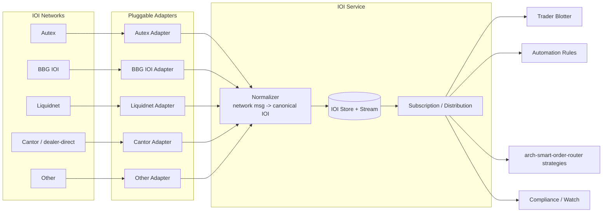

# IOI — Indications of Interest

A **pluggable inbound layer** integrating with IOI networks (Autex / Refinitiv, Bloomberg IOI, Liquidnet, Cantor IOIs, dealer-direct feeds, others). IOIs are advertisements of trading interest from counterparties — **not orders, not quotes, not RFQs** — and must be modelled as a distinct first-class entity in the data model so they aren't confused with executable instruments.

## What an IOI is

A counterparty (typically a dealer or block-trading network) advertises: "I have interest in this instrument, this side, this size, around this price, in this condition." The recipient (typically buy-side) can:

- Use it as **liquidity intelligence** — informs decisions, no action taken.
- **Reach out** to the IOI sender (chat / phone) to negotiate.
- **Trade against it** electronically when the IOI is *actionable* (negotiated workflow per network).

IOIs are inherently **indicative** — they may be withdrawn, refined, or never executable. The data model treats them as such.

## Why differentiate in the data model

A common implementation mistake is shoving IOIs into the same table as orders or quotes. Then:

- A trader sees a "price" on the blotter and thinks it's tradable.
- Compliance evaluates an IOI like an order.
- TCA confuses an IOI miss for an unfilled order.

**IOIs are a separate entity** with their own type, their own event stream, their own state machine, and their own UI surface. The data model differentiates explicitly.

## Data model

```text
IOI {
  ioi_id                       UUID                    # EMS-internal
  source_network               AUTEX | BBG_IOI | LIQUIDNET | CANTOR | DEALER_DIRECT | OTHER
  source_network_msg_id        string                  # the network's identifier
  source_dealer / sender_id    DealerRef
  instrument                   FIGI                    # via [[arch-symbology-figi]]
  side                         BUY | SELL | TWO_WAY
  size:                        { qty, qty_type: FIRM | INDICATIVE | RANGE }
  price:                       { kind: MID | LAST | LIMIT | OFFSET | NEGOTIABLE,
                                 value?, offset_bps?, currency }
  ioi_qualifier                NATURAL | SUPER_NATURAL | UNWOUND |
                               IN_TOUCH_WITH | DELTA_HEDGED | PORTFOLIO_TRADE
  ioi_type                     NEW | CANCEL | REPLACE
  valid_from, valid_until
  client_segments              [tier_or_tag]           # who at receiving firm can see this IOI
  attributes                   map<string, any>        # network-specific extension
  state                        ACTIVE | EXPIRED | CANCELLED | TRADED_AGAINST
  received_at                  timestamp
}
```

### IOI qualifier semantics (industry standard)

| Qualifier | Meaning |
|---|---|
| `NATURAL` | Dealer has the position; selling out / buying back their book. Strong signal. |
| `SUPER_NATURAL` | Multiple clients on the other side; dealer has confidence. |
| `UNWOUND` | Position has already been worked; this is residual. |
| `IN_TOUCH_WITH` | Dealer is talking to a counterparty; not a sure thing. |
| `DELTA_HEDGED` | Comes with a hedge (relevant for options / convertibles). |
| `PORTFOLIO_TRADE` | Part of a portfolio program; package-level. |

These qualifiers are part of FIX's IOI message (`35=6`) and most network protocols. The EMS preserves the qualifier so it can be used in scoring / filtering downstream.

## Pluggable network architecture



Each adapter:

- Speaks the network's protocol (FIX `35=6`, proprietary REST / WebSocket, file feed).
- Translates to the canonical `IOI` envelope.
- Emits `IoiReceived` events.
- Handles `IoiCancel` (`35=Y` IOI Cancel) and `IoiReplace` per network conventions.

The plug-and-play property: enabling Autex is a config change (turn on the adapter); the rest of the EMS sees IOIs identically.

## IOI → potential order flow

```mermaid
sequenceDiagram
  participant N as IOI Network
  participant A as Network Adapter
  participant S as IOI Service
  participant T as Trader / Rule
  participant O as Order Layer
  participant V as Validator + Compliance

  N->>A: 35=6 IOI (or proprietary)
  A->>S: normalize -> IoiReceived event
  S->>T: distribute (subscription)
  Note over T: trader sees it on blotter; can act on it
  alt act on IOI
    T->>O: stage_orders([{ ..., ioi_link_id: X }])
    O->>V: validate + compliance check
    V-->>O: pass
    O->>O: persist with ioi_link_id in metadata
    Note over O: TCA + audit can trace the order back to the source IOI
  else just informational
    Note over T: no action; IOI eventually expires
  end
```

## IOI subscription / distribution

Like [[arch-quote-server|quotes]], IOIs are distributed via PubSub with permission-scoped subscriptions:

```text
ioi.{figi}                              # all IOIs for an instrument
ioi.network.{network}                   # all from a specific network
ioi.qualifier.{qualifier}               # filter by qualifier
ioi.firm.{firm_id}                      # all IOIs visible to a firm
```

**Permission scope is critical** — many IOI networks segment IOIs by client tier (only top-tier clients see certain natural-axe IOIs). The adapter respects `client_segments` and the [[arch-tag-permissions|tag system]] gates subscriptions accordingly.

## IOI in workflows

IOIs influence multiple workflows:

- **Routing**: traders may [[route-to-rfq|RFQ]] back to the IOI sender. The order can carry `ioi_link_id` so the routing decision is traced to the source.
- **SOR strategies**: a strategy may include "if a NATURAL IOI exists for the instrument, route to that dealer first" logic.
- **Automation**: a rule can fire on `IoiReceived` matching criteria — e.g. "auto-RFQ when a SUPER_NATURAL IOI > 1M arrives for any instrument in my watch list".
- **Compliance**: surveillance can detect suspicious IOI patterns (e.g. IOIs received minutes before related order activity → potential frontrunning ingestion).

## Outbound IOI (if firm publishes its own)

Some firms publish their own IOIs to networks (sell-side desks advertising). The same plug-and-play architecture in reverse: the EMS produces canonical IOIs; per-network adapters translate to the network's protocol; outbound rate limits and content filtering applied.

Sell-side IOI publication is **separately gated** by `#ioi-publish-{network}` tags — usually highly restricted.

## State machine (small)

```text
NEW -> ACTIVE -> EXPIRED | CANCELLED | TRADED_AGAINST
                  ^
                  +-- on REPLACE: new IOI version supersedes; prior moves to CANCELLED
```

Replaces and cancels follow per-network semantics; the canonical state machine is simple and uniform.

## Determinism / replay

IOIs are inbound events. The replay log captures the raw network message + the normalized IOI. Replays re-derive distribution decisions deterministically.

## Anti-patterns

- **Treating IOIs as orders.** They're not. Separate entity, separate table, separate event stream.
- **Mixing IOI display with quote display.** Different UI conventions (IOIs typically dimmer, clearly labelled, qualifier displayed prominently).
- **Hardcoded network logic in the IOI service.** Networks are adapters; the service is generic.
- **No qualifier preservation.** Losing the qualifier converts a useful trading signal into noise.
- **Single visibility scope.** IOIs come with tier / segment restrictions; failing to honour them violates dealer ToS.

## See also

- [[arch-quote-server]] (sibling distribution pattern) · [[arch-symbology-figi]] · [[arch-event-sourcing]]
- [[arch-rfq]] (IOI → RFQ is the common follow-on flow)
- [[arch-smart-order-router]] · [[arch-automation-layer]] · [[arch-compliance]] · [[arch-surveillance]]
- [[bloomberg-ib]] (often the chat-channel side of an IOI conversation)
- [[arch-tag-permissions]] · [[arch-firm-desk-user]]
