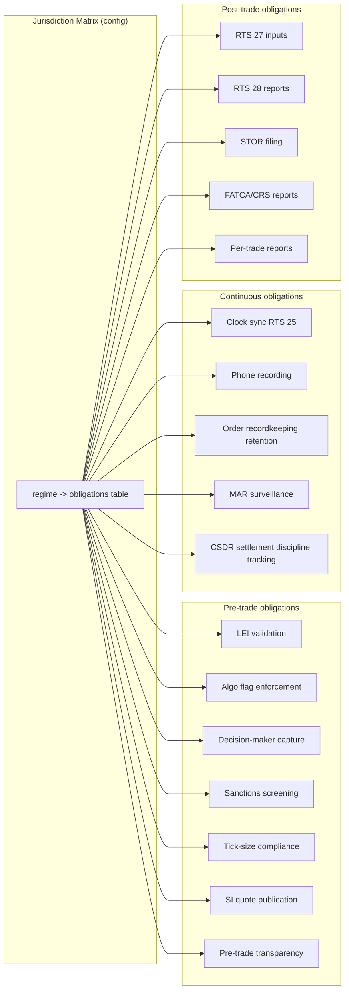

# Jurisdictional Compliance Matrix

A **cross-cutting layer** mapping per-jurisdiction regulatory obligations to system requirements. Many obligations are **not reporting** — they are pre-trade controls, system-level requirements (clock sync, phone recording), order-content requirements (LEI, algo flags), pre-trade transparency obligations, market-abuse surveillance regimes, sanctions screening, and best-execution policies.

Distinct from [[arch-regulatory-reporting-service]] which handles the submission of *reports*; this note covers everything else the regulators require the EMS to do.

## Why a single matrix

A trade booked in one jurisdiction by a firm registered in another with a client in a third routinely crosses 3+ regulatory regimes. Each regime imposes obligations on the system — and many of those obligations require **pre-trade behaviour**, not just post-trade reports. Examples:

- A trade subject to MiFID II must carry an **LEI** in the order envelope, an **algo flag** if any automation participated, and a **decision-maker identifier**.
- A trade subject to MAR triggers continuous **STOR surveillance**.
- A trade through a US venue requires **OFAC sanctions screening** on every counterparty.
- A trade in CSDR scope triggers **settlement-discipline tracking** with cash penalties.

Without an explicit per-jurisdiction matrix, these requirements get implemented per-trade ad-hoc; coverage gaps result in regulatory failures.

## Architecture



The matrix is consumed by multiple components — [[arch-compliance]] for pre-trade, [[arch-surveillance]] for continuous, [[arch-regulatory-reporting-service]] for reports, [[arch-tca]] for RTS 27/28 inputs.

## Pre-trade obligations matrix

### LEI (Legal Entity Identifier)

| Regime | Requirement |
|---|---|
| MiFID II / MIFIR | LEI mandatory on every reportable order's owner and decision-maker |
| EMIR | LEI mandatory both sides of OTC derivative |
| SFTR | LEI both sides |
| CFTC | LEI on swap counterparties |
| Hong Kong SFC OTC | LEI on OTC derivatives |
| ASIC | LEI on derivatives reporting |

Implementation: every order envelope carries `owner_lei` and `decision_maker_lei` (when set automatically; trader-LEI when human-driven). Validator rejects pre-trade if missing for in-scope orders (`EMS-PRM-2110 lei_required_for_jurisdiction`).

### Algorithmic-trading flagging (MiFID II RTS 6, RTS 7)

| Field | Meaning |
|---|---|
| `algo_flag` | true if the order is generated/decided by an algorithm |
| `algo_id` | identifier of the algorithm (versioned) |
| `hft_flag` | true if from a registered HFT participant |
| `dea_flag` | true if Direct Electronic Access |
| `liquidity_provision_flag` | true if part of market-making strategy |

Set by the originating component (UI, FIX bridge, automation, SOR). [[arch-automation-layer|automation]]-originated orders set `algo_flag=true` and the rule's `algo_id`. [[arch-smart-order-router|SOR]] sets `algo_id` to the strategy.

Validation: in-scope orders must have these fields populated correctly. Misrepresentation is a regulatory offence.

### Decision-maker identification

| Regime | Field |
|---|---|
| MiFID II RTS 22 | National ID or LEI of the natural person making the investment decision |
| US (varying) | trader badge + supervisor in some flows |

Captured on every order; tracked via [[arch-firm-desk-user]].

### Pre-trade sanctions screening

OFAC (US), EU CFSP, UN, UK OFSI, plus firm-specific sanctions lists:

- Every order: counterparty + ultimate beneficial owner screened against current sanctions lists.
- Every payment instruction: receiving-bank screening.
- Sanctioned-party match → hard block (per [[arch-compliance]] block-with-override; override is **rare** and requires senior signoff + audit).

Sanctions lists are reference data ([[arch-reference-data-service]]); list updates trigger re-screening of in-flight orders. A live order whose counterparty becomes sanctioned mid-life is **cancelled** and a regulator notification fires.

### Pre-trade transparency (MiFIR)

Equity, equity-like, ETF, certificates:

- Public quotes from MTFs/RMs/OTFs are aggregated to drive pre-trade visibility.
- **SI obligation**: a firm classified as Systematic Internaliser must publish firm quotes up to standard market size when actively quoting.
- SI quotes published via [[arch-quote-server]] outbound channel to APA.
- Waiver tracking (LIS, RPW, OOO, NTI): each SI quote has a waiver claim that the EMS records.

Non-equity instruments (FI, derivatives): conditional pre-trade transparency thresholds (LIS, SSTI); waivers tracked.

### Tick-size regime (MiFID II RTS 11)

- Liquidity-tier-based tick sizes for equity instruments.
- EMS validator enforces tick alignment at order entry (already in [[arch-validator]] / [[spot-limit-price]]).
- Tick regime data is reference data; updates flow through [[arch-reference-data-service]].

### Trader certification (MiFID II Article 25(1))

- Knowledge & competence — traders must be certified for the products they trade.
- Firms maintain a register; the EMS validator can check against the register via [[arch-tag-permissions]] (each certified product range is a tag).

## Continuous obligations

### Clock synchronization (MiFID II RTS 25)

Mandates UTC-traceable clock sync within tolerance bands based on activity type:

| Activity | Granularity | Max divergence from UTC |
|---|---|---|
| HFT activity | microseconds | 100 µs |
| Voice / manual non-HFT | seconds | 1 second |
| Other electronic | milliseconds | 1 ms |

EMS implementation:

- All time-stamping flows through [[arch-time-replay-server|the clock interface]] using a UTC-traceable source (PTP-disciplined oscillator or equivalent).
- Time-server publishes both `local_time` and `offset_from_utc_traceable`; both captured on events.
- [[arch-jmx-introspection|Health checks]] monitor clock divergence; alarms via [[arch-notification-service]] if approaching tolerance.

### Phone recording (MiFID II Article 16(7))

- Voice + electronic communications related to trades must be recorded.
- Retention: 5 years minimum, 7 years in some cases.
- The EMS does **not** record voice but **references** voice tickets:
  - [[staging-on-behalf]] captures `source_ref` linking to the voice recording system.
  - [[notes-and-custom-notes]] captures meaningful chat content.

### Order record-keeping retention

| Regime | Retention |
|---|---|
| MiFID II RTS 22 | 5 years |
| SEC 17a-4 | 7 years (some 3 years) |
| FINRA 4511 | 6 years |
| CFTC 1.31 | 5 years |
| UK FCA SYSC | 5 years |
| FATCA / CRS | 6 years |
| EU AMLD | 5 years from end of relationship |
| Hong Kong SFC | 7 years |

[[arch-event-sourcing|Event log]] retention configured to satisfy the strictest applicable regime per firm/region. Archival to cold storage after N years; full-fidelity replay still possible from cold.

### MAR (Market Abuse Regulation) — EU surveillance

[[arch-surveillance|Surveillance]]'s remit overlaps with MAR specifics:

- **Insider dealing** detection
- **Market manipulation** detection (spoofing, layering, marking the close, ramping, wash trades)
- **STOR** filing — Suspicious Transaction & Order Reports to the relevant NCA "without delay"

EMS implementation: [[arch-surveillance]] detectors with MAR-aligned thresholds. Severe alerts auto-escalate to compliance officer with STOR-drafting workflow.

Specifically for STOR:

```
StorDrafted {
  stor_id, suspect_actor, subject_alert_ids,
  drafted_by_compliance_officer, rationale
}
StorFiled { stor_id, nca, filed_at, filing_ref }
StorClosed { stor_id, outcome }
```

### CSDR settlement-discipline tracking

- Settlement fails accrue cash penalties (paused as of 2024; conditional reactivation).
- Mandatory buy-in regime (currently suspended).
- The EMS tracks per-trade settlement status from confirmation through settlement; failed-settlement events trigger [[arch-notification-service]] alerts and CSDR reporting cycles.

### Best-execution policy compliance (MiFID II)

- Firm publishes a best-ex policy.
- Each order traced against the policy: was the chosen venue/strategy/broker consistent with the policy?
- [[arch-tca]] aggregates produce the RTS 28 annual report.
- Per-trade audit: [[arch-smart-order-router|SOR]] selection rationale captured at the time, demonstrable on request.

## Post-trade obligations beyond reporting

- **Trade reconstruction**: regulators can demand reconstruction of a specific moment in time. [[arch-event-sourcing|Event log]] + [[arch-time-replay-server|replay]] satisfy this.
- **Order-fill audit chain**: linking parent order → routes → fills → allocations. Maintained by [[arch-projection-engine]] projections.
- **Per-client reporting** (FATCA / CRS / KIDs): triggered annually or per-trade depending on regime.

## Per-jurisdiction summary matrix

| Jurisdiction | Pre-trade obligations | Continuous obligations | Reports |
|---|---|---|---|
| **US** | OFAC sanctions, Reg SHO marking, large-trader ID | 17a-4 retention, CAT clock sync, fail-to-deliver tracking | TRACE, MSRB, CFTC SDR, CAT, FICC, Fed, Form PF |
| **EU MiFID II** | LEI, algo flags, decision-maker ID, sanctions, tick rule, SI quotes, trader certification | RTS 25 clock sync, phone recording, 5y retention, MAR surveillance | MiFIR RTS 22, APA post-trade, EMIR, SFTR, CSDR metrics, MAR STORs, AIFMD, RTS 27/28 |
| **UK** | (same as MiFID II) | (same) | UK MiFIR RTS 22, UK APA, UK EMIR, UK SFTR, FCA reports |
| **HK** | LEI, position limit tracking | SFC retention | SFC OTC, HKEX OMD |
| **SG** | LEI | MAS retention | MAS OTC reporting |
| **JP** | LEI | JFSA / JSDA retention | JFSA OTC, JPX |
| **AU** | LEI | ASIC retention | ASIC derivatives |
| **CN (Stock Connect)** | Investor ID (CSI ID), daily quota | KYC enhanced | CSRC + Connect reports |
| **Cross-border** | OFAC + EU + UN + UK sanctions screening | — | FATCA, CRS, AML reports |

## How components consume the matrix

```mermaid
flowchart LR
  M[Jurisdiction Matrix<br/>config in [[arch-reference-data-service]]] --> V[Validator]
  M --> C[Compliance]
  M --> S[Surveillance]
  M --> R[Reg Reporting]
  M --> T[TCA]
  M --> O[Order Layer]
  M --> Q[Quote Server / SI quote publication]
  M --> P[Phone-ref capture]
  M --> E[Event log retention]
```

The matrix is **versioned reference data** — when a regime adds a new field requirement, the matrix is amended (with sign-off) and consumers re-validate appropriately.

## Trade-jurisdiction determination

A small function central to all of this:

```
applicable_jurisdictions(trade) =
  union(
    booking_entity.jurisdiction,
    trading_venue.jurisdiction (if any),
    counterparty.jurisdiction (per leg),
    instrument.issuer_jurisdiction,
    instrument.listing_jurisdictions,
    client.residency
  )
```

For each jurisdiction, the matrix dictates which obligations apply. Captured on every order at stage time so audit and replay reproduce identical determinations.

## Determinism / replay

The matrix is reference data; per-trade jurisdiction determination is a pure function snapshotted at stage time. [[arch-time-replay-server|Replay]] reproduces identical obligation sets.

## See also

- [[arch-regulatory-reporting-service]] (the reports themselves)
- [[arch-compliance]] (pre-trade sanctions, fat-finger, KYC) · [[arch-surveillance]] (MAR / STOR)
- [[arch-tca]] (RTS 27/28 source) · [[arch-validator]] · [[arch-time-replay-server]] (RTS 25)
- [[arch-event-sourcing]] (retention) · [[arch-reference-data-service]] (matrix storage)
- [[arch-symbology-figi]] (LEI is referenced here) · [[arch-firm-desk-user]] (decision-maker / certification)
- [[arch-quote-server]] (SI quote publication) · [[arch-borrow-service]] (Reg SHO)
- [[arch-automation-layer]] (algo flagging) · [[arch-smart-order-router]] (best-ex selection)
- [[trace]] · [[msrb-rtrs]] · [[cftc-sdr]] · [[finra]] · [[ficc-reporting]] · [[fed-reporting]] · [[dtcc-sdr]] · [[fdic-occ]]
- [[isda]] · [[csa]] · [[gmra]] · [[dvp]]
