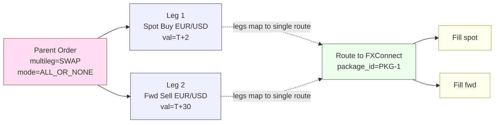
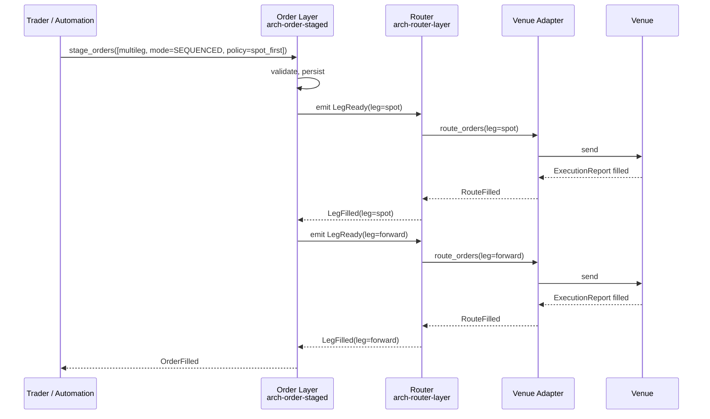

# Multi-Leg Orders

A multi-leg order is **one parent order whose execution intent is N inter-dependent legs**. The legs may settle together (FX swap), execute atomically as a package (listed options spread), or have ordering constraints (spot-first hedged FX). The OMS treats the parent as a unit; the [[arch-router-layer|router]] resolves legs into one or more routes per the venue's multileg capabilities.

## When multileg applies

| Use case | Legs |
|---|---|
| FX swap | spot leg + forward leg (opposite sides) |
| FX block hedge | spot + multiple forwards |
| Options spread (vertical / calendar / butterfly) | 2–4 option legs |
| Futures roll | sell near + buy far on same underlying |
| Listed delta-hedged option | option leg + stock leg |
| IRS / CDS unwind | offsetting derivative + cash hedge |
| Portfolio trade ("PT") | N securities, often hundreds, settled atomically |

## Order shape

```
StagedOrder (multileg) {
  order_id            UUID
  multileg_kind       SWAP | SPREAD | ROLL | DELTA_HEDGE | PT | CUSTOM
  legs                [Leg]
  package_id          string?         // venue-side package identifier when applicable
  execution_mode      ALL_OR_NONE | LEGS_INDEPENDENT | SEQUENCED
  sequence_policy     SequencePolicy? // e.g. spot_first — see [[spot-first]]
  net_price_target    decimal?        // package-level price (e.g. spread)
  // shared envelope: identity, tags, batch_name, group_id, etc.
}

Leg {
  leg_id              UUID
  leg_ratio           int             // signed; e.g. +1, -1
  instrument          FIGI            // see [[arch-symbology-figi]]
  side, qty
  limit_price         decimal?
  value_date          date?           // FX, FI
  extension           AssetSpecific
  routing_hint        VenueRef?
  state               PENDING | ROUTING | FILLED | CANCELLED | REJECTED
}
```

## Execution modes

| Mode | Semantics |
|---|---|
| `ALL_OR_NONE` | All legs must trade together or none do. Routed to a venue that supports the package (listed options spread, FX swap on a swap-capable venue). |
| `LEGS_INDEPENDENT` | Legs are scheduled to execute in parallel; partial outcomes accepted. Allocation reconciliation done at the end. |
| `SEQUENCED` | Legs execute in a declared order — e.g. `SequencePolicy = spot_first` ensures the spot hedge prints before the forward is sent. See [[spot-first]]. |

The execution mode is **immutable post-stage**. Switching modes requires cancel + re-stage.

## Relationship diagram



For `LEGS_INDEPENDENT` the router materialises one route per leg instead of a single package route.

## Sequenced execution



## State machine (order-level vs leg-level)

- The parent has its own state per [[arch-order-staged|the staged order state machine]] extended with multileg-aware substates: `STAGED` → `READY` → `LEGS_WORKING` → `FILLED|PARTIALLY_FILLED|CANCELLED|REJECTED`.
- Each leg has an independent lifecycle. The parent's terminal state is derived from the conjunction of leg states under the execution mode.

## Reject and partial semantics

| Mode | Failure on leg N |
|---|---|
| `ALL_OR_NONE` | Whole package is rejected/cancelled. Already-filled legs (rare on package venues but possible on race) become orphaned positions and are flagged for ops via [[arch-jmx-introspection]]. |
| `LEGS_INDEPENDENT` | The failed leg terminates; surviving legs continue. Parent ends `PARTIALLY_FILLED`. |
| `SEQUENCED` | Failure on leg N halts emission of leg N+1. Trader / automation decides whether to retry or unwind. |

## Allocation

Multileg fills allocate as a **package** when the package is single-account, or **per-leg** when the legs map to different prime brokers / accounts. The allocation template attached at order level encodes the mapping; the layer 2 router does not invent it.

## Mixed-client (FIX + API) handling

A FIX-staged multileg arrives as `NewOrderMultileg` (`35=AB`). All edits to the order — leg amends, cancels, mode changes — are API-only per the [[arch-fix-api-bridge|mixed-client rule]]. The FIX client sees per-leg `ExecutionReport` echoes on fills.

## Validator codes touched

`EMS-ORD-4401` (legs heterogeneous in a mode that requires homogeneity), `EMS-ORD-4402` (package_id required but missing), `EMS-ORD-4403` (sequence_policy invalid for kind), `EMS-ORD-4404` (package malformed — fewer than 2 legs), `EMS-RTE-1006` (venue does not support multileg package).

> Codes re-numbered 2026-06-10 into the 44xx multileg block — `EMS-ORD-4001` already means
> "Order not found" in `schemas/reject-codes/catalog.yaml`, which is the source of truth.

## See also

- [[arch-order-staged]] · [[arch-router-layer]] · [[arch-validator]] · [[arch-fix-api-bridge]]
- [[arch-aggregation]] · [[arch-fx-netting]]
- [[what-are-swaps]] · [[spot-first]] · [[partial-routes]]
