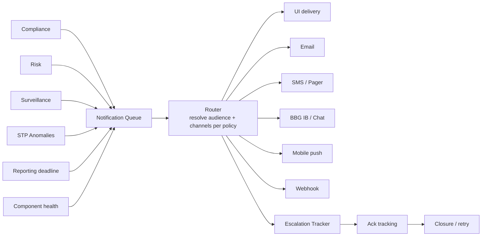

# Notification Service

Routes **alerts, escalations, and informational messages** to humans and systems. Consumed by [[arch-compliance|compliance officer queues]], [[arch-risk-engine|risk alerts]], [[arch-surveillance|surveillance flags]], [[arch-stp-pipeline|STP anomalies]], [[arch-regulatory-reporting-service|reporting-deadline warnings]], ops triage queues, [[arch-jmx-introspection|component health]] alerts.

Without a unified service, each component invents its own notification mechanism — inconsistent delivery, no centralized acknowledgement, no escalation, no audit.

## Channels supported

| Channel | Use |
|---|---|
| In-app UI banner | trader / officer at terminal |
| Blotter side-panel queue | items awaiting action |
| Email | non-urgent + summaries |
| SMS / pager | urgent + on-call |
| Bloomberg IB / chat | dealer / sales conversation |
| Mobile push | senior management out-of-office |
| Webhook | downstream automation / ticketing |
| Voice (rare) | critical incidents |

Different alert kinds use different channels per **escalation policy**.

## Architecture



## Notification envelope

```
Notification {
  notification_id          UUID
  kind                     ALERT | INFO | ESCALATION | RESOLUTION
  source                   originating component
  severity                 INFO | LOW | MEDIUM | HIGH | CRITICAL
  subject_event_ids        [event_id]               # links back to the event log
  audience                 AudienceRef              # role / individual / queue
  channels                 [Channel]                # one Notification can fan out
  delivery_policy          IMMEDIATE | THROTTLED | DIGEST
  ack_required             bool
  ack_deadline?            timestamp
  escalation_policy?       EscalationPolicy
  body                     structured payload (renderable per channel)
}
```

## Routing rules

A `NotificationRule` matches incoming alerts to audience + channels:

```
NotificationRule {
  rule_id, version
  match { source, kind, severity, subject_filter }
  audience: { roles | identities | queues }
  channels: [Channel]
  delivery_policy
  ack_required
  escalation { after, to, channels }
}
```

Example:

```yaml
rule: compliance-block-fat-finger
match: { source: compliance, kind: ALERT, subject: fat_finger_block }
audience:
  - role: desk-supervisor-of(blocked_user.desk)
  - queue: compliance-officer-queue
channels: [ui_banner, email]
ack_required: true
ack_deadline: 15min
escalation:
  - after: 15min
    to: [head-of-compliance]
    channels: [sms]
```

Rules are versioned reference data ([[arch-reference-data-service]]) signed off by ops.

## Throttling / digest

Avoid alert fatigue:

- **Throttled**: identical alerts within window collapse to one notification with a count.
- **Digest**: low-severity alerts batched into periodic digest (e.g. EOD email).
- **Per-recipient quiet hours**: configurable; CRITICAL bypasses.

## Acknowledgement and escalation

For alerts with `ack_required`:

- Recipient acks via UI / link / API.
- `NotificationAcked` event with identity + timestamp.
- Unacked past `ack_deadline` → escalation triggered.
- Escalation sends to higher audience via configured channels.
- Repeated escalation steps possible (3-tier typical).

`NotificationClosed` when the underlying issue resolves (e.g. compliance block overridden → close the corresponding notifications).

## Audit

Every notification is an event:

```
NotificationDispatched { notification_id, ... }
NotificationDelivered { notification_id, channel, recipient }
NotificationDeliveryFailed { notification_id, channel, reason }
NotificationAcked { notification_id, by, at }
NotificationEscalated { notification_id, to, escalation_step }
NotificationClosed { notification_id, reason }
```

Audit answers "did the right person get the alert, did they ack, when did they ack" — common questions in compliance / risk reviews.

## Channel adapters

Each external channel (email, SMS, IB, etc.) is an adapter:

- Translates the canonical notification body to the channel's format.
- Handles delivery semantics (sync vs. async, ack vs. fire-and-forget).
- Surfaces delivery failures back to the service.

Plug-and-play: enabling a new channel (e.g. Microsoft Teams integration) is adding an adapter.

## Determinism / replay

Notification routing is a deterministic function of (rule version, alert, audience resolution at time). [[arch-time-replay-server|Replay]] reproduces identical routing decisions; outbound deliveries are sandboxed.

## Anti-patterns

- **Direct email/SMS sending from components.** Bypasses audit, routing, escalation. Always go through the service.
- **Notification storms.** No throttling on a hot event spike. Always declare throttling per rule.
- **Stale audience caches.** Routing to a recipient who left the firm. Audience resolution is a live lookup.
- **No ack tracking.** "Did the trader see it?" Notification with `ack_required=false` doesn't track; use sparingly.

## API surface

```
operation: notify
items: [{ source, kind, severity, subject_event_ids, body, audience_hint? }]
returns: notification_id (per item)

operation: ack_notification
items: [{ notification_id }]

operation: close_notification
items: [{ notification_id, reason }]

operation: register_notification_rule
items: [{ rule, ..., signed_off_by }]

operation: list_pending_notifications(filter)
operation: notification_audit(filter, time_range)
```

## See also

- [[arch-event-sourcing]] · [[arch-time-replay-server]] · [[arch-reference-data-service]] · [[arch-tag-permissions]]
- [[arch-compliance]] · [[arch-risk-engine]] · [[arch-surveillance]] · [[arch-stp-pipeline]]
- [[arch-regulatory-reporting-service]] · [[arch-jmx-introspection]] · [[arch-firm-desk-user]]
